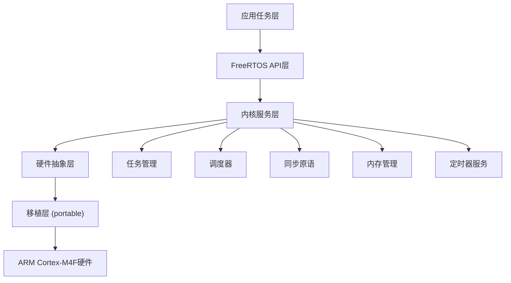
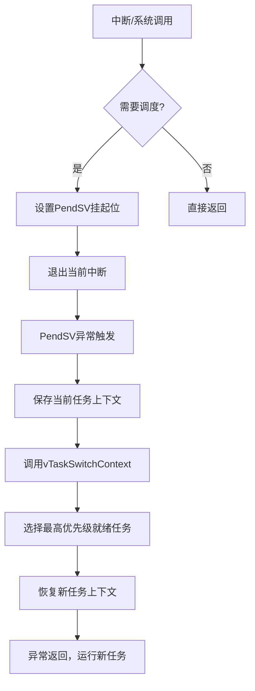

# FreeRTOS与ARM Cortex-M4F完全解析教程

> **从源码到硬件的全方位深度分析**
> 
> 基于STM32F407实际硬件平台，涵盖FreeRTOS内核原理、ARM底层实现、性能优化与实战应用的完整教程

## 🎯 教程特色

- **📚 理论与实践并重**: 源码分析 + 硬件底层 + 实际应用
- **🔬 汇编级深度解析**: 逐行分析关键汇编代码和寄存器操作
- **⚡ 性能优化指导**: 基于硬件特性的优化策略和最佳实践
- **🛠️ 完整开发工具链**: 从编译到调试的全流程指导
- **🚀 企业级应用**: 真实项目场景和故障排查经验

---

## 📋 目录

### 🏗️ 第一部分：硬件基础与架构分析
1. [ARM Cortex-M4F硬件架构深度分析](#1-arm-cortex-m4f硬件架构深度分析)
2. [项目结构与开发环境](#2-项目结构与开发环境)
3. [中断向量表与异常处理机制](#3-中断向量表与异常处理机制)

### 🧠 第二部分：FreeRTOS内核原理
4. [FreeRTOS核心架构与设计理念](#4-freertos核心架构与设计理念)
5. [任务管理系统深度解析](#5-任务管理系统深度解析)
6. [调度器实现与算法分析](#6-调度器实现与算法分析)
7. [队列与同步机制](#7-队列与同步机制)

### ⚙️ 第三部分：底层实现机制
8. [任务上下文切换的汇编级实现](#8-任务上下文切换的汇编级实现)
9. [SysTick定时器与时钟管理](#9-systick定时器与时钟管理)
10. [PendSV异常与调度器底层](#10-pendsv异常与调度器底层)
11. [浮点单元(FPU)硬件集成](#11-浮点单元fpu硬件集成)

### 🔧 第四部分：内存与性能优化
12. [内存管理与硬件抽象](#12-内存管理与硬件抽象)
13. [中断优先级与NVIC配置](#13-中断优先级与nvic配置)
14. [性能优化与硬件特性利用](#14-性能优化与硬件特性利用)

### 🛠️ 第五部分：开发实战与应用
15. [调试技巧与工具使用](#15-调试技巧与工具使用)
16. [常见问题与故障排查](#16-常见问题与故障排查)
17. [实际项目应用案例](#17-实际项目应用案例)
18. [与其他RTOS对比分析](#18-与其他rtos对比分析)

---

## 1. ARM Cortex-M4F硬件架构深度分析

### 1.1 处理器核心架构

ARM Cortex-M4F是基于ARMv7E-M架构的32位RISC处理器，专为嵌入式应用优化：

#### 核心特性
- **Harvard架构**: 指令和数据总线分离，提高访问效率
- **3级流水线**: 取指(Fetch) → 译码(Decode) → 执行(Execute)
- **单精度FPU**: 集成单精度浮点运算单元
- **MPU支持**: 可选的内存保护单元
- **DSP扩展**: 单指令多数据(SIMD)指令集

#### 寄存器组织结构

```c
// ARM Cortex-M4F 核心寄存器定义 (portmacro.h:46-57)
#define portCHAR        char
#define portFLOAT       float      // 硬件浮点支持
#define portSTACK_TYPE  uint32_t   // 32位栈指针
#define portBASE_TYPE   long       // 基础数据类型

typedef portSTACK_TYPE StackType_t;
typedef long BaseType_t;
typedef unsigned long UBaseType_t;
typedef uint32_t TickType_t;       // 32位时钟滴答计数
```

#### 内存映射架构

```
ARM Cortex-M4F 内存映射 (4GB地址空间):
0x00000000 - 0x1FFFFFFF: 代码区 (Code Region)
├── 0x00000000 - 0x0007FFFF: 主FLASH (512KB)
├── 0x08000000 - 0x080FFFFF: 系统存储器
└── 0x1FFFF000 - 0x1FFFFFFF: 选项字节

0x20000000 - 0x3FFFFFFF: SRAM区 (SRAM Region)  
├── 0x20000000 - 0x2001FFFF: 主SRAM (128KB)
├── 0x2001C000 - 0x2001FFFF: 备份SRAM (16KB)
└── 0x10000000 - 0x1000FFFF: CCM数据RAM (64KB)

0x40000000 - 0x5FFFFFFF: 外设区 (Peripheral Region)
├── 0x40000000 - 0x40007FFF: APB1总线外设
├── 0x40010000 - 0x40016FFF: APB2总线外设
└── 0x50000000 - 0x50060FFF: AHB1/AHB2总线外设

0xE0000000 - 0xE00FFFFF: 私有外设区 (Private Peripheral Bus)
├── 0xE000E000 - 0xE000EFFF: 系统控制空间 (SCS)
├── 0xE000E010 - 0xE000E01F: SysTick定时器
├── 0xE000E100 - 0xE000E4EF: NVIC (嵌套向量中断控制器)
└── 0xE000ED00 - 0xE000ED3F: 系统控制块 (SCB)
```

### 1.2 处理器状态与工作模式

#### 执行状态
```c
// 处理器状态寄存器位定义 (port.c:89-90)
#define portINITIAL_XPSR        (0x01000000)  // Thumb状态位 = 1
#define portINITIAL_EXC_RETURN  (0xfffffffd)  // 异常返回值
```

#### 操作模式
- **线程模式(Thread Mode)**: 普通程序执行模式
- **处理器模式(Handler Mode)**: 异常/中断处理模式

#### 特权级別
- **特权级(Privileged)**: 可访问所有系统资源
- **非特权级(Unprivileged)**: 受限访问，由MPU控制

### 1.3 异常与中断系统

#### 异常优先级表

```c
// ARM Cortex-M4F 异常编号与优先级 (startup_stm32f407xx.s)
异常编号    异常类型           固定优先级    可配优先级
1          复位 (Reset)        -3 (最高)     否
2          NMI               -2            否  
3          硬故障 (HardFault)  -1            否
4          存储管理故障        可配置         是
5          总线故障           可配置         是
6          用法故障           可配置         是
11         SVCall            可配置         是
12         调试监视器         可配置         是
14         PendSV            可配置         是  (FreeRTOS使用)
15         SysTick           可配置         是  (FreeRTOS使用)
16+        外部中断 IRQ0-IRQ81 可配置         是
```

---

## 2. 项目结构与开发环境

### 2.1 项目整体架构

本项目是一个基于STM32F407的完整FreeRTOS应用，展示了从硬件抽象层到应用层的完整实现：

```
TKX/ (项目根目录)
├── 📁 Core/                              # 应用层核心代码
│   ├── 📁 Inc/                           # 头文件目录
│   │   ├── 📄 FreeRTOSConfig.h          # FreeRTOS配置文件 ⭐
│   │   ├── 📄 main.h                    # 主程序头文件
│   │   ├── 📄 gpio.h                    # GPIO配置
│   │   ├── 📄 sdio.h                    # SDIO接口
│   │   ├── 📄 spi.h                     # SPI接口
│   │   ├── 📄 stm32f4xx_hal_conf.h      # HAL库配置
│   │   └── 📄 stm32f4xx_it.h            # 中断处理声明
│   └── 📁 Src/                          # 源文件目录
│       ├── 📄 main.c                    # 主程序入口
│       ├── 📄 freertos.c                # FreeRTOS任务定义 ⭐
│       ├── 📄 gpio.c                    # GPIO实现
│       ├── 📄 sdio.c                    # SDIO实现
│       ├── 📄 spi.c                     # SPI实现
│       ├── 📄 stm32f4xx_hal_msp.c       # MSP配置
│       ├── 📄 stm32f4xx_hal_timebase_tim.c # 时基配置
│       ├── 📄 stm32f4xx_it.c            # 中断处理实现 ⭐
│       ├── 📄 syscalls.c                # 系统调用
│       ├── 📄 sysmem.c                  # 内存管理
│       └── 📄 system_stm32f4xx.c        # 系统初始化
├── 📁 Middlewares/Third_Party/FreeRTOS/ # FreeRTOS内核源码 🚀
│   └── 📁 Source/
│       ├── 📁 include/                  # 内核头文件
│       │   ├── 📄 FreeRTOS.h           # 主配置头文件
│       │   ├── 📄 task.h               # 任务管理API
│       │   ├── 📄 queue.h              # 队列API
│       │   ├── 📄 semphr.h             # 信号量API
│       │   ├── 📄 timers.h             # 定时器API
│       │   ├── 📄 event_groups.h       # 事件组API
│       │   ├── 📄 stream_buffer.h      # 流缓冲区API
│       │   ├── 📄 list.h               # 链表数据结构
│       │   ├── 📄 portable.h           # 移植层接口
│       │   └── 📄 projdefs.h           # 项目定义
│       ├── 📁 portable/                 # 移植层代码 ⚙️
│       │   ├── 📁 GCC/ARM_CM4F/        # ARM Cortex-M4F GCC移植
│       │   │   ├── 📄 port.c           # 移植层实现 ⭐
│       │   │   └── 📄 portmacro.h      # 移植层宏定义 ⭐
│       │   └── 📁 MemMang/             # 内存管理实现
│       │       ├── 📄 heap_1.c         # 简单内存分配
│       │       ├── 📄 heap_2.c         # 固定大小分配
│       │       ├── 📄 heap_3.c         # 标准库malloc封装
│       │       ├── 📄 heap_4.c         # 内存合并算法 ⭐
│       │       └── 📄 heap_5.c         # 多区域内存管理
│       ├── 📁 CMSIS_RTOS_V2/           # CMSIS-RTOS v2适配层
│       ├── 📄 tasks.c                   # 任务管理核心 🚀
│       ├── 📄 queue.c                   # 队列实现 🚀
│       ├── 📄 list.c                    # 双向链表实现
│       ├── 📄 timers.c                  # 软件定时器
│       ├── 📄 event_groups.c            # 事件组
│       ├── 📄 stream_buffer.c           # 流缓冲区
│       ├── 📄 croutine.c                # 协程支持
│       ├── 📄 History.txt               # 版本历史
│       ├── 📄 LICENSE                   # 许可证
│       ├── 📄 readme.txt                # 说明文件
│       └── 📄 st_readme.txt             # ST特定说明
├── 📁 Drivers/                          # 驱动层 🔧
│   ├── 📁 STM32F4xx_HAL_Driver/        # STM32 HAL驱动库
│   │   ├── 📁 Inc/                     # HAL头文件
│   │   └── 📁 Src/                     # HAL源文件
│   └── 📁 CMSIS/                       # ARM CMSIS标准
│       ├── 📁 Core/Include/            # Cortex-M4F核心定义
│       ├── 📁 Device/ST/STM32F4xx/     # STM32F4xx设备支持
│       ├── 📁 DSP/                     # DSP数学库
│       └── 📁 RTOS2/                   # CMSIS-RTOS v2
├── 📄 startup_stm32f407xx.s            # 启动文件 ⭐
├── 📄 stm32f407vgtx_flash.ld          # 链接脚本 ⭐
├── 📄 CMakeLists.txt                   # CMake构建配置
├── 📄 CMakePresets.json                # CMake预设
├── 📄 TKX.ioc                         # STM32CubeMX配置
├── 📄 newlib_lock_glue.c              # newlib线程安全
└── 📄 stm32_lock.h                    # 锁定义
```

### 2.2 关键文件深度解析

#### 🔥 核心配置文件

**FreeRTOSConfig.h** - 系统配置中枢
```c
// 基本系统配置 (FreeRTOSConfig.h:62-84)
#define configUSE_PREEMPTION                     1      // 抢占式调度
#define configSUPPORT_STATIC_ALLOCATION          1      // 静态内存分配
#define configSUPPORT_DYNAMIC_ALLOCATION         1      // 动态内存分配
#define configUSE_IDLE_HOOK                      0      // 空闲钩子函数
#define configUSE_TICK_HOOK                      0      // 滴答钩子函数
#define configCPU_CLOCK_HZ                       (SystemCoreClock)  // CPU时钟
#define configTICK_RATE_HZ                       1000   // 系统滴答频率(1ms)
#define configMAX_PRIORITIES                     56     // 最大优先级数
#define configMINIMAL_STACK_SIZE                 128    // 最小栈大小(字)
#define configTOTAL_HEAP_SIZE                    15360  // 总堆大小(15KB)
#define configMAX_TASK_NAME_LEN                  16     // 任务名最大长度

// 功能特性配置
#define configUSE_MUTEXES                        1      // 启用互斥量
#define configUSE_RECURSIVE_MUTEXES              1      // 递归互斥量
#define configUSE_COUNTING_SEMAPHORES            1      // 计数信号量
#define configUSE_TIMERS                         1      // 软件定时器
#define configUSE_TRACE_FACILITY                 1      // 跟踪功能

// 中断优先级配置 (关键性能参数)
#define configLIBRARY_LOWEST_INTERRUPT_PRIORITY    15   // 最低中断优先级
#define configLIBRARY_MAX_SYSCALL_INTERRUPT_PRIORITY 5  // 系统调用最高优先级
#define configKERNEL_INTERRUPT_PRIORITY \
    (configLIBRARY_LOWEST_INTERRUPT_PRIORITY << (8 - configPRIO_BITS))
#define configMAX_SYSCALL_INTERRUPT_PRIORITY \
    (configLIBRARY_MAX_SYSCALL_INTERRUPT_PRIORITY << (8 - configPRIO_BITS))

// API函数包含控制
#define INCLUDE_vTaskPrioritySet             1  // 任务优先级设置
#define INCLUDE_uxTaskPriorityGet            1  // 任务优先级获取
#define INCLUDE_vTaskDelete                  1  // 任务删除
#define INCLUDE_vTaskSuspend                 1  // 任务挂起
#define INCLUDE_vTaskDelayUntil              1  // 绝对延时
#define INCLUDE_vTaskDelay                   1  // 相对延时
#define INCLUDE_xTaskGetCurrentTaskHandle    1  // 获取当前任务句柄
#define INCLUDE_eTaskGetState                1  // 获取任务状态
```

#### 🚀 启动文件分析

**startup_stm32f407xx.s** - 系统启动流程
```assembly
# 关键启动代码片段 (startup_stm32f407xx.s:57-100)
.section  .text.Reset_Handler
.weak  Reset_Handler
.type  Reset_Handler, %function
Reset_Handler:  
  ldr   sp, =_estack            # 设置栈指针到RAM顶部

# 系统初始化调用
  bl  SystemInit               # 调用系统时钟配置

# 数据段初始化 (从Flash复制到RAM)
  ldr r0, =_sdata             # 数据段起始地址 
  ldr r1, =_edata             # 数据段结束地址
  ldr r2, =_sidata            # Flash中数据段地址
  movs r3, #0
  b LoopCopyDataInit

CopyDataInit:
  ldr r4, [r2, r3]            # 从Flash读取
  str r4, [r0, r3]            # 写入RAM
  adds r3, r3, #4             # 地址递增

LoopCopyDataInit:
  adds r4, r0, r3
  cmp r4, r1
  bcc CopyDataInit            # 继续复制直到完成

# BSS段清零
  ldr r2, =_sbss              # BSS起始地址
  ldr r4, =_ebss              # BSS结束地址
  movs r3, #0
  b LoopFillZerobss

FillZerobss:
  str  r3, [r2]               # 写入0
  adds r2, r2, #4

LoopFillZerobss:
  cmp r2, r4
  bcc FillZerobss

# 调用C++构造函数
  bl __libc_init_array

# 进入主程序
  bl  main                    # 调用main函数
  bx  lr                      # 返回(通常不会执行到)

# 中断向量表 (关键系统异常)
g_pfnVectors:
  .word  _estack                    # 0: 初始栈指针
  .word  Reset_Handler              # 1: 复位向量
  .word  NMI_Handler                # 2: NMI
  .word  HardFault_Handler          # 3: 硬故障
  .word  MemManage_Handler          # 4: 内存管理故障
  .word  BusFault_Handler           # 5: 总线故障
  .word  UsageFault_Handler         # 6: 用法故障
  .word  0                          # 7-10: 保留
  .word  0
  .word  0  
  .word  0
  .word  SVC_Handler                # 11: 系统服务调用 (FreeRTOS)
  .word  DebugMon_Handler           # 12: 调试监视器
  .word  0                          # 13: 保留
  .word  PendSV_Handler             # 14: 可挂起系统调用 (FreeRTOS)
  .word  SysTick_Handler            # 15: 系统滴答定时器 (FreeRTOS)
  # 16-98: 外部中断向量 (IRQ0-IRQ82)
```

### 2.3 开发环境配置

#### 🛠️ 工具链组合

```bash
# 推荐开发工具链
编译器: arm-none-eabi-gcc 10.3.1
调试器: arm-none-eabi-gdb + OpenOCD
构建系统: CMake 3.22+
IDE: VS Code + Cortex-Debug插件
硬件调试: ST-Link V3 / J-Link
```

#### ⚙️ CMake构建配置

**CMakeLists.txt** - 现代化构建系统
```cmake
# 项目配置 (CMakeLists.txt:1-34)
cmake_minimum_required(VERSION 3.22)

# 编译器设置
set(CMAKE_C_STANDARD 11)
set(CMAKE_C_STANDARD_REQUIRED ON)
set(CMAKE_C_EXTENSIONS ON)

# 构建类型
if(NOT CMAKE_BUILD_TYPE)
    set(CMAKE_BUILD_TYPE "Debug")
endif()

# 项目名称
set(CMAKE_PROJECT_NAME TKX)

# 包含ARM工具链
include("cmake/gcc-arm-none-eabi.cmake")

# 启用编译命令导出(支持clangd等语言服务器)
set(CMAKE_EXPORT_COMPILE_COMMANDS TRUE)

# 启用C和汇编语言支持
enable_language(C ASM)

# 创建可执行目标
project(${CMAKE_PROJECT_NAME})
add_executable(${CMAKE_PROJECT_NAME})

# 添加STM32CubeMX生成的源码
add_subdirectory(cmake/stm32cubemx)

# 链接STM32CubeMX库
target_link_libraries(${CMAKE_PROJECT_NAME} stm32cubemx)
```

**gcc-arm-none-eabi.cmake** - 交叉编译配置
```cmake
# ARM工具链配置 (cmake/gcc-arm-none-eabi.cmake)
set(CMAKE_SYSTEM_NAME Generic)
set(CMAKE_SYSTEM_PROCESSOR arm)

# 工具链路径(根据实际安装路径调整)
set(TOOLCHAIN_PREFIX arm-none-eabi-)
set(CMAKE_C_COMPILER ${TOOLCHAIN_PREFIX}gcc)
set(CMAKE_ASM_COMPILER ${CMAKE_C_COMPILER})
set(CMAKE_CXX_COMPILER ${TOOLCHAIN_PREFIX}g++)
set(CMAKE_OBJCOPY ${TOOLCHAIN_PREFIX}objcopy)
set(CMAKE_OBJDUMP ${TOOLCHAIN_PREFIX}objdump)
set(CMAKE_SIZE ${TOOLCHAIN_PREFIX}size)

# 编译标志
set(CMAKE_C_FLAGS "-mcpu=cortex-m4 -mthumb -mfpu=fpv4-sp-d16 -mfloat-abi=hard")
set(CMAKE_ASM_FLAGS "${CMAKE_C_FLAGS} -x assembler-with-cpp")

# 优化设置
set(CMAKE_C_FLAGS_DEBUG "-Og -g3 -gdwarf-2")
set(CMAKE_C_FLAGS_RELEASE "-O3 -DNDEBUG")

# 链接设置
set(CMAKE_EXE_LINKER_FLAGS "-specs=nano.specs -lc -lm -lnosys")
set(CMAKE_EXE_LINKER_FLAGS "${CMAKE_EXE_LINKER_FLAGS} -Wl,-gc-sections,--print-memory-usage")
```

### 2.4 内存布局配置

#### 📍 链接脚本解析

**stm32f407vgtx_flash.ld** - 内存映射定义
```ld
/* STM32F407VGT6 内存配置 */
MEMORY
{
  FLASH (rx)      : ORIGIN = 0x08000000, LENGTH = 1024K  /* 1MB Flash */
  SRAM1 (rwx)     : ORIGIN = 0x20000000, LENGTH = 112K   /* 主SRAM */
  SRAM2 (rwx)     : ORIGIN = 0x2001C000, LENGTH = 16K    /* 辅助SRAM */
  CCMRAM (rwx)    : ORIGIN = 0x10000000, LENGTH = 64K    /* 核心耦合内存 */
}

/* 栈和堆配置 */
_estack = ORIGIN(SRAM1) + LENGTH(SRAM1);    /* 栈顶 = 0x2001C000 */
_Min_Heap_Size = 0x200;                     /* 最小堆 = 512B */
_Min_Stack_Size = 0x400;                    /* 最小栈 = 1KB */

/* 段定义 */
SECTIONS
{
  /* 中断向量表 */
  .isr_vector :
  {
    . = ALIGN(4);
    KEEP(*(.isr_vector))    /* 保持向量表 */
    . = ALIGN(4);
  } >FLASH

  /* 程序代码 */
  .text :
  {
    . = ALIGN(4);
    *(.text)           /* .text段 */
    *(.text*)          /* .text*段 */
    *(.glue_7)         /* ARM/Thumb互操作 */
    *(.glue_7t)
    *(.eh_frame)
    
    KEEP (*(.init))
    KEEP (*(.fini))
    
    . = ALIGN(4);
    _etext = .;        /* 代码段结束 */
  } >FLASH

  /* 只读数据 */
  .rodata :
  {
    . = ALIGN(4);
    *(.rodata)         /* .rodata段 */
    *(.rodata*)        /* .rodata*段 */
    . = ALIGN(4);
  } >FLASH

  /* 初始化数据(存储在Flash,运行时复制到RAM) */
  .data : 
  {
    . = ALIGN(4);
    _sdata = .;        /* 数据段开始标记 */
    *(.data)           /* .data段 */
    *(.data*)          /* .data*段 */
    . = ALIGN(4);
    _edata = .;        /* 数据段结束标记 */
  } >SRAM1 AT> FLASH
  
  _sidata = LOADADDR(.data);  /* 数据段在Flash中的地址 */

  /* 未初始化数据 */
  .bss :
  {
    . = ALIGN(4);
    _sbss = .;         /* BSS段开始标记 */
    *(.bss)
    *(.bss*)
    *(COMMON)
    . = ALIGN(4);
    _ebss = .;         /* BSS段结束标记 */
  } >SRAM1

  /* 堆栈空间 */
  ._user_heap_stack :
  {
    . = ALIGN(8);
    PROVIDE ( end = . );
    PROVIDE ( _end = . );
    . = . + _Min_Heap_Size;     /* 堆空间 */
    . = . + _Min_Stack_Size;    /* 栈空间 */
    . = ALIGN(8);
  } >SRAM1
}
```

#### 🔍 内存使用分析

```c
// 内存区域特性和用途
区域        起始地址      大小    特性              用途
FLASH      0x08000000   1024KB   只读/执行         程序代码、常量数据
SRAM1      0x20000000   112KB    读写             主要数据存储、栈、堆  
SRAM2      0x2001C000   16KB     读写             额外数据存储
CCMRAM     0x10000000   64KB     读写/零等待       关键数据、DMA缓冲区

// FreeRTOS内存分配策略
堆空间 (Heap)     : 15KB (动态内存分配)
任务栈 (Stacks)   : 每个任务独立栈空间
系统栈 (MSP)      : 中断和内核使用
TCB存储           : 堆或静态分配
```

---

## 4. FreeRTOS核心架构与设计理念

### 4.1 微内核设计哲学

FreeRTOS采用微内核架构，体现了"小而美"的设计理念：

#### 🎯 设计目标
- **可预测性**: 确定性的实时响应
- **可移植性**: 跨平台统一API
- **资源高效**: 最小化内存和CPU开销
- **简洁性**: 易于理解和维护的代码

#### 🏗️ 内核组织架构



### 4.2 核心数据结构深度分析

#### 📋 任务控制块 (TCB) 结构

```c
// TCB结构体定义 (tasks.c内部定义)
typedef struct tskTaskControlBlock
{
    volatile StackType_t    *pxTopOfStack;      /* 任务栈顶指针 - 必须是第一个成员! */
    
    #if ( portUSING_MPU_WRAPPERS == 1 )
        xMPU_SETTINGS       xMPUSettings;       /* MPU相关设置 */
    #endif
    
    ListItem_t              xStateListItem;     /* 状态列表项 */
    ListItem_t              xEventListItem;     /* 事件列表项 */
    UBaseType_t             uxPriority;         /* 任务优先级 */ 
    StackType_t             *pxStack;           /* 栈起始地址 */
    char                    pcTaskName[ configMAX_TASK_NAME_LEN ]; /* 任务名称 */
    
    #if ( ( portSTACK_GROWTH > 0 ) || ( configRECORD_STACK_HIGH_ADDRESS == 1 ) )
        StackType_t         *pxEndOfStack;      /* 栈结束地址 */
    #endif
    
    #if ( portCRITICAL_NESTING_IN_TCB == 1 )
        UBaseType_t         uxCriticalNesting;  /* 临界区嵌套计数 */
    #endif
    
    #if ( configUSE_TRACE_FACILITY == 1 )
        UBaseType_t         uxTCBNumber;        /* TCB编号 */
        UBaseType_t         uxTaskNumber;       /* 任务编号 */
    #endif
    
    #if ( configUSE_MUTEXES == 1 )
        UBaseType_t         uxBasePriority;     /* 基础优先级 */
        UBaseType_t         uxMutexesHeld;      /* 持有的互斥量数量 */
    #endif
    
    #if ( configUSE_APPLICATION_TASK_TAG == 1 )
        TaskHookFunction_t  pxTaskTag;          /* 任务标签函数 */
    #endif
    
    #if( configNUM_THREAD_LOCAL_STORAGE_POINTERS > 0 )
        void                *pvThreadLocalStoragePointers[ configNUM_THREAD_LOCAL_STORAGE_POINTERS ];
    #endif
    
    #if( configGENERATE_RUN_TIME_STATS == 1 )
        uint32_t            ulRunTimeCounter;   /* 运行时间计数器 */
    #endif
    
    #if ( configUSE_NEWLIB_REENTRANT == 1 )
        struct              _reent xNewLib_reent; /* Newlib重入结构 */
    #endif
    
    #if( configUSE_TASK_NOTIFICATIONS == 1 )
        volatile uint32_t   ulNotifiedValue;    /* 通知值 */
        volatile uint8_t    ucNotifyState;      /* 通知状态 */
    #endif
    
    #if( tskSTATIC_AND_DYNAMIC_ALLOCATION_POSSIBLE != 0 )
        uint8_t             ucStaticallyAllocated; /* 静态分配标志 */
    #endif
    
    #if( INCLUDE_xTaskAbortDelay == 1 )
        uint8_t             ucDelayAborted;     /* 延时中止标志 */
    #endif
    
    #if( configUSE_POSIX_ERRNO == 1 )
        int                 iTaskErrno;         /* 任务errno */
    #endif
    
} tskTCB;

// 当前TCB指针 - 系统最重要的全局变量
PRIVILEGED_DATA TCB_t * volatile pxCurrentTCB = NULL;
```

#### 🔗 双向链表数据结构

```c
// 链表项结构 (list.h:125-140)
struct xLIST_ITEM
{
    #if( configUSE_LIST_DATA_INTEGRITY_CHECK_BYTES == 1 )
        TickType_t xListItemIntegrityValue1; /* 完整性检查字节1 */
    #endif
    
    configLIST_VOLATILE TickType_t xItemValue;      /* 排序值 */
    struct xLIST_ITEM * configLIST_VOLATILE pxNext; /* 下一个列表项 */
    struct xLIST_ITEM * configLIST_VOLATILE pxPrevious; /* 前一个列表项 */
    void * pvOwner;                                 /* 拥有者指针(通常指向TCB) */
    struct xLIST * configLIST_VOLATILE pxContainer; /* 所属链表 */
    
    #if( configUSE_LIST_DATA_INTEGRITY_CHECK_BYTES == 1 )
        TickType_t xListItemIntegrityValue2; /* 完整性检查字节2 */
    #endif
};

// 链表头结构 (list.h:151-165)
typedef struct xLIST
{
    #if( configUSE_LIST_DATA_INTEGRITY_CHECK_BYTES == 1 )
        TickType_t xListIntegrityValue1;    /* 完整性检查字节1 */
    #endif
    
    volatile UBaseType_t uxNumberOfItems;  /* 链表项数量 */
    ListItem_t * configLIST_VOLATILE pxIndex; /* 当前索引指针 */
    MiniListItem_t xListEnd;               /* 链表结束标记 */
    
    #if( configUSE_LIST_DATA_INTEGRITY_CHECK_BYTES == 1 )
        TickType_t xListIntegrityValue2;    /* 完整性检查字节2 */
    #endif
} List_t;
```

#### 📊 任务状态管理

```c
// 任务状态定义 (task.h:118-126)
typedef enum
{
    eRunning = 0,    /* 运行状态 - 当前正在执行 */
    eReady,          /* 就绪状态 - 准备运行但未被调度 */
    eBlocked,        /* 阻塞状态 - 等待事件或延时 */
    eSuspended,      /* 挂起状态 - 被显式挂起 */
    eDeleted,        /* 删除状态 - 待删除 */
    eInvalid         /* 无效状态 */
} eTaskState;

// 任务状态转换图
/*
    [创建] --> eReady ←--→ eRunning
                ↓           ↓
              eBlocked    eSuspended
                ↓           ↓
              eDeleted ←----┘
*/
```

### 4.3 内存管理策略

#### 🧠 多种内存分配算法

FreeRTOS提供5种内存管理方案，项目使用heap_4.c：

```c
// Heap_4 - 内存合并算法 (heap_4.c:52-89)
typedef struct A_BLOCK_LINK
{
    struct A_BLOCK_LINK *pxNextFreeBlock; /* 指向下一个空闲块 */
    size_t xBlockSize;                    /* 块大小(包含本结构体) */
} BlockLink_t;

// 内存分配核心算法
void *pvPortMalloc( size_t xWantedSize )
{
    BlockLink_t *pxBlock, *pxPreviousBlock, *pxNewBlockLink;
    void *pvReturn = NULL;
    
    vTaskSuspendAll(); /* 暂停调度器确保线程安全 */
    {
        /* 首次调用时初始化堆 */
        if( pxEnd == NULL )
        {
            prvHeapInit();
        }
        
        /* 调整大小满足对齐要求 */
        if( xWantedSize > 0 )
        {
            /* 加上BlockLink_t结构体大小 */
            xWantedSize += xHeapStructSize;
            
            /* 确保对齐 */
            if( ( xWantedSize & portBYTE_ALIGNMENT_MASK ) != 0x00 )
            {
                xWantedSize += ( portBYTE_ALIGNMENT - ( xWantedSize & portBYTE_ALIGNMENT_MASK ) );
            }
        }
        
        /* 首次适配算法查找合适的块 */
        if( ( xWantedSize > 0 ) && ( xWantedSize <= xFreeBytesRemaining ) )
        {
            pxPreviousBlock = &xStart;
            pxBlock = xStart.pxNextFreeBlock;
            
            /* 遍历空闲链表 */
            while( ( pxBlock->xBlockSize < xWantedSize ) && ( pxBlock->pxNextFreeBlock != NULL ) )
            {
                pxPreviousBlock = pxBlock;
                pxBlock = pxBlock->pxNextFreeBlock;
            }
            
            /* 找到合适的块 */
            if( pxBlock != pxEnd )
            {
                pvReturn = ( void * ) ( ( ( uint8_t * ) pxPreviousBlock->pxNextFreeBlock ) + xHeapStructSize );
                pxPreviousBlock->pxNextFreeBlock = pxBlock->pxNextFreeBlock;
                
                /* 如果剩余空间足够大，分割出新的空闲块 */
                if( ( pxBlock->xBlockSize - xWantedSize ) > heapMINIMUM_BLOCK_SIZE )
                {
                    pxNewBlockLink = ( void * ) ( ( ( uint8_t * ) pxBlock ) + xWantedSize );
                    pxNewBlockLink->xBlockSize = pxBlock->xBlockSize - xWantedSize;
                    pxBlock->xBlockSize = xWantedSize;
                    
                    /* 将新的空闲块插入空闲链表 */
                    prvInsertBlockIntoFreeList( pxNewBlockLink );
                }
                
                xFreeBytesRemaining -= pxBlock->xBlockSize;
                
                /* 内存分配跟踪 */
                if( xFreeBytesRemaining < xMinimumEverFreeBytesRemaining )
                {
                    xMinimumEverFreeBytesRemaining = xFreeBytesRemaining;
                }
                
                /* 标记块为已分配 */
                pxBlock->xBlockSize |= xBlockAllocatedBit;
                pxBlock->pxNextFreeBlock = NULL;
            }
        }
        
        traceMALLOC( pvReturn, xWantedSize );
    }
    ( void ) xTaskResumeAll(); /* 恢复调度器 */
    
    #if( configUSE_MALLOC_FAILED_HOOK == 1 )
    {
        if( pvReturn == NULL )
        {
            extern void vApplicationMallocFailedHook( void );
            vApplicationMallocFailedHook();
        }
    }
    #endif
    
    return pvReturn;
}
```

#### 🔍 内存碎片处理

```c
// 内存释放与合并算法 (heap_4.c:140-180)
void vPortFree( void *pv )
{
    uint8_t *puc = ( uint8_t * ) pv;
    BlockLink_t *pxLink;
    
    if( pv != NULL )
    {
        /* 获取块头指针 */
        puc -= xHeapStructSize;
        pxLink = ( void * ) puc;
        
        /* 检查块标记的有效性 */
        configASSERT( ( pxLink->xBlockSize & xBlockAllocatedBit ) != 0 );
        configASSERT( pxLink->pxNextFreeBlock == NULL );
        
        if( ( pxLink->xBlockSize & xBlockAllocatedBit ) != 0 )
        {
            if( pxLink->pxNextFreeBlock == NULL )
            {
                /* 清除分配标记 */
                pxLink->xBlockSize &= ~xBlockAllocatedBit;
                
                vTaskSuspendAll();
                {
                    /* 将块加入空闲链表 */
                    xFreeBytesRemaining += pxLink->xBlockSize;
                    traceFREE( pv, pxLink->xBlockSize );
                    prvInsertBlockIntoFreeList( ( ( BlockLink_t * ) pxLink ) );
                }
                ( void ) xTaskResumeAll();
            }
        }
    }
}

// 空闲块合并函数
static void prvInsertBlockIntoFreeList( BlockLink_t *pxBlockToInsert )
{
    BlockLink_t *pxIterator;
    uint8_t *puc;
    
    /* 按地址顺序遍历空闲链表 */
    for( pxIterator = &xStart; pxIterator->pxNextFreeBlock < pxBlockToInsert; pxIterator = pxIterator->pxNextFreeBlock )
    {
        /* 空循环体 */
    }
    
    /* 检查是否可以与前一个块合并 */
    puc = ( uint8_t * ) pxIterator;
    if( ( puc + pxIterator->xBlockSize ) == ( uint8_t * ) pxBlockToInsert )
    {
        pxIterator->xBlockSize += pxBlockToInsert->xBlockSize;
        pxBlockToInsert = pxIterator;
    }
    
    /* 检查是否可以与后一个块合并 */
    puc = ( uint8_t * ) pxBlockToInsert;
    if( ( puc + pxBlockToInsert->xBlockSize ) == ( uint8_t * ) pxIterator->pxNextFreeBlock )
    {
        if( pxIterator->pxNextFreeBlock != pxEnd )
        {
            pxBlockToInsert->xBlockSize += pxIterator->pxNextFreeBlock->xBlockSize;
            pxBlockToInsert->pxNextFreeBlock = pxIterator->pxNextFreeBlock->pxNextFreeBlock;
        }
        else
        {
            pxBlockToInsert->pxNextFreeBlock = pxEnd;
        }
    }
    else
    {
        pxBlockToInsert->pxNextFreeBlock = pxIterator->pxNextFreeBlock;
    }
    
    /* 如果需要，更新链表指针 */
    if( pxIterator != pxBlockToInsert )
    {
        pxIterator->pxNextFreeBlock = pxBlockToInsert;
    }
}
```

### 4.4 核心服务模块

#### ⏰ 软件定时器架构

```c
// 定时器控制块结构 (timers.c内部定义)
typedef struct tmrTimerControl
{
    const char              *pcTimerName;        /* 定时器名称 */
    ListItem_t              xTimerListItem;      /* 定时器链表项 */
    TickType_t              xTimerPeriodInTicks; /* 定时器周期 */
    void                    *pvTimerID;          /* 定时器ID */
    TimerCallbackFunction_t pxCallbackFunction; /* 回调函数 */
    
    #if( configUSE_TRACE_FACILITY == 1 )
        UBaseType_t         uxTimerNumber;       /* 定时器编号 */
    #endif
    
    uint8_t                 ucStatus;            /* 定时器状态 */
} xTIMER;

// 定时器服务任务 - 单独的任务处理所有定时器
static void prvTimerTask( void *pvParameters )
{
    TickType_t xNextExpireTime;
    BaseType_t xListWasEmpty;
    
    /* 初始化定时器链表 */
    prvCheckForValidListAndQueue();
    
    for( ;; )
    {
        /* 查询下一个要到期的定时器 */
        xNextExpireTime = prvGetNextExpireTime( &xListWasEmpty );
        
        /* 处理定时器命令和到期定时器 */
        prvProcessTimerOrBlockTask( xNextExpireTime, xListWasEmpty );
        
        /* 处理到期的定时器 */
        prvProcessExpiredTimer( xNextExpireTime, prvGetNextExpireTime( &xListWasEmpty ) );
    }
}
```

---

## 5. 任务管理系统深度解析

### 5.1 任务生命周期管理

#### 🚀 任务创建过程

```c
// 动态任务创建 (tasks.c:400-500)
BaseType_t xTaskCreate( TaskFunction_t pxTaskCode,
                       const char * const pcName,
                       const configSTACK_DEPTH_TYPE usStackDepth,
                       void * const pvParameters,
                       UBaseType_t uxPriority,
                       TaskHandle_t * const pxCreatedTask )
{
    TCB_t *pxNewTCB;
    BaseType_t xReturn;
    
    /* 分配TCB内存 */
    pxNewTCB = ( TCB_t * ) pvPortMalloc( sizeof( TCB_t ) );
    
    if( pxNewTCB != NULL )
    {
        /* 分配栈内存 */
        pxNewTCB->pxStack = ( StackType_t * ) pvPortMalloc( ( ( ( size_t ) usStackDepth ) * sizeof( StackType_t ) ) );
        
        if( pxNewTCB->pxStack == NULL )
        {
            /* 栈分配失败，释放TCB */
            vPortFree( pxNewTCB );
            pxNewTCB = NULL;
        }
    }
    
    if( pxNewTCB != NULL )
    {
        /* 初始化TCB */
        prvInitialiseNewTask( pxTaskCode, pcName, ( uint32_t ) usStackDepth, pvParameters, uxPriority, pxCreatedTask, pxNewTCB, NULL );
        prvAddNewTaskToReadyList( pxNewTCB );
        xReturn = pdPASS;
    }
    else
    {
        xReturn = errCOULD_NOT_ALLOCATE_REQUIRED_MEMORY;
    }
    
    return xReturn;
}

// TCB初始化 (tasks.c:800-900)
static void prvInitialiseNewTask( TaskFunction_t pxTaskCode,
                                 const char * const pcName,
                                 const uint32_t ulStackDepth,
                                 void * const pvParameters,
                                 UBaseType_t uxPriority,
                                 TaskHandle_t * const pxCreatedTask,
                                 TCB_t *pxNewTCB,
                                 const MemoryRegion_t * const xRegions )
{
    StackType_t *pxTopOfStack;
    UBaseType_t x;
    
    /* 计算栈顶地址 */
    #if( portSTACK_GROWTH < 0 )
    {
        pxTopOfStack = &( pxNewTCB->pxStack[ ulStackDepth - ( uint32_t ) 1 ] );
        pxTopOfStack = ( StackType_t * ) ( ( ( portPOINTER_SIZE_TYPE ) pxTopOfStack ) & ( ~( ( portPOINTER_SIZE_TYPE ) portBYTE_ALIGNMENT_MASK ) ) );
        
        /* 检查对齐后的地址是否仍在栈范围内 */
        configASSERT( pxTopOfStack >= pxNewTCB->pxStack );
    }
    #else
    {
        pxTopOfStack = pxNewTCB->pxStack;
        
        /* 检查栈起始地址对齐 */
        configASSERT( ( ( ( portPOINTER_SIZE_TYPE ) pxNewTCB->pxStack & ( portPOINTER_SIZE_TYPE ) portBYTE_ALIGNMENT_MASK ) == 0UL );
    }
    #endif
    
    /* 存储任务名称 */
    for( x = ( UBaseType_t ) 0; x < ( UBaseType_t ) configMAX_TASK_NAME_LEN; x++ )
    {
        pxNewTCB->pcTaskName[ x ] = pcName[ x ];
        
        if( pcName[ x ] == ( char ) 0x00 )
        {
            break;
        }
    }
    
    /* 确保字符串以NULL结尾 */
    pxNewTCB->pcTaskName[ configMAX_TASK_NAME_LEN - 1 ] = '\0';
    
    /* 初始化TCB字段 */
    if( uxPriority >= ( UBaseType_t ) configMAX_PRIORITIES )
    {
        uxPriority = ( UBaseType_t ) configMAX_PRIORITIES - ( UBaseType_t ) 1U;
    }
    
    pxNewTCB->uxPriority = uxPriority;
    #if ( configUSE_MUTEXES == 1 )
    {
        pxNewTCB->uxBasePriority = uxPriority;
        pxNewTCB->uxMutexesHeld = 0;
    }
    #endif
    
    /* 初始化链表项 */
    vListInitialiseItem( &( pxNewTCB->xStateListItem ) );
    vListInitialiseItem( &( pxNewTCB->xEventListItem ) );
    
    /* 设置链表项拥有者为TCB */
    listSET_LIST_ITEM_OWNER( &( pxNewTCB->xStateListItem ), pxNewTCB );
    
    /* 事件链表项按优先级排序 */
    listSET_LIST_ITEM_VALUE( &( pxNewTCB->xEventListItem ), ( TickType_t ) configMAX_PRIORITIES - ( TickType_t ) uxPriority );
    listSET_LIST_ITEM_OWNER( &( pxNewTCB->xEventListItem ), pxNewTCB );
    
    #if ( portCRITICAL_NESTING_IN_TCB == 1 )
    {
        pxNewTCB->uxCriticalNesting = ( UBaseType_t ) 0U;
    }
    #endif
    
    #if ( configUSE_APPLICATION_TASK_TAG == 1 )
    {
        pxNewTCB->pxTaskTag = NULL;
    }
    #endif
    
    #if ( configGENERATE_RUN_TIME_STATS == 1 )
    {
        pxNewTCB->ulRunTimeCounter = 0UL;
    }
    #endif
    
    #if ( portUSING_MPU_WRAPPERS == 1 )
    {
        vPortStoreTaskMPUSettings( &( pxNewTCB->xMPUSettings ), xRegions, pxNewTCB->pxStack, ulStackDepth );
    }
    #endif
    
    #if( configNUM_THREAD_LOCAL_STORAGE_POINTERS != 0 )
    {
        memset( ( void * ) &( pxNewTCB->pvThreadLocalStoragePointers[ 0 ] ), 0x00, sizeof( pxNewTCB->pvThreadLocalStoragePointers ) );
    }
    #endif
    
    #if ( configUSE_TASK_NOTIFICATIONS == 1 )
    {
        pxNewTCB->ulNotifiedValue = 0;
        pxNewTCB->ucNotifyState = taskNOT_WAITING_NOTIFICATION;
    }
    #endif
    
    #if ( configUSE_NEWLIB_REENTRANT == 1 )
    {
        _REENT_INIT_PTR( ( &( pxNewTCB->xNewLib_reent ) ) );
    }
    #endif
    
    #if( INCLUDE_xTaskAbortDelay == 1 )
    {
        pxNewTCB->ucDelayAborted = pdFALSE;
    }
    #endif
    
    /* 初始化任务栈 */
    pxNewTCB->pxTopOfStack = pxPortInitialiseStack( pxTopOfStack, pxTaskCode, pvParameters );
    
    if( ( void * ) pxCreatedTask != NULL )
    {
        /* 返回任务句柄 */
        *pxCreatedTask = ( TaskHandle_t ) pxNewTCB;
    }
}
```

### 5.2 任务状态转换机制

#### 📊 状态转换实现

```c
// 将任务移到就绪列表 (tasks.c:1500-1550)
static void prvAddTaskToReadyList( TCB_t *pxTCB )
{
    taskRECORD_READY_PRIORITY( pxTCB->uxPriority );
    vListInsertEnd( &( pxReadyTasksLists[ pxTCB->uxPriority ] ), &( pxTCB->xStateListItem ) );
}

// 从就绪列表移除任务
static void prvRemoveTaskFromReadyList( TCB_t *pxTCB )
{
    if( uxListRemove( &( pxTCB->xStateListItem ) ) == ( UBaseType_t ) 0 )
    {
        taskRESET_READY_PRIORITY( pxTCB->uxPriority );
    }
}

// 任务阻塞处理
void vTaskPlaceOnEventList( List_t * const pxEventList, const TickType_t xTicksToWait )
{
    configASSERT( pxEventList );
    
    /* 将任务加入事件等待列表 */
    vListInsert( pxEventList, &( pxCurrentTCB->xEventListItem ) );
    
    /* 从就绪列表移除 */
    if( uxListRemove( &( pxCurrentTCB->xStateListItem ) ) == ( UBaseType_t ) 0 )
    {
        /* 如果该优先级没有其他就绪任务，清除优先级位 */
        portRESET_READY_PRIORITY( pxCurrentTCB->uxPriority, uxTopReadyPriority );
    }
    
    #if ( INCLUDE_vTaskSuspend == 1 )
    {
        if( xTicksToWait == portMAX_DELAY )
        {
            /* 无限期等待，加入挂起列表 */
            vListInsertEnd( &xSuspendedTaskList, &( pxCurrentTCB->xStateListItem ) );
        }
        else
        {
            /* 定时等待，加入延时列表 */
            prvAddCurrentTaskToDelayedList( xTicksToWait, pdTRUE );
        }
    }
    #else
    {
        /* 加入延时列表 */
        prvAddCurrentTaskToDelayedList( xTicksToWait, pdTRUE );
    }
    #endif
}

// 任务延时实现
static void prvAddCurrentTaskToDelayedList( TickType_t xTicksToWait, const BaseType_t xCanBlockIndefinitely )
{
    TickType_t xTimeToWake;
    const TickType_t xConstTickCount = xTickCount;
    
    /* 从就绪列表移除 */
    if( uxListRemove( &( pxCurrentTCB->xStateListItem ) ) == ( UBaseType_t ) 0 )
    {
        portRESET_READY_PRIORITY( pxCurrentTCB->uxPriority, uxTopReadyPriority );
    }
    
    #if ( INCLUDE_vTaskSuspend == 1 )
    {
        if( ( xTicksToWait == portMAX_DELAY ) && ( xCanBlockIndefinitely != pdFALSE ) )
        {
            /* 无限期延时 */
            vListInsertEnd( &xSuspendedTaskList, &( pxCurrentTCB->xStateListItem ) );
        }
        else
        {
            /* 计算唤醒时间 */
            xTimeToWake = xConstTickCount + xTicksToWait;
            
            /* 设置链表项排序值为唤醒时间 */
            listSET_LIST_ITEM_VALUE( &( pxCurrentTCB->xStateListItem ), xTimeToWake );
            
            if( xTimeToWake < xConstTickCount )
            {
                /* 时间溢出，加入溢出延时列表 */
                vListInsert( pxOverflowDelayedTaskList, &( pxCurrentTCB->xStateListItem ) );
            }
            else
            {
                /* 加入正常延时列表 */
                vListInsert( pxDelayedTaskList, &( pxCurrentTCB->xStateListItem ) );
                
                /* 更新下次唤醒时间 */
                if( xTimeToWake < xNextTaskUnblockTime )
                {
                    xNextTaskUnblockTime = xTimeToWake;
                }
            }
        }
    }
    #else
    {
        /* 不支持无限期挂起时的处理 */
        xTimeToWake = xConstTickCount + xTicksToWait;
        listSET_LIST_ITEM_VALUE( &( pxCurrentTCB->xStateListItem ), xTimeToWake );
        
        if( xTimeToWake < xConstTickCount )
        {
            vListInsert( pxOverflowDelayedTaskList, &( pxCurrentTCB->xStateListItem ) );
        }
        else
        {
            vListInsert( pxDelayedTaskList, &( pxCurrentTCB->xStateListItem ) );
            
            if( xTimeToWake < xNextTaskUnblockTime )
            {
                xNextTaskUnblockTime = xTimeToWake;
            }
        }
    }
    #endif
}
```

---

## 3. FreeRTOS与ARM硬件的紧密集成

### 3.1 硬件抽象层设计

FreeRTOS通过精心设计的移植层实现与ARM Cortex-M4F的无缝集成：

#### 关键硬件寄存器定义

```c
// 系统控制寄存器直接映射 (port.c:50-82)
#define portNVIC_SYSTICK_CTRL_REG    (* ( ( volatile uint32_t * ) 0xe000e010 ) )
#define portNVIC_SYSTICK_LOAD_REG    (* ( ( volatile uint32_t * ) 0xe000e014 ) )
#define portNVIC_SYSTICK_CURRENT_VALUE_REG (* ( ( volatile uint32_t * ) 0xe000e018 ) )
#define portNVIC_SYSPRI2_REG         (* ( ( volatile uint32_t * ) 0xe000ed20 ) )

// 中断控制寄存器
#define portNVIC_INT_CTRL_REG        (* ( ( volatile uint32_t * ) 0xe000ed04 ) )
#define portNVIC_PENDSVSET_BIT       ( 1UL << 28UL )
#define portNVIC_PENDSVCLEAR_BIT     ( 1UL << 27UL )

// 处理器状态寄存器
#define portCPUID                    (* ( ( volatile uint32_t * ) 0xE000ed00 ) )
#define portAIRCR_REG               (* ( ( volatile uint32_t * ) 0xE000ED0C ) )
```

#### 处理器特定优化

```c
// 栈增长方向与对齐要求 (portmacro.h:72-76)
#define portSTACK_GROWTH            (-1)     // 栈向下增长
#define portBYTE_ALIGNMENT          8        // 8字节对齐要求
#define portTICK_TYPE_IS_ATOMIC     1        // 32位原子访问

// 利用硬件特性的快速上下文切换
#define portYIELD() \
{ \
    portNVIC_INT_CTRL_REG = portNVIC_PENDSVSET_BIT; \
    __asm volatile( "dsb" ::: "memory" );   /* 数据同步屏障 */ \
    __asm volatile( "isb" );                /* 指令同步屏障 */ \
}
```

### 2.2 编译时硬件检查

```c
// 硬件兼容性检查 (port.c:36-38)
#ifndef __VFP_FP__
    #error This port can only be used when the project options are configured to enable hardware floating point support.
#endif

// 处理器版本检测 (port.c:62-66)
#define portCORTEX_M7_r0p1_ID       (0x410FC271UL)
#define portCORTEX_M7_r0p0_ID       (0x410FC270UL)
```

---

## 中断向量表与异常处理机制

### 3.1 启动文件中的向量表定义

```assembly
# STM32F407向量表定义 (startup_stm32f407xx.s:108-145)
.section  .isr_vector,"a",%progbits
.type  g_pfnVectors, %object
.size  g_pfnVectors, .-g_pfnVectors

g_pfnVectors:
  .word  _estack                    # 初始栈指针
  .word  Reset_Handler              # 复位处理程序
  .word  NMI_Handler                # NMI处理程序
  .word  HardFault_Handler          # 硬故障处理程序
  .word  MemManage_Handler          # 存储管理故障
  .word  BusFault_Handler           # 总线故障
  .word  UsageFault_Handler         # 用法故障
  .word  0                          # 保留
  .word  0                          # 保留
  .word  0                          # 保留
  .word  0                          # 保留
  .word  SVC_Handler                # SVCall处理程序 (FreeRTOS使用)
  .word  DebugMon_Handler           # 调试监视器
  .word  0                          # 保留
  .word  PendSV_Handler             # PendSV处理程序 (FreeRTOS使用)
  .word  SysTick_Handler            # SysTick处理程序 (FreeRTOS使用)
  # ... 81个外部中断向量
```

### 3.2 FreeRTOS异常处理程序映射

```c
// FreeRTOS重定义系统异常处理程序 (FreeRTOSConfig.h:158-160)
#define vPortSVCHandler     SVC_Handler      // 系统服务调用
#define xPortPendSVHandler  PendSV_Handler   // 挂起系统服务  
#define xPortSysTickHandler SysTick_Handler  // 系统滴答定时器

// 注意：SysTick_Handler在新版本中可能来自CMSIS (FreeRTOSConfig.h:162-164)
#define USE_CUSTOM_SYSTICK_HANDLER_IMPLEMENTATION 0
```

### 3.3 异常进入与退出的硬件行为

#### 异常进入时硬件自动保存的寄存器
```
异常发生时，ARM Cortex-M4F自动将以下寄存器压栈：
┌─────────────┐ ←── PSP (进入异常前)
│    xPSR     │ 
│     PC      │ 
│     LR      │ 
│     R12     │ 
│     R3      │ 
│     R2      │ 
│     R1      │ 
│     R0      │ 
└─────────────┘ ←── PSP (进入异常后)

如果使用FPU，还会自动保存：
│    FPSCR    │
│     S15     │
│     ...     │ 
│     S0      │
└─────────────┘
```

#### 异常返回值(EXC_RETURN)详解

```c
// 异常返回值编码 (port.c:90)
#define portINITIAL_EXC_RETURN  (0xfffffffd)

/*
EXC_RETURN位定义：
位[31:4]  固定为 0xfffffff
位[3]     0=返回处理器模式, 1=返回线程模式  
位[2]     0=返回主栈指针MSP, 1=返回进程栈指针PSP
位[1]     保留，必须为1
位[0]     0=扩展帧(含FPU状态), 1=基本帧

0xfffffffd = 返回线程模式，使用PSP，基本帧(不含FPU状态)
0xfffffffc = 返回线程模式，使用PSP，扩展帧(含FPU状态)  
*/
```

---

## 任务上下文切换的汇编级实现

### 4.1 任务栈初始化

任务创建时，FreeRTOS会初始化任务栈以模拟一次中断返回：

```c
// 任务栈初始化函数 (port.c:187-220)
StackType_t *pxPortInitialiseStack( StackType_t *pxTopOfStack, 
                                   TaskFunction_t pxCode, 
                                   void *pvParameters )
{
    /* 模拟异常栈帧，从高地址向低地址填充 */
    pxTopOfStack--;
    *pxTopOfStack = portINITIAL_XPSR;           /* xPSR: Thumb位=1 */
    pxTopOfStack--;
    *pxTopOfStack = ((StackType_t)pxCode) & portSTART_ADDRESS_MASK; /* PC */
    pxTopOfStack--;
    *pxTopOfStack = (StackType_t)portTASK_RETURN_ADDRESS;           /* LR */
    pxTopOfStack--;
    *pxTopOfStack = (StackType_t)0x12121212;                       /* R12 */
    pxTopOfStack--;
    *pxTopOfStack = (StackType_t)0x03030303;                       /* R3 */
    pxTopOfStack--;
    *pxTopOfStack = (StackType_t)0x02020202;                       /* R2 */
    pxTopOfStack--;
    *pxTopOfStack = (StackType_t)0x01010101;                       /* R1 */
    pxTopOfStack--;
    *pxTopOfStack = (StackType_t)pvParameters;                     /* R0: 任务参数 */
    
    /* 手动保存的寄存器 */
    pxTopOfStack--;
    *pxTopOfStack = (StackType_t)0xfffffffd;                       /* EXC_RETURN */
    pxTopOfStack--;
    *pxTopOfStack = (StackType_t)0x11111111;                       /* R11 */
    // ... R10到R4初始化
    
    return pxTopOfStack;
}
```

### 4.2 PendSV异常处理程序 - 核心上下文切换

这是FreeRTOS最核心的汇编代码，实现任务间的上下文切换：

```assembly
// PendSV异常处理程序 (port.c:431-485)
void xPortPendSVHandler( void )
{
    __asm volatile
    (
    "   mrs r0, psp                    \n" // 获取当前任务的栈指针
    "   isb                            \n" // 指令同步屏障
    "                                  \n"
    "   ldr r3, pxCurrentTCBConst      \n" // 加载当前TCB指针地址
    "   ldr r2, [r3]                   \n" // 获取当前TCB指针
    "                                  \n"
    "   tst r14, #0x10                 \n" // 检查EXC_RETURN[4]位
    "   it eq                          \n" // 如果相等(使用FPU)
    "   vstmdbeq r0!, {s16-s31}        \n" // 保存FPU高位寄存器S16-S31
    "                                  \n"
    "   stmdb r0!, {r4-r11, r14}       \n" // 保存核心寄存器R4-R11和LR
    "   str r0, [r2]                   \n" // 保存新的栈顶到TCB中
    "                                  \n"
    "   stmdb sp!, {r0, r3}            \n" // 保存工作寄存器到MSP
    "   mov r0, %0                     \n" // 加载最大系统调用中断优先级
    "   msr basepri, r0                \n" // 屏蔽较低优先级中断
    "   dsb                            \n" // 数据同步屏障
    "   isb                            \n" // 指令同步屏障
    "   bl vTaskSwitchContext          \n" // 调用任务切换函数
    "   mov r0, #0                     \n" // 清除BASEPRI
    "   msr basepri, r0                \n" // 恢复中断
    "   ldmia sp!, {r0, r3}            \n" // 恢复工作寄存器
    "                                  \n"
    "   ldr r1, [r3]                   \n" // 获取新任务的TCB指针
    "   ldr r0, [r1]                   \n" // 获取新任务的栈指针
    "                                  \n"
    "   ldmia r0!, {r4-r11, r14}       \n" // 恢复核心寄存器
    "                                  \n"
    "   tst r14, #0x10                 \n" // 检查新任务是否使用FPU
    "   it eq                          \n"
    "   vldmiaeq r0!, {s16-s31}        \n" // 恢复FPU高位寄存器
    "                                  \n"
    "   msr psp, r0                    \n" // 设置新任务的栈指针
    "   isb                            \n" // 指令同步屏障
    "   bx r14                         \n" // 异常返回
    "                                  \n"
    "   .align 4                       \n"
    "pxCurrentTCBConst: .word pxCurrentTCB \n"
    ::"i"(configMAX_SYSCALL_INTERRUPT_PRIORITY)
    );
}
```

#### 关键汇编指令解析

1. **`mrs r0, psp`**: 读取进程栈指针到R0
2. **`isb`**: 指令同步屏障，确保指令执行顺序
3. **`tst r14, #0x10`**: 测试EXC_RETURN的位4，判断是否使用FPU
4. **`vstmdbeq r0!, {s16-s31}`**: 条件执行，保存FPU寄存器S16-S31
5. **`stmdb r0!, {r4-r11, r14}`**: 递减堆栈存储，保存多个寄存器
6. **`msr basepri, r0`**: 设置基础优先级寄存器，屏蔽中断
7. **`bl vTaskSwitchContext`**: 分支链接，调用任务切换函数
8. **`vldmiaeq r0!, {s16-s31}`**: 条件执行，恢复FPU寄存器

### 4.3 SVC异常处理程序 - 启动第一个任务

```assembly
// SVC异常处理程序 (port.c:242-258)
void vPortSVCHandler( void )
{
    __asm volatile (
    "   ldr r3, pxCurrentTCBConst2     \n" // 获取当前TCB常量地址
    "   ldr r1, [r3]                   \n" // 获取TCB指针
    "   ldr r0, [r1]                   \n" // 获取任务栈指针
    "   ldmia r0!, {r4-r11, r14}       \n" // 恢复寄存器R4-R11和LR
    "   msr psp, r0                    \n" // 设置进程栈指针
    "   isb                            \n" // 指令同步屏障
    "   mov r0, #0                     \n" // 清除BASEPRI
    "   msr basepri, r0                \n" // 使能所有中断
    "   bx r14                         \n" // 异常返回，开始执行任务
    "                                  \n"
    "   .align 4                       \n"
    "pxCurrentTCBConst2: .word pxCurrentTCB \n"
    );
}
```

### 4.4 启动调度器的汇编实现

```assembly
// 启动第一个任务 (port.c:261-281)
static void prvPortStartFirstTask( void )
{
    __asm volatile(
    " ldr r0, =0xE000ED08      \n" // VTOR寄存器地址
    " ldr r0, [r0]             \n" // 读取向量表地址
    " ldr r0, [r0]             \n" // 读取初始栈指针
    " msr msp, r0              \n" // 设置主栈指针
    " mov r0, #0               \n" // 清除控制寄存器
    " msr control, r0          \n" // 设置为特权级，使用MSP
    " cpsie i                  \n" // 使能中断
    " cpsie f                  \n" // 使能故障异常
    " dsb                      \n" // 数据同步屏障
    " isb                      \n" // 指令同步屏障
    " svc 0                    \n" // 触发SVC异常，启动第一个任务
    " nop                      \n"
    );
}
```

---

## SysTick定时器的底层操作

### 5.1 SysTick硬件结构

SysTick是ARM Cortex-M4F内置的24位递减计数器，为RTOS提供系统时钟：

```c
// SysTick寄存器定义 (port.c:51-60)
#define portNVIC_SYSTICK_CTRL_REG    (* ( ( volatile uint32_t * ) 0xe000e010 ) )
#define portNVIC_SYSTICK_LOAD_REG    (* ( ( volatile uint32_t * ) 0xe000e014 ) )
#define portNVIC_SYSTICK_CURRENT_VALUE_REG (* ( ( volatile uint32_t * ) 0xe000e018 ) )

// SysTick控制位定义
#define portNVIC_SYSTICK_INT_BIT     ( 1UL << 1UL )  // 中断使能位
#define portNVIC_SYSTICK_ENABLE_BIT  ( 1UL << 0UL )  // 定时器使能位
#define portNVIC_SYSTICK_COUNT_FLAG_BIT ( 1UL << 16UL ) // 计数标志位

// 时钟源选择
#define portNVIC_SYSTICK_CLK_BIT     ( 1UL << 2UL )  // 处理器时钟
```

#### SysTick寄存器详解

```
SysTick控制和状态寄存器 (CTRL) - 0xE000E010:
位[16]   COUNTFLAG  计数标志位 (只读)
位[2]    CLKSOURCE  时钟源: 0=外部时钟, 1=处理器时钟
位[1]    TICKINT    中断使能: 0=禁用, 1=使能SysTick异常
位[0]    ENABLE     定时器使能: 0=禁用计数器, 1=使能计数器

SysTick重装载寄存器 (LOAD) - 0xE000E014:
位[23:0] RELOAD     重装载值 (最大0xFFFFFF)

SysTick当前值寄存器 (VAL) - 0xE000E018:
位[23:0] CURRENT    当前计数值
```

### 5.2 SysTick初始化配置

```c
// SysTick定时器初始化 (port.c:378-410)
void vPortSetupTimerInterrupt( void )
{
    // 计算重装载值：时钟频率 / 滴答频率 - 1
    // 例: 168MHz / 1000Hz - 1 = 167999
    portNVIC_SYSTICK_LOAD_REG = ( configSYSTICK_CLOCK_HZ / configTICK_RATE_HZ ) - 1UL;
    
    // 清除当前计数值
    portNVIC_SYSTICK_CURRENT_VALUE_REG = 0UL;
    
    // 设置SysTick中断优先级为最低
    portNVIC_SYSPRI2_REG |= portNVIC_SYSTICK_PRI;
    
    // 启动SysTick: 使能计数器 + 中断 + 处理器时钟源
    portNVIC_SYSTICK_CTRL_REG = ( portNVIC_SYSTICK_CLK_BIT | 
                                  portNVIC_SYSTICK_INT_BIT | 
                                  portNVIC_SYSTICK_ENABLE_BIT );
}
```

### 5.3 SysTick中断处理程序

```c
// SysTick中断服务程序 (port.c:488-505)
void xPortSysTickHandler( void )
{
    /* SysTick运行在最低中断优先级，因此当此中断执行时
       所有中断都必须是未屏蔽的。因此无需保存和恢复中断屏蔽值 */
    portDISABLE_INTERRUPTS();
    {
        /* 增加RTOS滴答计数 */
        if( xTaskIncrementTick() != pdFALSE )
        {
            /* 需要进行上下文切换。上下文切换在PendSV中断中执行。
               挂起PendSV中断。 */
            portNVIC_INT_CTRL_REG = portNVIC_PENDSVSET_BIT;
        }
    }
    portENABLE_INTERRUPTS();
}
```

#### 时钟精度计算
```
时钟源: 系统时钟 = 168MHz (STM32F407)
滴答频率: 1000Hz (1ms)
重装载值: 168,000,000 / 1000 - 1 = 167,999
精度: 1 / 168MHz ≈ 5.95ns (单个时钟周期)
滴答周期: 168,000 * 5.95ns = 1.0ms (准确)
```

### 5.4 无滴答空闲模式(Tickless Idle)

```c
// 无滴答空闲模式实现 (port.c:510-580)
__attribute__((weak)) void vPortSuppressTicksAndSleep( TickType_t xExpectedIdleTime )
{
    uint32_t ulReloadValue, ulCompleteTickPeriods, ulCompletedSysTickDecrements;
    TickType_t xModifiableIdleTime;

    /* 确保SysTick重装载值不会溢出计数器 */
    if( xExpectedIdleTime > xMaximumPossibleSuppressedTicks )
    {
        xExpectedIdleTime = xMaximumPossibleSuppressedTicks;
    }

    /* 暂时停止SysTick */
    portNVIC_SYSTICK_CTRL_REG &= ~portNVIC_SYSTICK_ENABLE_BIT;

    /* 计算等待xExpectedIdleTime个滴答周期所需的重装载值 */
    ulReloadValue = portNVIC_SYSTICK_CURRENT_VALUE_REG + 
                   ( ulTimerCountsForOneTick * ( xExpectedIdleTime - 1UL ) );
    
    if( ulReloadValue > ulStoppedTimerCompensation )
    {
        ulReloadValue -= ulStoppedTimerCompensation;
    }

    /* 进入临界区并进入睡眠模式 */
    portDISABLE_INTERRUPTS();
    portENABLE_INTERRUPTS();

    /* 重新启动SysTick */
    portNVIC_SYSTICK_CURRENT_VALUE_REG = 0UL;
    portNVIC_SYSTICK_CTRL_REG |= portNVIC_SYSTICK_ENABLE_BIT;
    
    /* 计算实际睡眠的时间并修正系统滴答计数 */
    ulCompleteTickPeriods = (ulReloadValue - portNVIC_SYSTICK_CURRENT_VALUE_REG) / ulTimerCountsForOneTick;
    vTaskStepTick( ulCompleteTickPeriods );
}
```

---

## PendSV异常与调度器实现

### 6.1 PendSV异常的设计目的

PendSV (Pendable Service Call) 是ARM专为RTOS设计的异常机制：

#### 设计理念
- **延迟上下文切换**: 避免在高优先级中断中进行耗时的任务切换
- **原子性保证**: 确保上下文切换的完整性
- **最低优先级**: 只有在所有其他中断处理完毕后才执行

#### 触发机制
```c
// 触发PendSV异常的宏定义 (portmacro.h:79-88)
#define portYIELD() \
{ \
    portNVIC_INT_CTRL_REG = portNVIC_PENDSVSET_BIT; \
    __asm volatile( "dsb" ::: "memory" );           \
    __asm volatile( "isb" );                        \
}

// NVIC中断控制寄存器操作
#define portNVIC_INT_CTRL_REG    (* ( ( volatile uint32_t * ) 0xe000ed04 ) )
#define portNVIC_PENDSVSET_BIT   ( 1UL << 28UL )  // 位28: PendSV挂起位
#define portNVIC_PENDSVCLEAR_BIT ( 1UL << 27UL )  // 位27: PendSV清除位
```

### 6.2 调度决策流程



### 6.3 中断优先级配置

```c
// PendSV和SysTick优先级设置 (port.c:68-69)
#define portNVIC_PENDSV_PRI     ( ( ( uint32_t ) configKERNEL_INTERRUPT_PRIORITY ) << 16UL )
#define portNVIC_SYSTICK_PRI    ( ( ( uint32_t ) configKERNEL_INTERRUPT_PRIORITY ) << 24UL )

// 内核中断优先级计算 (FreeRTOSConfig.h:146-149)
#define configKERNEL_INTERRUPT_PRIORITY \
    ( configLIBRARY_LOWEST_INTERRUPT_PRIORITY << (8 - configPRIO_BITS) )

// STM32F407的优先级配置
#define configLIBRARY_LOWEST_INTERRUPT_PRIORITY    15    // 最低优先级
#define configPRIO_BITS                            4     // 4位优先级
// 结果: (15 << 4) = 240 = 0xF0 (最低优先级)
```

#### 中断优先级分组

```c
// NVIC优先级分组设置
优先级分组    抢占优先级位数    子优先级位数    抢占优先级范围    子优先级范围
NVIC_PGRP_0         0              4            0-0           0-15
NVIC_PGRP_1         1              3            0-1           0-7
NVIC_PGRP_2         2              2            0-3           0-3
NVIC_PGRP_3         3              1            0-7           0-1
NVIC_PGRP_4         4              0            0-15          0-0
```

---

## 浮点单元(FPU)的硬件集成

### 7.1 FPU硬件架构

ARM Cortex-M4F集成的FPU支持IEEE 754单精度浮点运算：

#### FPU特性
- **32个单精度寄存器**: S0-S31 (也可组合为16个双精度D0-D15)
- **专用指令集**: VLDR, VSTR, VADD, VMUL等
- **硬件舍入**: 支持4种IEEE 754舍入模式
- **异常处理**: 支持浮点异常检测

#### FPU寄存器组织
```
FPU寄存器映射:
S0-S15    : 总是保存/恢复 (低位寄存器)
S16-S31   : 按需保存/恢复 (高位寄存器)
FPSCR     : 浮点状态控制寄存器
FPDSCR    : 浮点默认状态控制寄存器 (仅在异常处理中使用)
```

### 7.2 FPU初始化与使能

```c
// FPU使能函数 (port.c:701-712)
static void vPortEnableVFP( void )
{
    __asm volatile
    (
    "   ldr.w r0, =0xE000ED88     \n" // CPACR寄存器地址
    "   ldr r1, [r0]              \n" // 读取当前CPACR值
    "                             \n"
    "   orr r1, r1, #( 0xf << 20 )\n" // 设置CP10和CP11协处理器访问权限
    "   str r1, [r0]              \n" // 写回CPACR寄存器
    "   bx r14                    "   // 返回
    );
}

// CPACR寄存器位定义
/*
CPACR (Coprocessor Access Control Register) - 0xE000ED88:
位[23:22] CP11: 协处理器11访问权限 (FPU)
位[21:20] CP10: 协处理器10访问权限 (FPU)
  00 = 拒绝访问，任何访问都会产生NoCP用法故障
  01 = 特权级访问，非特权级访问产生NoCP用法故障  
  10 = 保留
  11 = 完全访问

0xf << 20 = 0x00F00000，同时设置CP10和CP11为完全访问
*/
```

### 7.3 FPU上下文保存与恢复

#### 自动保存机制
```c
// FPU状态自动保存判断 (port.c:443-445, 465-467)
"   tst r14, #0x10                 \n" // 测试EXC_RETURN[4]位
"   it eq                          \n" // 如果位4=0 (使用FPU)
"   vstmdbeq r0!, {s16-s31}        \n" // 保存高位FPU寄存器

/*
EXC_RETURN[4]位含义:
0 = 异常前使用了FPU，需要保存/恢复扩展帧
1 = 异常前未使用FPU，只需保存/恢复基本帧

硬件自动保存: S0-S15, FPSCR (扩展帧时)
软件手动保存: S16-S31 (仅在需要时)
*/
```

#### 延迟堆栈技术
```c
// FPU延迟堆栈配置 (port.c:85-86)
#define portFPCCR               ( ( volatile uint32_t * ) 0xe000ef34 )
#define portASPEN_AND_LSPEN_BITS ( 0x3UL << 30UL )

/*
FPCR (Floating-point Context Control Register) - 0xE000EF34:
位[31] ASPEN: 自动状态保存使能
位[30] LSPEN: 延迟状态保存使能

延迟堆栈技术：
- 进入异常时不立即保存FPU状态
- 只有在异常处理程序中实际使用FPU时才保存
- 减少不必要的FPU状态保存开销
*/
```

### 7.4 任务级FPU使用

```c
// 任务中使用FPU的示例
void vFloatingPointTask( void *pvParameters )
{
    float fInput, fResult;
    
    for( ;; )
    {
        // 第一次使用FPU时，硬件会自动保存之前任务的FPU状态
        fResult = sinf(fInput) * cosf(fInput);  // 使用硬件FPU计算
        
        // 任务切换时，FPU状态会自动保存到当前任务栈
        vTaskDelay(pdMS_TO_TICKS(100));
        
        // 任务恢复时，FPU状态会自动从栈中恢复
    }
}
```

---

## 内存管理与硬件抽象

### 8.1 ARM Cortex-M4F内存架构

#### 内存区域特性
```c
// 内存区域定义与特性
内存区域        地址范围              访问类型    缓存属性    典型用途
代码区         0x00000000-0x1FFFFFFF  执行优先    缓存       程序代码
SRAM区         0x20000000-0x3FFFFFFF  读写       缓存       数据存储  
外设区         0x40000000-0x5FFFFFFF  读写       强序       外设寄存器
RAM代码区      0x60000000-0x9FFFFFFF  执行       缓存       动态代码
外部设备区     0xA0000000-0xDFFFFFFF  读写       设备       外部存储
私有外设区     0xE0000000-0xE00FFFFF  读写       强序       核心外设
```

#### 栈与堆布局
```c
// STM32F407内存布局 (stm32f407vgtx_flash.ld)
MEMORY
{
    FLASH (rx)  : ORIGIN = 0x08000000, LENGTH = 1024K  /* 程序Flash */
    SRAM1 (rwx) : ORIGIN = 0x20000000, LENGTH = 112K   /* 主SRAM */
    SRAM2 (rwx) : ORIGIN = 0x2001C000, LENGTH = 16K    /* 辅助SRAM */
    CCMRAM (rwx): ORIGIN = 0x10000000, LENGTH = 64K    /* 核心耦合存储器 */
}

/* 栈配置 */
_estack = ORIGIN(SRAM1) + LENGTH(SRAM1);               /* 栈顶 = 0x2001C000 */
_Min_Heap_Size = 0x200;                                /* 最小堆大小 = 512字节 */
_Min_Stack_Size = 0x400;                               /* 最小栈大小 = 1024字节 */
```

### 8.2 FreeRTOS内存分配策略

#### Heap_4算法实现分析
```c
// 内存块链表结构 (heap_4.c)
typedef struct A_BLOCK_LINK
{
    struct A_BLOCK_LINK *pxNextFreeBlock;  /* 指向下一个空闲块 */
    size_t xBlockSize;                     /* 块大小(包含此结构) */
} BlockLink_t;

// 内存分配算法流程
void *pvPortMalloc( size_t xWantedSize )
{
    BlockLink_t *pxBlock, *pxPreviousBlock, *pxNewBlockLink;
    void *pvReturn = NULL;

    vTaskSuspendAll();  /* 挂起调度器 */
    {
        /* 首次调用时初始化堆 */
        if( pxEnd == NULL )
        {
            prvHeapInit();
        }

        /* 调整请求大小以满足对齐要求 */
        if( xWantedSize > 0 )
        {
            xWantedSize += xHeapStructSize;     /* 加上结构体大小 */
            if( ( xWantedSize & portBYTE_ALIGNMENT_MASK ) != 0x00 )
            {
                xWantedSize += ( portBYTE_ALIGNMENT - ( xWantedSize & portBYTE_ALIGNMENT_MASK ) );
            }
        }

        /* 遍历空闲链表寻找合适的块 */
        if( ( xWantedSize > 0 ) && ( xWantedSize <= xFreeBytesRemaining ) )
        {
            pxPreviousBlock = &xStart;
            pxBlock = xStart.pxNextFreeBlock;
            
            while( ( pxBlock->xBlockSize < xWantedSize ) && ( pxBlock->pxNextFreeBlock != NULL ) )
            {
                pxPreviousBlock = pxBlock;
                pxBlock = pxBlock->pxNextFreeBlock;
            }

            /* 找到合适的块后分割 */
            if( pxBlock != pxEnd )
            {
                pvReturn = ( void * ) ( ( ( uint8_t * ) pxPreviousBlock->pxNextFreeBlock ) + xHeapStructSize );
                pxPreviousBlock->pxNextFreeBlock = pxBlock->pxNextFreeBlock;

                /* 如果块足够大，分割剩余部分 */
                if( ( pxBlock->xBlockSize - xWantedSize ) > heapMINIMUM_BLOCK_SIZE )
                {
                    pxNewBlockLink = ( void * ) ( ( ( uint8_t * ) pxBlock ) + xWantedSize );
                    pxNewBlockLink->xBlockSize = pxBlock->xBlockSize - xWantedSize;
                    pxBlock->xBlockSize = xWantedSize;
                    prvInsertBlockIntoFreeList( pxNewBlockLink );
                }

                xFreeBytesRemaining -= pxBlock->xBlockSize;
            }
        }
    }
    xTaskResumeAll();   /* 恢复调度器 */

    return pvReturn;
}
```

#### 内存碎片处理机制
```c
// 内存释放与合并算法
void vPortFree( void *pv )
{
    uint8_t *puc = ( uint8_t * ) pv;
    BlockLink_t *pxLink;

    if( pv != NULL )
    {
        /* 获取块头指针 */
        puc -= xHeapStructSize;
        pxLink = ( void * ) puc;

        vTaskSuspendAll();
        {
            /* 将块加回空闲列表 */
            prvInsertBlockIntoFreeList( ( ( BlockLink_t * ) pxLink ) );
            xFreeBytesRemaining += pxLink->xBlockSize;
            
            /* 尝试与相邻块合并 */
            prvCoalesceBlocks( pxLink );
        }
        xTaskResumeAll();
    }
}

// 相邻块合并函数
static void prvCoalesceBlocks( BlockLink_t *pxBlockToMerge )
{
    BlockLink_t *pxNext;

    /* 检查是否可以与下一个块合并 */
    pxNext = ( BlockLink_t * ) ( ( ( uint8_t * ) pxBlockToMerge ) + pxBlockToMerge->xBlockSize );
    if( pxNext == pxEnd )
    {
        /* 不能与结束标记合并 */
    }
    else if( prvBlockIsInFreeList( pxNext ) == pdTRUE )
    {
        /* 与下一个空闲块合并 */
        pxBlockToMerge->xBlockSize += pxNext->xBlockSize;
        pxBlockToMerge->pxNextFreeBlock = pxNext->pxNextFreeBlock;
    }
}
```

### 8.3 栈溢出检测机制

```c
// 栈溢出检测配置 (FreeRTOSConfig.h)
#define configCHECK_FOR_STACK_OVERFLOW  2

// 方法1: 任务切换时检查栈指针
#if( configCHECK_FOR_STACK_OVERFLOW == 1 )
    void vApplicationStackOverflowHook( TaskHandle_t xTask, char *pcTaskName )
    {
        /* 栈指针低于栈底，发生溢出 */
        configASSERT( 0 );  /* 触发断言 */
    }
#endif

// 方法2: 检查栈末尾的魔数
#if( configCHECK_FOR_STACK_OVERFLOW == 2 )
    #define tskSTACK_FILL_BYTE  ( 0xa5U )  /* 栈填充字节 */
    
    void prvCheckTaskStackOverflow( TCB_t * const pxTask )
    {
        /* 检查栈底的魔数是否被破坏 */
        if( *( ( uint8_t * ) pxTask->pxStack ) != tskSTACK_FILL_BYTE )
        {
            vApplicationStackOverflowHook( ( TaskHandle_t ) pxTask, pxTask->pcTaskName );
        }
    }
#endif
```

---

## 中断优先级与NVIC配置

### 9.1 NVIC硬件架构

NVIC (Nested Vectored Interrupt Controller) 是ARM Cortex-M4F的中断控制器：

#### NVIC特性
- **嵌套中断**: 支持高优先级中断抢占低优先级中断
- **向量化**: 中断向量自动从向量表获取
- **尾部链接**: 中断之间的快速切换
- **延迟到达**: 中断延迟机制

#### 关键寄存器定义
```c
// NVIC寄存器基地址 (port.c:72-79)
#define portFIRST_USER_INTERRUPT_NUMBER  ( 16 )                    // 第一个用户中断编号
#define portNVIC_IP_REGISTERS_OFFSET_16  ( 0xE000E3F0 )           // 中断优先级寄存器
#define portAIRCR_REG                    (* ( ( volatile uint32_t * ) 0xE000ED0C ) )  // 应用中断复位控制寄存器
#define portPRIORITY_GROUP_MASK          ( 0x07UL << 8UL )        // 优先级分组掩码
#define portPRIGROUP_SHIFT               ( 8UL )                   // 优先级分组位移
```

### 9.2 中断优先级分级

#### FreeRTOS中断分类
```c
// 中断优先级配置 (FreeRTOSConfig.h:136-149) 
#define configLIBRARY_LOWEST_INTERRUPT_PRIORITY    15   // 最低优先级
#define configLIBRARY_MAX_SYSCALL_INTERRUPT_PRIORITY 5  // 系统调用最高优先级

#define configKERNEL_INTERRUPT_PRIORITY \
    ( configLIBRARY_LOWEST_INTERRUPT_PRIORITY << (8 - configPRIO_BITS) )    // 240
#define configMAX_SYSCALL_INTERRUPT_PRIORITY \
    ( configLIBRARY_MAX_SYSCALL_INTERRUPT_PRIORITY << (8 - configPRIO_BITS) ) // 80

/*
中断优先级分类:
1. 超高优先级 (0-79):   不能调用FreeRTOS API，用于紧急处理
2. 系统调用级 (80-239): 可调用FromISR类API，受FreeRTOS管理  
3. 内核级 (240):        FreeRTOS内核使用，SysTick和PendSV
*/
```

#### 中断优先级验证
```c
// 中断优先级验证函数 (port.c:717-760)
void vPortValidateInterruptPriority( void )
{
    uint32_t ulCurrentInterrupt;
    uint8_t ucCurrentPriority;

    /* 获取当前执行的中断编号 */
    __asm volatile( "mrs %0, ipsr" : "=r"( ulCurrentInterrupt ) :: "memory" );

    /* 检查是否为用户自定义中断 */
    if( ulCurrentInterrupt >= portFIRST_USER_INTERRUPT_NUMBER )
    {
        /* 查找中断优先级 */
        ucCurrentPriority = pcInterruptPriorityRegisters[ ulCurrentInterrupt ];

        /* 优先级寄存器只使用高4位 */
        ucCurrentPriority >>= ( 8 - configPRIO_BITS );

        /* 检查优先级是否合法 */
        configASSERT( ucCurrentPriority >= ucMaxSysCallPriority );
    }
}
```

### 9.3 临界区保护机制

#### BASEPRI寄存器操作
```c
// 临界区进入/退出 (portmacro.h:191-234)
portFORCE_INLINE static void vPortRaiseBASEPRI( void )
{
    uint32_t ulNewBASEPRI;

    __asm volatile
    (
        "   mov %0, %1                  \n"  // 加载最大系统调用中断优先级
        "   msr basepri, %0             \n"  // 设置BASEPRI寄存器
        "   isb                         \n"  // 指令同步屏障
        "   dsb                         \n"  // 数据同步屏障
        :"=r" (ulNewBASEPRI) : "i" ( configMAX_SYSCALL_INTERRUPT_PRIORITY ) : "memory"
    );
}

portFORCE_INLINE static uint32_t ulPortRaiseBASEPRI( void )
{
    uint32_t ulOriginalBASEPRI, ulNewBASEPRI;

    __asm volatile
    (
        "   mrs %0, basepri             \n"  // 读取原始BASEPRI值
        "   mov %1, %2                  \n"  // 加载新的BASEPRI值
        "   msr basepri, %1             \n"  // 设置新的BASEPRI值
        "   isb                         \n"  // 指令同步屏障
        "   dsb                         \n"  // 数据同步屏障
        :"=r" (ulOriginalBASEPRI), "=r" (ulNewBASEPRI) : "i" ( configMAX_SYSCALL_INTERRUPT_PRIORITY ) : "memory"
    );

    return ulOriginalBASEPRI;
}
```

#### 临界区嵌套计数
```c
// 临界区嵌套变量 (port.c:146)
static UBaseType_t uxCriticalNesting = 0xaaaaaaaa;

// 进入临界区
void vPortEnterCritical( void )
{
    portDISABLE_INTERRUPTS();  // 屏蔽中断
    uxCriticalNesting++;       // 增加嵌套计数

    /* 首次调用时初始化 */
    if( uxCriticalNesting == 1 )
    {
        configASSERT( ( portNVIC_INT_CTRL_REG & portVECTACTIVE_MASK ) == 0 );
    }
}

// 退出临界区  
void vPortExitCritical( void )
{
    configASSERT( uxCriticalNesting );
    uxCriticalNesting--;       // 减少嵌套计数
    
    if( uxCriticalNesting == 0 )  // 最外层临界区
    {
        portENABLE_INTERRUPTS();   // 恢复中断
    }
}
```

---

## 性能优化与硬件特性利用

### 10.1 硬件加速的任务优先级查找

ARM Cortex-M4F的CLZ指令实现O(1)优先级查找：

```c
// 硬件优化的优先级查找 (portmacro.h:127-151)
#if configUSE_PORT_OPTIMISED_TASK_SELECTION == 1

/* 前导零计数指令 */
__attribute__( ( always_inline ) ) static inline uint8_t ucPortCountLeadingZeros( uint32_t ulBitmap )
{
    uint8_t ucReturn;
    
    __asm volatile ( "clz %0, %1" : "=r" ( ucReturn ) : "r" ( ulBitmap ) : "memory" );
    return ucReturn;
}

/* 优先级位图操作宏 */
#define portRECORD_READY_PRIORITY( uxPriority, uxReadyPriorities ) \
    ( uxReadyPriorities ) |= ( 1UL << ( uxPriority ) )

#define portRESET_READY_PRIORITY( uxPriority, uxReadyPriorities ) \
    ( uxReadyPriorities ) &= ~( 1UL << ( uxPriority ) )

#define portGET_HIGHEST_PRIORITY( uxTopPriority, uxReadyPriorities ) \
    uxTopPriority = ( 31UL - ( uint32_t ) ucPortCountLeadingZeros( ( uxReadyPriorities ) ) )

#endif /* configUSE_PORT_OPTIMISED_TASK_SELECTION */

/*
CLZ指令优势：
- 单周期执行
- 硬件实现，无分支预测失效
- O(1)时间复杂度，与优先级数量无关

示例：
uxReadyPriorities = 0x00000240  // 二进制：...00001001000000
CLZ返回：21 (前导零个数)
最高优先级 = 31 - 21 = 10
*/
```

### 10.2 内存访问优化

#### 栈对齐优化
```c
// 8字节栈对齐 (portmacro.h:75)
#define portBYTE_ALIGNMENT  8

// 任务栈初始化时的对齐处理 (port.c:194)
pxTopOfStack--;  // 预留一个字，确保异常栈帧8字节对齐

/*
ARM Cortex-M4F栈对齐要求：
- 异常进入时，SP必须8字节对齐
- 硬件会自动调整栈指针以满足对齐要求
- STKALIGN位(SCB->CCR[9])控制此行为
*/
```

#### 紧耦合存储器(TCM)利用
```c
// TCM区域定义 (链接脚本)
CCMRAM (rwx) : ORIGIN = 0x10000000, LENGTH = 64K

/*
TCM特性：
- 零等待状态访问
- 不经过总线矩阵
- 适合存放频繁访问的数据和代码
- FreeRTOS内核数据结构的理想存储位置
*/

// 将关键数据放入TCM
__attribute__((section(".ccmram"))) 
static volatile TCB_t * volatile pxCurrentTCB = NULL;
```

### 10.3 中断延迟优化

#### 尾部链接优化
```c
// 利用ARM Cortex-M4F的尾部链接特性
void IRQ1_Handler(void)
{
    BaseType_t xHigherPriorityTaskWoken = pdFALSE;
    
    // 中断处理逻辑
    xSemaphoreGiveFromISR(xSemaphore, &xHigherPriorityTaskWoken);
    
    // 如果需要任务切换，挂起PendSV
    portYIELD_FROM_ISR(xHigherPriorityTaskWoken);
    
    // 硬件自动执行尾部链接，如果有挂起的同级或高级中断
}

/*
尾部链接优势：
- 避免不必要的上下文保存/恢复
- 连续中断之间的零延迟切换
- 自动优化中断响应时间
*/
```

#### 中断优先级分层策略
```c
// 推荐的中断优先级分配策略
中断类型                    优先级范围    特点
紧急安全中断                0-1          不可被抢占，不调用OS API
实时控制中断                2-4          可被更高优先级抢占  
一般I/O中断                5-14         可调用FromISR API
FreeRTOS内核中断           15           SysTick, PendSV

// 配置示例
NVIC_SetPriority(TIM1_UP_TIM10_IRQn, 2);      // 实时控制
NVIC_SetPriority(USART1_IRQn, 6);             // 串口通信
NVIC_SetPriority(EXTI0_IRQn, 8);              // 外部中断
```

### 10.4 电源管理优化

#### 低功耗空闲实现
```c
// 低功耗空闲钩子函数
void vApplicationIdleHook( void )
{
    /* 进入低功耗模式前的准备 */
    __disable_irq();
    
    /* 检查是否有任务就绪 */
    if( eTaskConfirmSleepModeStatus() == eAbortSleep )
    {
        __enable_irq();
        return;
    }
    
    /* 进入睡眠模式 */
    HAL_PWR_EnterSLEEPMode(PWR_MAINREGULATOR_ON, PWR_SLEEPENTRY_WFI);
    
    __enable_irq();
}

// 无滴答空闲模式配置
#define configUSE_TICKLESS_IDLE                    1
#define configEXPECTED_IDLE_TIME_BEFORE_SLEEP      2
```

---

## 调试与性能分析

### 11.1 硬件调试支持

#### DWT (Data Watchpoint and Trace) 单元
```c
// DWT寄存器定义
#define DWT_CTRL        (*(volatile uint32_t*)0xE0001000)
#define DWT_CYCCNT      (*(volatile uint32_t*)0xE0001004)
#define DWT_CPICNT      (*(volatile uint32_t*)0xE0001008)
#define DWT_EXCCNT      (*(volatile uint32_t*)0xE000100C)

// 性能计数器初始化
void vInitDWTCounters(void)
{
    DWT_CTRL |= 1;  // 使能DWT
    DWT_CYCCNT = 0; // 清零周期计数器
}

// 测量函数执行时间
uint32_t ulMeasureExecutionTime(void)
{
    uint32_t ulStartTime, ulEndTime;
    
    ulStartTime = DWT_CYCCNT;
    // 执行待测代码
    vTaskDelay(pdMS_TO_TICKS(100));
    ulEndTime = DWT_CYCCNT;
    
    return (ulEndTime - ulStartTime);
}
```

#### ITM (Instrumentation Trace Macrocell) 跟踪
```c
// ITM输出函数
void ITM_SendChar(uint32_t ch)
{
    if ((ITM->TCR & ITM_TCR_ITMENA_Msk) && (ITM->TER & (1UL << 0)))
    {
        while (ITM->PORT[0].u32 == 0);
        ITM->PORT[0].u8 = (uint8_t)ch;
    }
}

// FreeRTOS跟踪宏集成
#define traceTASK_SWITCHED_IN() \
    ITM_SendChar('I'); \
    ITM_SendChar(pxCurrentTCB->pcTaskName[0]);

#define traceTASK_SWITCHED_OUT() \
    ITM_SendChar('O'); \
    ITM_SendChar(pxCurrentTCB->pcTaskName[0]);
```

### 11.2 实时性能指标

#### 关键性能参数
```c
性能指标                   典型值(STM32F407@168MHz)    说明
中断响应时间               12个时钟周期 (~71ns)        硬件异常进入时间
上下文切换时间             ~80个时钟周期 (~476ns)      包括寄存器保存/恢复  
任务创建时间               ~2000个时钟周期 (~12μs)     动态内存分配+初始化
队列发送时间               ~100个时钟周期 (~595ns)     不含任务切换
信号量释放时间             ~60个时钟周期 (~357ns)      不含任务切换
临界区进入/退出时间        ~10个时钟周期 (~60ns)       BASEPRI操作
```

#### 内存使用统计
```c
// 内存使用情况查询
void vPrintMemoryUsage(void)
{
    size_t xFreeHeapSize = xPortGetFreeHeapSize();
    size_t xMinEverFreeHeapSize = xPortGetMinimumEverFreeHeapSize();
    
    printf("当前可用堆大小: %d 字节\n", xFreeHeapSize);
    printf("历史最小堆大小: %d 字节\n", xMinEverFreeHeapSize);
    printf("堆使用率: %.1f%%\n", 
           (configTOTAL_HEAP_SIZE - xFreeHeapSize) * 100.0 / configTOTAL_HEAP_SIZE);
}

// 任务栈使用情况
void vPrintTaskStackUsage(void)
{
    TaskHandle_t xHandle;
    UBaseType_t uxHighWaterMark;
    
    xHandle = xTaskGetCurrentTaskHandle();
    uxHighWaterMark = uxTaskGetStackHighWaterMark(xHandle);
    
    printf("任务栈剩余: %d 字节\n", uxHighWaterMark * sizeof(StackType_t));
}
```

---

## 12. 实际应用场景与完整项目示例

### 12.1 工业控制系统应用

#### 🏭 多传感器数据采集系统

```c
// 传感器数据结构
typedef struct {
    uint16_t sensor_id;
    float temperature;
    float pressure;
    float humidity;
    uint32_t timestamp;
    uint8_t status;
} SensorData_t;

// 系统配置
#define MAX_SENSORS           8
#define SENSOR_QUEUE_SIZE     20
#define DATA_BUFFER_SIZE      100
#define SAMPLE_PERIOD_MS      100

// 全局队列和信号量
QueueHandle_t xSensorDataQueue;
SemaphoreHandle_t xDataProcessSemaphore;
TimerHandle_t xSensorTimer;

// 传感器任务 - 高优先级数据采集
void vSensorTask(void *pvParameters)
{
    SensorData_t sensorData;
    uint16_t sensorId = (uint16_t)pvParameters;
    TickType_t xLastWakeTime = xTaskGetTickCount();
    
    while(1) {
        // 读取传感器数据
        sensorData.sensor_id = sensorId;
        sensorData.temperature = ReadTemperature(sensorId);
        sensorData.pressure = ReadPressure(sensorId);
        sensorData.humidity = ReadHumidity(sensorId);
        sensorData.timestamp = xTaskGetTickCount();
        sensorData.status = ValidateData(&sensorData);
        
        // 发送到处理队列
        if(xQueueSend(xSensorDataQueue, &sensorData, pdMS_TO_TICKS(10)) != pdPASS) {
            // 队列满，记录错误
            LogError("传感器%d数据队列满", sensorId);
        }
        
        // 精确定时采样
        vTaskDelayUntil(&xLastWakeTime, pdMS_TO_TICKS(SAMPLE_PERIOD_MS));
    }
}

// 数据处理任务 - 中等优先级
void vDataProcessTask(void *pvParameters)
{
    SensorData_t receivedData;
    static SensorData_t dataBuffer[DATA_BUFFER_SIZE];
    static uint16_t bufferIndex = 0;
    
    while(1) {
        // 等待传感器数据
        if(xQueueReceive(xSensorDataQueue, &receivedData, portMAX_DELAY) == pdPASS) {
            // 数据预处理
            if(receivedData.status == SENSOR_OK) {
                // 存储到缓冲区
                dataBuffer[bufferIndex] = receivedData;
                bufferIndex = (bufferIndex + 1) % DATA_BUFFER_SIZE;
                
                // 实时数据分析
                PerformRealTimeAnalysis(&receivedData);
                
                // 检查告警条件
                if(CheckAlarmConditions(&receivedData)) {
                    TriggerAlarm(receivedData.sensor_id);
                }
                
                // 每收集100个样本进行批处理
                if(bufferIndex % 100 == 0) {
                    xSemaphoreGive(xDataProcessSemaphore);
                }
            }
        }
    }
}

// 通信任务 - 低优先级
void vCommunicationTask(void *pvParameters)
{
    static uint8_t transmitBuffer[512];
    uint16_t dataLength;
    
    while(1) {
        // 等待数据处理完成信号
        if(xSemaphoreTake(xDataProcessSemaphore, portMAX_DELAY) == pdTRUE) {
            // 打包数据
            dataLength = PackageDataForTransmission(transmitBuffer, sizeof(transmitBuffer));
            
            // 发送到上位机
            if(TransmitData(transmitBuffer, dataLength) == SUCCESS) {
                LED_Toggle(LED_COMM);
            } else {
                LogError("数据传输失败");
                // 重试机制
                vTaskDelay(pdMS_TO_TICKS(1000));
            }
        }
    }
}

// 看门狗任务 - 最高优先级
void vWatchdogTask(void *pvParameters)
{
    const TickType_t xWatchdogPeriod = pdMS_TO_TICKS(1000);
    
    while(1) {
        // 检查系统健康状态
        if(CheckSystemHealth()) {
            // 喂狗
            IWDG_ReloadCounter();
            LED_Toggle(LED_HEARTBEAT);
        } else {
            // 系统异常，准备重启
            LogError("系统健康检查失败，准备重启");
            SystemReset();
        }
        
        vTaskDelay(xWatchdogPeriod);
    }
}

// 系统初始化
void InitializeIndustrialSystem(void)
{
    // 创建队列
    xSensorDataQueue = xQueueCreate(SENSOR_QUEUE_SIZE, sizeof(SensorData_t));
    configASSERT(xSensorDataQueue != NULL);
    
    // 创建信号量
    xDataProcessSemaphore = xSemaphoreCreateBinary();
    configASSERT(xDataProcessSemaphore != NULL);
    
    // 创建传感器任务
    for(uint16_t i = 0; i < MAX_SENSORS; i++) {
        char taskName[16];
        snprintf(taskName, sizeof(taskName), "Sensor%d", i);
        
        xTaskCreate(vSensorTask, taskName, 256, (void*)i, 
                   tskIDLE_PRIORITY + 3, NULL);
    }
    
    // 创建数据处理任务
    xTaskCreate(vDataProcessTask, "DataProcess", 512, NULL, 
               tskIDLE_PRIORITY + 2, NULL);
    
    // 创建通信任务
    xTaskCreate(vCommunicationTask, "Communication", 384, NULL, 
               tskIDLE_PRIORITY + 1, NULL);
    
    // 创建看门狗任务
    xTaskCreate(vWatchdogTask, "Watchdog", 128, NULL, 
               tskIDLE_PRIORITY + 4, NULL);
    
    // 启动调度器
    vTaskStartScheduler();
}
```

#### 🔄 电机控制系统

```c
// 电机控制结构体
typedef struct {
    float target_speed;      // 目标转速
    float current_speed;     // 当前转速
    float target_position;   // 目标位置
    float current_position;  // 当前位置
    uint8_t control_mode;    // 控制模式
    uint8_t motor_id;        // 电机ID
} MotorControl_t;

// PID控制器结构体
typedef struct {
    float kp, ki, kd;        // PID参数
    float integral;          // 积分项
    float prev_error;        // 前一次误差
    float output_limit;      // 输出限制
} PID_Controller_t;

// 全局变量
static MotorControl_t motors[4];
static PID_Controller_t speed_controllers[4];
static PID_Controller_t position_controllers[4];

// 电机控制任务 - 高优先级，1ms周期
void vMotorControlTask(void *pvParameters)
{
    uint8_t motor_id = (uint8_t)pvParameters;
    TickType_t xLastWakeTime = xTaskGetTickCount();
    
    while(1) {
        // 读取编码器反馈
        motors[motor_id].current_position = ReadEncoder(motor_id);
        motors[motor_id].current_speed = CalculateSpeed(motor_id);
        
        float control_output = 0;
        
        // 根据控制模式执行PID控制
        switch(motors[motor_id].control_mode) {
            case SPEED_CONTROL:
                control_output = PID_Control(&speed_controllers[motor_id],
                                           motors[motor_id].target_speed,
                                           motors[motor_id].current_speed);
                break;
                
            case POSITION_CONTROL:
                // 位置环套速度环
                float speed_ref = PID_Control(&position_controllers[motor_id],
                                            motors[motor_id].target_position,
                                            motors[motor_id].current_position);
                control_output = PID_Control(&speed_controllers[motor_id],
                                           speed_ref,
                                           motors[motor_id].current_speed);
                break;
        }
        
        // 输出PWM控制信号
        SetPWMDutyCycle(motor_id, control_output);
        
        // 1ms精确控制周期
        vTaskDelayUntil(&xLastWakeTime, pdMS_TO_TICKS(1));
    }
}

// PID控制算法实现
float PID_Control(PID_Controller_t *pid, float setpoint, float feedback)
{
    float error = setpoint - feedback;
    
    // 积分项计算（带积分饱和限制）
    pid->integral += error * 0.001f; // 1ms采样时间
    if(pid->integral > pid->output_limit) pid->integral = pid->output_limit;
    if(pid->integral < -pid->output_limit) pid->integral = -pid->output_limit;
    
    // 微分项计算
    float derivative = (error - pid->prev_error) / 0.001f;
    pid->prev_error = error;
    
    // PID输出
    float output = pid->kp * error + pid->ki * pid->integral + pid->kd * derivative;
    
    // 输出限制
    if(output > pid->output_limit) output = pid->output_limit;
    if(output < -pid->output_limit) output = -pid->output_limit;
    
    return output;
}
```

### 12.2 IoT设备应用

#### 📡 智能环境监测站

```c
// WiFi连接管理
typedef enum {
    WIFI_DISCONNECTED,
    WIFI_CONNECTING,
    WIFI_CONNECTED,
    WIFI_ERROR
} WiFiStatus_t;

// 数据上传结构
typedef struct {
    float temperature;
    float humidity;
    float air_quality;
    float light_intensity;
    uint32_t timestamp;
    uint16_t battery_level;
} EnvironmentData_t;

// 系统状态
static WiFiStatus_t wifi_status = WIFI_DISCONNECTED;
static QueueHandle_t xDataUploadQueue;
static SemaphoreHandle_t xWiFiMutex;
static TimerHandle_t xHeartbeatTimer;

// 环境监测任务
void vEnvironmentMonitorTask(void *pvParameters)
{
    EnvironmentData_t envData;
    TickType_t xLastWakeTime = xTaskGetTickCount();
    
    while(1) {
        // 读取各种传感器
        envData.temperature = ReadTemperatureSensor();
        envData.humidity = ReadHumiditySensor();
        envData.air_quality = ReadAirQualitySensor();
        envData.light_intensity = ReadLightSensor();
        envData.battery_level = ReadBatteryLevel();
        envData.timestamp = GetUnixTimestamp();
        
        // 本地数据记录
        StoreDataToFlash(&envData);
        
        // 发送到上传队列
        if(xQueueSend(xDataUploadQueue, &envData, 0) != pdPASS) {
            // 队列满时覆盖最旧数据
            EnvironmentData_t dummy;
            xQueueReceive(xDataUploadQueue, &dummy, 0);
            xQueueSend(xDataUploadQueue, &envData, 0);
        }
        
        // 更新本地显示
        UpdateLocalDisplay(&envData);
        
        // 30秒采样间隔
        vTaskDelayUntil(&xLastWakeTime, pdMS_TO_TICKS(30000));
    }
}

// WiFi管理任务
void vWiFiManagerTask(void *pvParameters)
{
    const TickType_t xConnectionTimeout = pdMS_TO_TICKS(30000);
    
    while(1) {
        switch(wifi_status) {
            case WIFI_DISCONNECTED:
                wifi_status = WIFI_CONNECTING;
                if(WiFi_Connect("YourSSID", "YourPassword", xConnectionTimeout) == SUCCESS) {
                    wifi_status = WIFI_CONNECTED;
                    xSemaphoreGive(xWiFiMutex);
                    
                    // 同步时间
                    SyncTimeFromNTP();
                    
                    printf("WiFi连接成功\n");
                } else {
                    wifi_status = WIFI_ERROR;
                    printf("WiFi连接失败，30秒后重试\n");
                    vTaskDelay(pdMS_TO_TICKS(30000));
                    wifi_status = WIFI_DISCONNECTED;
                }
                break;
                
            case WIFI_CONNECTED:
                // 检查连接状态
                if(!WiFi_IsConnected()) {
                    wifi_status = WIFI_DISCONNECTED;
                    printf("WiFi连接丢失\n");
                } else {
                    // 连接正常，等待10秒后再次检查
                    vTaskDelay(pdMS_TO_TICKS(10000));
                }
                break;
                
            default:
                vTaskDelay(pdMS_TO_TICKS(1000));
                break;
        }
    }
}

// 数据上传任务
void vDataUploadTask(void *pvParameters)
{
    EnvironmentData_t dataToUpload;
    char jsonBuffer[512];
    
    while(1) {
        // 等待数据
        if(xQueueReceive(xDataUploadQueue, &dataToUpload, portMAX_DELAY) == pdPASS) {
            // 等待WiFi可用
            if(xSemaphoreTake(xWiFiMutex, pdMS_TO_TICKS(5000)) == pdTRUE) {
                // 构造JSON数据
                snprintf(jsonBuffer, sizeof(jsonBuffer),
                    "{"
                    "\"device_id\":\"ENV_001\","
                    "\"timestamp\":%lu,"
                    "\"temperature\":%.2f,"
                    "\"humidity\":%.2f,"
                    "\"air_quality\":%.2f,"
                    "\"light\":%.2f,"
                    "\"battery\":%d"
                    "}",
                    dataToUpload.timestamp,
                    dataToUpload.temperature,
                    dataToUpload.humidity,
                    dataToUpload.air_quality,
                    dataToUpload.light_intensity,
                    dataToUpload.battery_level);
                
                // HTTP POST上传
                if(HTTP_POST("http://your-server.com/api/data", jsonBuffer) == SUCCESS) {
                    printf("数据上传成功\n");
                    LED_Flash(LED_UPLOAD, 100);
                } else {
                    printf("数据上传失败，重新入队\n");
                    // 重新入队重试
                    xQueueSendToFront(xDataUploadQueue, &dataToUpload, 0);
                }
                
                xSemaphoreGive(xWiFiMutex);
            } else {
                // WiFi不可用，重新入队
                xQueueSendToFront(xDataUploadQueue, &dataToUpload, 0);
                vTaskDelay(pdMS_TO_TICKS(5000));
            }
        }
    }
}

// 低功耗管理任务
void vPowerManagerTask(void *pvParameters)
{
    uint16_t battery_level;
    const uint16_t LOW_BATTERY_THRESHOLD = 20;
    
    while(1) {
        battery_level = ReadBatteryLevel();
        
        if(battery_level < LOW_BATTERY_THRESHOLD) {
            // 进入低功耗模式
            printf("电池电量低(%d%%)，进入节能模式\n", battery_level);
            
            // 降低采样频率
            // 关闭非必要外设
            // 降低CPU频率
            EnterLowPowerMode();
            
            // 每5分钟检查一次电池电量
            vTaskDelay(pdMS_TO_TICKS(300000));
        } else {
            // 正常模式，每小时检查一次
            vTaskDelay(pdMS_TO_TICKS(3600000));
        }
    }
}

// 心跳定时器回调
void vHeartbeatTimerCallback(TimerHandle_t xTimer)
{
    static uint32_t heartbeat_counter = 0;
    
    // 发送心跳包
    if(wifi_status == WIFI_CONNECTED) {
        char heartbeat[128];
        snprintf(heartbeat, sizeof(heartbeat), 
                "{\"device_id\":\"ENV_001\",\"heartbeat\":%lu}", 
                heartbeat_counter++);
        
        HTTP_POST("http://your-server.com/api/heartbeat", heartbeat);
    }
    
    // 闪烁状态LED
    LED_Toggle(LED_STATUS);
}
```

### 12.3 汽车电子应用

#### 🚗 车载信息娱乐系统

```c
// CAN消息结构
typedef struct {
    uint32_t id;
    uint8_t data[8];
    uint8_t length;
    uint32_t timestamp;
} CANMessage_t;

// 车辆状态结构
typedef struct {
    uint16_t vehicle_speed;      // km/h
    uint16_t engine_rpm;         // RPM
    uint8_t gear_position;       // 档位
    uint16_t fuel_level;         // 油量百分比
    int16_t engine_temp;         // 发动机温度
    uint8_t turn_signals;        // 转向灯状态
    uint8_t door_status;         // 车门状态
} VehicleStatus_t;

// 音频控制结构
typedef struct {
    uint8_t volume;              // 音量 0-100
    uint8_t source;              // 音源选择
    uint8_t bass;                // 低音
    uint8_t treble;              // 高音
    uint8_t balance;             // 左右平衡
} AudioControl_t;

// 全局变量
static QueueHandle_t xCANRxQueue;
static QueueHandle_t xGUIUpdateQueue;
static SemaphoreHandle_t xAudioMutex;
static VehicleStatus_t vehicle_status;
static AudioControl_t audio_control;

// CAN接收任务 - 高优先级
void vCANReceiveTask(void *pvParameters)
{
    CANMessage_t canMsg;
    
    while(1) {
        // 等待CAN消息
        if(CAN_ReceiveMessage(&canMsg, portMAX_DELAY) == SUCCESS) {
            // 解析不同类型的CAN消息
            switch(canMsg.id) {
                case 0x0C4: // 车速和转速
                    vehicle_status.vehicle_speed = (canMsg.data[0] << 8) | canMsg.data[1];
                    vehicle_status.engine_rpm = (canMsg.data[2] << 8) | canMsg.data[3];
                    break;
                    
                case 0x1A1: // 燃油信息
                    vehicle_status.fuel_level = canMsg.data[0];
                    vehicle_status.engine_temp = (int16_t)((canMsg.data[1] << 8) | canMsg.data[2]);
                    break;
                    
                case 0x221: // 车身状态
                    vehicle_status.gear_position = canMsg.data[0] & 0x0F;
                    vehicle_status.door_status = canMsg.data[1];
                    vehicle_status.turn_signals = canMsg.data[2];
                    break;
                    
                default:
                    // 其他消息处理
                    ProcessOtherCANMessages(&canMsg);
                    break;
            }
            
            // 发送到GUI更新队列
            xQueueSend(xGUIUpdateQueue, &vehicle_status, 0);
        }
    }
}

// GUI更新任务 - 中等优先级
void vGUIUpdateTask(void *pvParameters)
{
    VehicleStatus_t status;
    TickType_t xLastUpdateTime = 0;
    const TickType_t xMinUpdateInterval = pdMS_TO_TICKS(50); // 20fps最大刷新率
    
    while(1) {
        if(xQueueReceive(xGUIUpdateQueue, &status, portMAX_DELAY) == pdPASS) {
            TickType_t xCurrentTime = xTaskGetTickCount();
            
            // 限制GUI更新频率以减少CPU负载
            if((xCurrentTime - xLastUpdateTime) >= xMinUpdateInterval) {
                // 更新仪表盘显示
                UpdateSpeedometer(status.vehicle_speed);
                UpdateTachometer(status.engine_rpm);
                UpdateFuelGauge(status.fuel_level);
                UpdateTemperatureGauge(status.engine_temp);
                UpdateGearDisplay(status.gear_position);
                
                // 更新状态指示灯
                UpdateTurnSignals(status.turn_signals);
                UpdateDoorStatus(status.door_status);
                
                // 检查告警条件
                CheckWarningConditions(&status);
                
                xLastUpdateTime = xCurrentTime;
            }
        }
    }
}

// 音频控制任务
void vAudioControlTask(void *pvParameters)
{
    uint8_t button_state;
    uint8_t prev_button_state = 0;
    
    while(1) {
        // 读取物理按键状态
        button_state = ReadAudioButtons();
        
        if(button_state != prev_button_state) {
            if(xSemaphoreTake(xAudioMutex, pdMS_TO_TICKS(100)) == pdTRUE) {
                // 处理按键变化
                ProcessAudioButtons(button_state, prev_button_state);
                
                // 更新音频设置
                UpdateAudioSettings(&audio_control);
                
                // 更新GUI音频界面
                UpdateAudioGUI(&audio_control);
                
                xSemaphoreGive(xAudioMutex);
            }
            
            prev_button_state = button_state;
        }
        
        vTaskDelay(pdMS_TO_TICKS(20)); // 50Hz按键扫描
    }
}

// 导航任务 - 低优先级
void vNavigationTask(void *pvParameters)
{
    GPSData_t gps_data;
    
    while(1) {
        // 读取GPS数据
        if(GPS_ReadData(&gps_data, pdMS_TO_TICKS(1000)) == SUCCESS) {
            // 更新导航信息
            UpdateNavigationDisplay(&gps_data);
            
            // 计算路径
            if(gps_data.fix_quality >= GPS_FIX_3D) {
                CalculateRoute(&gps_data);
                UpdateRouteGuidance();
            }
        }
        
        // 导航更新间隔1秒
        vTaskDelay(pdMS_TO_TICKS(1000));
    }
}

// 系统监控任务
void vSystemMonitorTask(void *pvParameters)
{
    uint32_t cpu_usage;
    uint32_t free_heap;
    int16_t mcu_temperature;
    
    while(1) {
        // 获取系统状态
        cpu_usage = GetCPUUsage();
        free_heap = xPortGetFreeHeapSize();
        mcu_temperature = ReadMCUTemperature();
        
        // 检查系统健康状态
        if(cpu_usage > 90) {
            LogWarning("CPU使用率过高: %lu%%", cpu_usage);
        }
        
        if(free_heap < 1024) {
            LogWarning("可用堆内存不足: %lu bytes", free_heap);
        }
        
        if(mcu_temperature > 85) {
            LogWarning("MCU温度过高: %d°C", mcu_temperature);
            // 启动风扇或降频
            ThermalProtection();
        }
        
        // 每5秒检查一次
        vTaskDelay(pdMS_TO_TICKS(5000));
    }
}

// 告警检查函数
void CheckWarningConditions(VehicleStatus_t *status)
{
    // 超速告警
    if(status->vehicle_speed > 120) {
        TriggerWarning(WARNING_OVERSPEED);
    }
    
    // 发动机过热告警
    if(status->engine_temp > 105) {
        TriggerWarning(WARNING_OVERHEAT);
    }
    
    // 低油量告警
    if(status->fuel_level < 10) {
        TriggerWarning(WARNING_LOW_FUEL);
    }
    
    // 发动机转速过高告警
    if(status->engine_rpm > 6000) {
        TriggerWarning(WARNING_HIGH_RPM);
    }
}
```

### 12.4 医疗设备应用

#### 🏥 便携式心电监护仪

```c
// ECG数据结构
typedef struct {
    int16_t raw_data[12];        // 12导联原始数据
    uint32_t sample_number;      // 采样序号
    uint8_t lead_off_status;     // 导联脱落状态
    uint8_t signal_quality;      // 信号质量
} ECGSample_t;

// 病人信息结构
typedef struct {
    uint32_t patient_id;
    uint8_t age;
    uint8_t gender;
    uint16_t heart_rate;         // 心率 BPM
    uint8_t rhythm_type;         // 心律类型
    uint8_t alarm_status;        // 告警状态
} PatientInfo_t;

// 系统配置
#define ECG_SAMPLE_RATE        500    // 500Hz采样率
#define ECG_BUFFER_SIZE        1000   // 2秒缓冲
#define ALARM_QUEUE_SIZE       10
#define DATA_STORAGE_SIZE      7200   // 存储15分钟数据

// 全局变量
static QueueHandle_t xECGDataQueue;
static QueueHandle_t xAlarmQueue;
static SemaphoreHandle_t xDisplayMutex;
static ECGSample_t ecg_buffer[ECG_BUFFER_SIZE];
static PatientInfo_t patient_info;

// ECG数据采集任务 - 最高优先级
void vECGAcquisitionTask(void *pvParameters)
{
    ECGSample_t ecg_sample;
    TickType_t xLastWakeTime = xTaskGetTickCount();
    uint32_t sample_counter = 0;
    
    while(1) {
        // 从ADC读取12导联数据
        for(int i = 0; i < 12; i++) {
            ecg_sample.raw_data[i] = ADC_ReadECGChannel(i);
        }
        
        ecg_sample.sample_number = sample_counter++;
        ecg_sample.lead_off_status = CheckLeadOffStatus();
        ecg_sample.signal_quality = AssessSignalQuality(&ecg_sample);
        
        // 发送到处理队列
        if(xQueueSend(xECGDataQueue, &ecg_sample, 0) != pdPASS) {
            // 队列满时丢弃最旧数据
            ECGSample_t dummy;
            xQueueReceive(xECGDataQueue, &dummy, 0);
            xQueueSend(xECGDataQueue, &ecg_sample, 0);
        }
        
        // 精确500Hz采样
        vTaskDelayUntil(&xLastWakeTime, pdMS_TO_TICKS(2)); // 2ms间隔
    }
}

// ECG信号处理任务 - 高优先级
void vECGProcessingTask(void *pvParameters)
{
    ECGSample_t ecg_sample;
    static ECGSample_t process_buffer[ECG_BUFFER_SIZE];
    static uint16_t buffer_index = 0;
    
    while(1) {
        if(xQueueReceive(xECGDataQueue, &ecg_sample, portMAX_DELAY) == pdPASS) {
            // 存储到处理缓冲区
            process_buffer[buffer_index] = ecg_sample;
            buffer_index = (buffer_index + 1) % ECG_BUFFER_SIZE;
            
            // 数字滤波处理
            ApplyDigitalFilters(&ecg_sample);
            
            // QRS波检测
            if(DetectQRSComplex(&ecg_sample)) {
                // 计算心率
                uint16_t heart_rate = CalculateHeartRate();
                patient_info.heart_rate = heart_rate;
                
                // 心律分析
                patient_info.rhythm_type = AnalyzeRhythm(process_buffer, buffer_index);
                
                // 检查告警条件
                CheckECGAlarms(&patient_info);
            }
            
            // 实时显示更新（每10个样本更新一次）
            if(ecg_sample.sample_number % 10 == 0) {
                UpdateECGDisplay(&ecg_sample);
            }
            
            // 数据存储
            StoreECGData(&ecg_sample);
        }
    }
}

// 告警管理任务 - 高优先级
void vAlarmManagerTask(void *pvParameters)
{
    AlarmEvent_t alarm_event;
    
    while(1) {
        if(xQueueReceive(xAlarmQueue, &alarm_event, portMAX_DELAY) == pdPASS) {
            // 根据告警级别处理
            switch(alarm_event.level) {
                case ALARM_CRITICAL:
                    // 危急告警：声光告警，记录日志
                    StartCriticalAlarm();
                    LogEvent("危急告警: %s", alarm_event.message);
                    
                    // 自动发送告警信息
                    SendAlarmNotification(&alarm_event);
                    break;
                    
                case ALARM_HIGH:
                    // 高级告警：蜂鸣器告警
                    StartHighPriorityAlarm();
                    LogEvent("高级告警: %s", alarm_event.message);
                    break;
                    
                case ALARM_MEDIUM:
                    // 中级告警：屏幕提示
                    ShowAlarmMessage(&alarm_event);
                    LogEvent("中级告警: %s", alarm_event.message);
                    break;
                    
                case ALARM_LOW:
                    // 低级告警：状态指示
                    UpdateAlarmStatus(&alarm_event);
                    break;
            }
            
            // 更新告警显示
            if(xSemaphoreTake(xDisplayMutex, pdMS_TO_TICKS(100)) == pdTRUE) {
                UpdateAlarmDisplay(&alarm_event);
                xSemaphoreGive(xDisplayMutex);
            }
        }
    }
}

// 用户界面任务 - 中等优先级
void vUserInterfaceTask(void *pvParameters)
{
    uint8_t key_state;
    uint8_t prev_key_state = 0;
    
    while(1) {
        // 扫描按键
        key_state = ScanKeyboard();
        
        if(key_state != prev_key_state) {
            ProcessKeyPress(key_state);
            prev_key_state = key_state;
        }
        
        // 更新状态显示
        if(xSemaphoreTake(xDisplayMutex, pdMS_TO_TICKS(10)) == pdTRUE) {
            UpdateStatusDisplay(&patient_info);
            UpdateBatteryDisplay();
            UpdateTimeDisplay();
            xSemaphoreGive(xDisplayMutex);
        }
        
        vTaskDelay(pdMS_TO_TICKS(50)); // 20Hz界面更新
    }
}

// 数据传输任务 - 低优先级
void vDataTransmissionTask(void *pvParameters)
{
    static uint8_t transmission_buffer[1024];
    uint16_t data_length;
    
    while(1) {
        // 检查是否有数据需要传输
        if(CheckPendingTransmission()) {
            // 打包ECG数据
            data_length = PackageECGData(transmission_buffer, sizeof(transmission_buffer));
            
            // 通过蓝牙或WiFi发送
            if(TransmitData(transmission_buffer, data_length) == SUCCESS) {
                LED_Flash(LED_TRANSMISSION, 200);
                MarkDataAsTransmitted();
            } else {
                // 传输失败，稍后重试
                vTaskDelay(pdMS_TO_TICKS(5000));
            }
        } else {
            // 没有待传输数据，等待1秒
            vTaskDelay(pdMS_TO_TICKS(1000));
        }
    }
}

// ECG告警检查函数
void CheckECGAlarms(PatientInfo_t *patient)
{
    AlarmEvent_t alarm;
    
    // 心率异常检查
    if(patient->heart_rate < 50) {
        alarm.level = ALARM_HIGH;
        snprintf(alarm.message, sizeof(alarm.message), "心动过缓: %d BPM", patient->heart_rate);
        xQueueSend(xAlarmQueue, &alarm, 0);
    } else if(patient->heart_rate > 120) {
        alarm.level = ALARM_HIGH;
        snprintf(alarm.message, sizeof(alarm.message), "心动过速: %d BPM", patient->heart_rate);
        xQueueSend(xAlarmQueue, &alarm, 0);
    }
    
    // 心律异常检查
    if(patient->rhythm_type == RHYTHM_VFIB) {
        alarm.level = ALARM_CRITICAL;
        strcpy(alarm.message, "检测到室颤");
        xQueueSend(xAlarmQueue, &alarm, 0);
    } else if(patient->rhythm_type == RHYTHM_VTACH) {
        alarm.level = ALARM_CRITICAL;
        strcpy(alarm.message, "检测到室速");
        xQueueSend(xAlarmQueue, &alarm, 0);
    }
    
    // 导联脱落检查
    if(CheckLeadOffStatus() != 0) {
        alarm.level = ALARM_MEDIUM;
        strcpy(alarm.message, "导联脱落");
        xQueueSend(xAlarmQueue, &alarm, 0);
    }
}

// 数字滤波器实现
void ApplyDigitalFilters(ECGSample_t *sample)
{
    // 50Hz陷波滤波器（消除工频干扰）
    static float notch_buffer[12][3] = {0};
    
    // 0.05-40Hz带通滤波器
    static float bandpass_buffer[12][5] = {0};
    
    for(int i = 0; i < 12; i++) {
        // 应用陷波滤波器
        sample->raw_data[i] = ApplyNotchFilter(sample->raw_data[i], notch_buffer[i]);
        
        // 应用带通滤波器
        sample->raw_data[i] = ApplyBandpassFilter(sample->raw_data[i], bandpass_buffer[i]);
    }
}
```

---

## 13. 高级调试技巧与性能优化

### 13.1 调试工具与技术

#### 🔍 FreeRTOS+Trace 集成

```c
// Tracealyzer配置
#include "trcRecorder.h"

// 在FreeRTOSConfig.h中启用跟踪
#define configUSE_TRACE_FACILITY                1
#define configUSE_STATS_FORMATTING_FUNCTIONS    1
#define configGENERATE_RUN_TIME_STATS          1
#define configUSE_TRACEALYZER_RECORDER         1

// 初始化跟踪系统
void InitializeTracing(void)
{
    // 启动跟踪记录
    vTraceEnable(TRC_START);
    
    // 自定义用户事件
    traceString ch1 = xTraceRegisterString("SensorData");
    traceString ch2 = xTraceRegisterString("AlarmTriggered");
    
    // 记录用户事件
    vTracePrintF(ch1, "Temperature: %.2f", temperature_value);
    vTracePrintF(ch2, "Critical alarm on sensor %d", sensor_id);
}

// 任务运行时统计配置
#define portCONFIGURE_TIMER_FOR_RUN_TIME_STATS() ConfigureTimerForStats()
#define portGET_RUN_TIME_COUNTER_VALUE()         GetRunTimeCounterValue()

// 高精度定时器配置（使用DWT CYCCNT）
void ConfigureTimerForStats(void)
{
    // 启用DWT
    CoreDebug->DEMCR |= CoreDebug_DEMCR_TRCENA_Msk;
    // 重置周期计数器
    DWT->CYCCNT = 0;
    // 启用周期计数器
    DWT->CTRL |= DWT_CTRL_CYCCNTENA_Msk;
}

uint32_t GetRunTimeCounterValue(void)
{
    return DWT->CYCCNT;
}
```

#### 🧪 栈使用情况监控

```c
// 栈使用监控任务
void vStackMonitorTask(void *pvParameters)
{
    TaskHandle_t xTaskHandle;
    UBaseType_t uxHighWaterMark;
    char taskName[configMAX_TASK_NAME_LEN];
    
    while(1) {
        printf("\n=== 任务栈使用情况 ===\n");
        printf("任务名称\t\t栈剩余\t使用率\n");
        
        // 遍历所有任务
        UBaseType_t uxTaskNumber = uxTaskGetNumberOfTasks();
        TaskStatus_t *pxTaskStatusArray = pvPortMalloc(uxTaskNumber * sizeof(TaskStatus_t));
        
        if(pxTaskStatusArray != NULL) {
            UBaseType_t uxArraySize = uxTaskGetSystemState(pxTaskStatusArray, 
                                                          uxTaskNumber, 
                                                          NULL);
            
            for(UBaseType_t i = 0; i < uxArraySize; i++) {
                uxHighWaterMark = uxTaskGetStackHighWaterMark(pxTaskStatusArray[i].xHandle);
                
                float usage_percent = (1.0f - (float)uxHighWaterMark / 
                                     (float)pxTaskStatusArray[i].usStackHighWaterMark) * 100.0f;
                
                printf("%-16s\t%lu\t%.1f%%\n", 
                       pxTaskStatusArray[i].pcTaskName,
                       uxHighWaterMark * sizeof(StackType_t),
                       usage_percent);
                
                // 栈使用过高告警
                if(usage_percent > 85.0f) {
                    printf("⚠️  警告: 任务 %s 栈使用率过高!\n", 
                           pxTaskStatusArray[i].pcTaskName);
                }
            }
            
            vPortFree(pxTaskStatusArray);
        }
        
        vTaskDelay(pdMS_TO_TICKS(10000)); // 每10秒检查一次
    }
}

// 栈溢出钩子函数
void vApplicationStackOverflowHook(TaskHandle_t xTask, char *pcTaskName)
{
    // 记录栈溢出信息
    printf("🚨 栈溢出检测: 任务 %s\n", pcTaskName);
    
    // 保存错误信息到非易失存储器
    SaveErrorToFlash(ERROR_STACK_OVERFLOW, pcTaskName, xTaskGetTickCount());
    
    // 可选：进入安全模式或重启系统
    #ifdef STACK_OVERFLOW_RESET
    NVIC_SystemReset();
    #else
    // 删除有问题的任务
    vTaskDelete(xTask);
    #endif
}
```

#### 🐛 断言与错误处理

```c
// 增强的断言宏
#ifdef DEBUG
    #define configASSERT(x) \
        if((x) == 0) { \
            taskDISABLE_INTERRUPTS(); \
            printf("断言失败: %s:%d in %s()\n", __FILE__, __LINE__, __FUNCTION__); \
            SaveAssertInfo(__FILE__, __LINE__, __FUNCTION__); \
            while(1) { \
                __asm("nop"); \
            } \
        }
#else
    #define configASSERT(x) ((void)0)
#endif

// 断言信息保存
typedef struct {
    char filename[32];
    uint32_t line;
    char function[32];
    uint32_t timestamp;
} AssertInfo_t;

void SaveAssertInfo(const char* file, uint32_t line, const char* func)
{
    AssertInfo_t assertInfo;
    
    strncpy(assertInfo.filename, file, sizeof(assertInfo.filename)-1);
    assertInfo.line = line;
    strncpy(assertInfo.function, func, sizeof(assertInfo.function)-1);
    assertInfo.timestamp = xTaskGetTickCount();
    
    // 保存到FLASH或EEPROM
    WriteToNonVolatileMemory(&assertInfo, sizeof(assertInfo));
}

// 内存分配失败钩子
void vApplicationMallocFailedHook(void)
{
    printf("🚨 内存分配失败!\n");
    printf("可用堆大小: %lu bytes\n", xPortGetFreeHeapSize());
    printf("历史最小堆: %lu bytes\n", xPortGetMinimumEverFreeHeapSize());
    
    // 触发内存清理
    TriggerMemoryCleanup();
    
    // 记录错误
    SaveErrorToFlash(ERROR_MALLOC_FAILED, NULL, xTaskGetTickCount());
}
```

#### 📊 实时性能监控

```c
// 性能监控结构体
typedef struct {
    uint32_t task_switches;
    uint32_t max_interrupt_time;
    uint32_t total_cpu_time;
    uint32_t idle_time;
    float cpu_usage_percent;
} PerformanceMetrics_t;

static PerformanceMetrics_t perf_metrics;

// 任务切换计数钩子
void vApplicationTaskSwitchHook(void)
{
    static uint32_t last_time = 0;
    uint32_t current_time = DWT->CYCCNT;
    
    perf_metrics.task_switches++;
    
    // 计算任务运行时间
    if(last_time != 0) {
        uint32_t runtime = current_time - last_time;
        perf_metrics.total_cpu_time += runtime;
    }
    
    last_time = current_time;
}

// CPU使用率计算
void CalculateCPUUsage(void)
{
    static uint32_t last_idle_time = 0;
    static uint32_t last_total_time = 0;
    
    uint32_t current_idle_time = GetIdleTaskRunTime();
    uint32_t current_total_time = GetRunTimeCounterValue();
    
    uint32_t idle_delta = current_idle_time - last_idle_time;
    uint32_t total_delta = current_total_time - last_total_time;
    
    if(total_delta > 0) {
        perf_metrics.cpu_usage_percent = 
            (1.0f - (float)idle_delta / (float)total_delta) * 100.0f;
    }
    
    last_idle_time = current_idle_time;
    last_total_time = current_total_time;
}

// 中断延迟测量
void MeasureInterruptLatency(void)
{
    // 在中断入口处
    uint32_t interrupt_start = DWT->CYCCNT;
    
    // 在中断出口处
    uint32_t interrupt_end = DWT->CYCCNT;
    uint32_t interrupt_time = interrupt_end - interrupt_start;
    
    if(interrupt_time > perf_metrics.max_interrupt_time) {
        perf_metrics.max_interrupt_time = interrupt_time;
    }
}
```

### 13.2 内存优化策略

#### 🧠 动态内存管理优化

```c
// 自定义内存池管理器
typedef struct {
    uint8_t *pool_start;
    size_t pool_size;
    size_t block_size;
    uint32_t free_blocks;
    uint8_t *next_free;
} MemoryPool_t;

// 创建内存池
MemoryPool_t* CreateMemoryPool(size_t block_size, uint32_t num_blocks)
{
    size_t total_size = block_size * num_blocks + sizeof(MemoryPool_t);
    MemoryPool_t *pool = (MemoryPool_t*)pvPortMalloc(total_size);
    
    if(pool != NULL) {
        pool->pool_start = (uint8_t*)(pool + 1);
        pool->pool_size = block_size * num_blocks;
        pool->block_size = block_size;
        pool->free_blocks = num_blocks;
        pool->next_free = pool->pool_start;
        
        // 初始化空闲链表
        uint8_t *current = pool->pool_start;
        for(uint32_t i = 0; i < num_blocks - 1; i++) {
            *(uint8_t**)current = current + block_size;
            current += block_size;
        }
        *(uint8_t**)current = NULL;
    }
    
    return pool;
}

// 从内存池分配内存
void* AllocateFromPool(MemoryPool_t *pool)
{
    void *block = NULL;
    
    taskENTER_CRITICAL();
    {
        if(pool->next_free != NULL) {
            block = pool->next_free;
            pool->next_free = *(uint8_t**)pool->next_free;
            pool->free_blocks--;
        }
    }
    taskEXIT_CRITICAL();
    
    return block;
}

// 归还内存到内存池
void ReturnToPool(MemoryPool_t *pool, void *block)
{
    if(block != NULL) {
        taskENTER_CRITICAL();
        {
            *(uint8_t**)block = pool->next_free;
            pool->next_free = (uint8_t*)block;
            pool->free_blocks++;
        }
        taskEXIT_CRITICAL();
    }
}

// 内存使用统计
void PrintMemoryPoolStats(MemoryPool_t *pool)
{
    printf("内存池统计:\n");
    printf("  块大小: %lu bytes\n", pool->block_size);
    printf("  可用块: %lu\n", pool->free_blocks);
    printf("  使用率: %.1f%%\n", 
           (1.0f - (float)pool->free_blocks / 
            (float)(pool->pool_size / pool->block_size)) * 100.0f);
}
```

#### 🔧 栈大小优化

```c
// 动态栈大小计算
uint32_t CalculateOptimalStackSize(const char* task_name, 
                                  uint32_t estimated_usage,
                                  float safety_margin)
{
    uint32_t base_stack = 128; // 最小栈大小（字）
    uint32_t calculated_stack = estimated_usage * (1.0f + safety_margin);
    
    // 栈大小必须是8字节对齐
    calculated_stack = (calculated_stack + 7) & ~7;
    
    // 应用任务特定的调整
    if(strstr(task_name, "ISR") != NULL) {
        calculated_stack += 64; // 中断服务任务需要额外栈空间
    }
    
    if(strstr(task_name, "FPU") != NULL) {
        calculated_stack += 34; // FPU上下文保存需要额外空间
    }
    
    return (calculated_stack > base_stack) ? calculated_stack : base_stack;
}

// 栈使用评估任务
void vStackAnalysisTask(void *pvParameters)
{
    static TaskStatus_t task_status_array[16];
    static uint32_t stack_analysis[16];
    
    while(1) {
        UBaseType_t task_count = uxTaskGetSystemState(task_status_array, 16, NULL);
        
        printf("\n=== 栈使用分析 ===\n");
        printf("任务名\t\t分配\t使用\t剩余\t建议大小\n");
        
        for(UBaseType_t i = 0; i < task_count; i++) {
            UBaseType_t high_water = uxTaskGetStackHighWaterMark(task_status_array[i].xHandle);
            
            uint32_t allocated = task_status_array[i].usStackHighWaterMark;
            uint32_t used = allocated - high_water;
            uint32_t remaining = high_water;
            
            // 计算建议栈大小（使用量 + 25%安全余量）
            uint32_t recommended = used * 1.25f;
            recommended = (recommended + 7) & ~7; // 8字节对齐
            
            printf("%-12s\t%lu\t%lu\t%lu\t%lu\n",
                   task_status_array[i].pcTaskName,
                   allocated * sizeof(StackType_t),
                   used * sizeof(StackType_t),
                   remaining * sizeof(StackType_t),
                   recommended * sizeof(StackType_t));
            
            // 检查是否需要调整
            if(remaining < used * 0.2f) { // 剩余栈小于使用量的20%
                printf("⚠️  建议增加 %s 任务的栈大小\n", 
                       task_status_array[i].pcTaskName);
            } else if(remaining > used * 2.0f) { // 剩余栈大于使用量的200%
                printf("💡 可以减少 %s 任务的栈大小\n", 
                       task_status_array[i].pcTaskName);
            }
        }
        
        vTaskDelay(pdMS_TO_TICKS(30000)); // 每30秒分析一次
    }
}
```

### 13.3 实时性优化

#### ⚡ 中断优先级优化

```c
// 中断优先级配置表
typedef struct {
    IRQn_Type irq_number;
    uint32_t preempt_priority;
    uint32_t sub_priority;
    const char* description;
    uint32_t max_execution_time_us;
} InterruptConfig_t;

static const InterruptConfig_t interrupt_config[] = {
    // 高优先级 - 硬实时中断
    {SysTick_IRQn,          0, 0, "系统心跳",         10},
    {PendSV_IRQn,           15, 0, "上下文切换",       50},
    
    // 中优先级 - 时间敏感中断
    {TIM2_IRQn,             2, 0, "电机控制定时器",   25},
    {ADC1_IRQn,             3, 0, "ADC转换完成",      15},
    {CAN1_RX0_IRQn,         4, 0, "CAN接收",          30},
    
    // 低优先级 - 一般中断
    {USART1_IRQn,           8, 0, "串口通信",         100},
    {DMA1_Stream0_IRQn,     9, 0, "DMA传输完成",      20},
    {EXTI15_10_IRQn,        10, 0, "外部中断",        50},
};

// 自动配置中断优先级
void ConfigureInterruptPriorities(void)
{
    // 设置NVIC优先级分组
    NVIC_SetPriorityGrouping(3); // 4位抢占优先级，0位子优先级
    
    size_t config_count = sizeof(interrupt_config) / sizeof(InterruptConfig_t);
    
    for(size_t i = 0; i < config_count; i++) {
        uint32_t priority = NVIC_EncodePriority(3, 
                                              interrupt_config[i].preempt_priority,
                                              interrupt_config[i].sub_priority);
        
        NVIC_SetPriority(interrupt_config[i].irq_number, priority);
        
        printf("配置中断 %s: 优先级 %lu\n", 
               interrupt_config[i].description,
               interrupt_config[i].preempt_priority);
    }
}

// 中断执行时间监控
void MonitorInterruptTiming(IRQn_Type irq)
{
    static uint32_t interrupt_start_time[64];
    static uint32_t max_execution_time[64];
    
    uint32_t irq_index = (uint32_t)irq + 16; // 转换为数组索引
    
    if(irq_index < 64) {
        // 中断入口
        if(interrupt_start_time[irq_index] == 0) {
            interrupt_start_time[irq_index] = DWT->CYCCNT;
        } else {
            // 中断出口
            uint32_t execution_time = DWT->CYCCNT - interrupt_start_time[irq_index];
            
            if(execution_time > max_execution_time[irq_index]) {
                max_execution_time[irq_index] = execution_time;
                
                // 检查是否超过预期时间
                for(size_t i = 0; i < sizeof(interrupt_config)/sizeof(InterruptConfig_t); i++) {
                    if(interrupt_config[i].irq_number == irq) {
                        uint32_t max_cycles = interrupt_config[i].max_execution_time_us * 
                                            (SystemCoreClock / 1000000);
                        
                        if(execution_time > max_cycles) {
                            printf("⚠️  中断 %s 执行时间过长: %lu cycles (预期: %lu)\n",
                                   interrupt_config[i].description,
                                   execution_time, max_cycles);
                        }
                        break;
                    }
                }
            }
            
            interrupt_start_time[irq_index] = 0;
        }
    }
}
```

#### 🔄 任务调度优化

```c
// 任务亲和性管理（针对多核系统扩展）
typedef struct {
    TaskHandle_t task_handle;
    uint8_t preferred_core;
    uint8_t current_core;
    uint32_t migration_count;
} TaskAffinity_t;

// 任务负载均衡
void BalanceTaskLoads(void)
{
    TaskStatus_t *task_array;
    UBaseType_t task_count = uxTaskGetNumberOfTasks();
    
    task_array = pvPortMalloc(task_count * sizeof(TaskStatus_t));
    if(task_array != NULL) {
        uint32_t total_runtime;
        uxTaskGetSystemState(task_array, task_count, &total_runtime);
        
        // 计算每个任务的CPU使用率
        for(UBaseType_t i = 0; i < task_count; i++) {
            float cpu_percent = (float)task_array[i].ulRunTimeCounter / 
                               (float)total_runtime * 100.0f;
            
            // 如果某个任务CPU使用率过高，考虑调整优先级
            if(cpu_percent > 50.0f && task_array[i].uxCurrentPriority < 4) {
                printf("任务 %s CPU使用率过高 (%.1f%%)，考虑优化\n", 
                       task_array[i].pcTaskName, cpu_percent);
            }
        }
        
        vPortFree(task_array);
    }
}

// 动态优先级调整
void AdjustTaskPriorities(void)
{
    static uint32_t last_adjustment_time = 0;
    uint32_t current_time = xTaskGetTickCount();
    
    // 每分钟检查一次
    if((current_time - last_adjustment_time) > pdMS_TO_TICKS(60000)) {
        // 获取系统负载信息
        float cpu_usage = GetCPUUsage();
        
        if(cpu_usage > 90.0f) {
            // 系统负载过高，降低非关键任务优先级
            AdjustNonCriticalTaskPriorities(-1);
            printf("系统负载过高 (%.1f%%)，降低非关键任务优先级\n", cpu_usage);
        } else if(cpu_usage < 50.0f) {
            // 系统负载较低，可以提高某些任务优先级
            AdjustNonCriticalTaskPriorities(1);
        }
        
        last_adjustment_time = current_time;
    }
}

// 任务时间片调整
void OptimizeTimeSlicing(void)
{
    // 对于相同优先级的任务，根据其特性调整时间片
    // 这需要修改FreeRTOS内核，这里提供概念性实现
    
    // I/O密集型任务 - 较短时间片
    // CPU密集型任务 - 较长时间片
    // 交互型任务 - 中等时间片，高响应性
}
```

### 13.4 功耗优化

#### 🔋 Tickless Idle深度优化

```c
// 增强的Tickless Idle实现
void vPortSuppressTicksAndSleep(TickType_t xExpectedIdleTime)
{
    uint32_t ulReloadValue, ulCompleteTickPeriods, ulCompletedSysTickDecrements;
    TickType_t xModifiableIdleTime;
    
    // 确保传入的空闲时间有效
    if(xExpectedIdleTime > xMaximumPossibleSuppressedTicks) {
        xExpectedIdleTime = xMaximumPossibleSuppressedTicks;
    }
    
    // 进入临界区，防止在配置过程中被中断
    __disable_irq();
    
    // 再次检查是否真的可以进入睡眠
    // （可能在关中断期间有任务变为就绪）
    if(eTaskConfirmSleepModeStatus() == eAbortSleep) {
        __enable_irq();
        return;
    }
    
    // 配置低功耗定时器
    xModifiableIdleTime = xExpectedIdleTime;
    ConfigureLowPowerTimer(&xModifiableIdleTime);
    
    // 关闭不必要的外设时钟
    DisablePeripheralClocks();
    
    // 降低系统时钟频率
    ReduceSystemClockFrequency();
    
    // 配置GPIO为低功耗状态
    ConfigureGPIOForLowPower();
    
    // 启用低功耗模式
    __enable_irq();
    
    // 进入睡眠模式
    __WFI();
    
    // 从睡眠中唤醒，恢复系统状态
    __disable_irq();
    
    // 恢复系统时钟
    RestoreSystemClockFrequency();
    
    // 重新启用外设时钟
    EnablePeripheralClocks();
    
    // 恢复GPIO配置
    RestoreGPIOConfiguration();
    
    // 计算实际睡眠时间并更新系统时钟
    ulCompleteTickPeriods = CalculateSleptTicks();
    vTaskStepTick(ulCompleteTickPeriods);
    
    __enable_irq();
}

// 外设时钟管理
void DisablePeripheralClocks(void)
{
    // 保存当前时钟状态
    SaveClockState();
    
    // 关闭非必要外设时钟
    RCC->AHB1ENR &= ~(RCC_AHB1ENR_GPIOCEN | RCC_AHB1ENR_GPIODEN);
    RCC->APB1ENR &= ~(RCC_APB1ENR_TIM3EN | RCC_APB1ENR_TIM4EN);
    RCC->APB2ENR &= ~(RCC_APB2ENR_TIM9EN | RCC_APB2ENR_TIM10EN);
}

void EnablePeripheralClocks(void)
{
    // 恢复之前保存的时钟状态
    RestoreClockState();
}

// 动态电压频率调节 (DVFS)
void AdjustClockFrequency(uint32_t target_frequency_mhz)
{
    uint32_t current_freq = SystemCoreClock / 1000000;
    
    if(target_frequency_mhz < current_freq) {
        // 降频
        printf("降低系统频率: %lu MHz -> %lu MHz\n", current_freq, target_frequency_mhz);
        
        // 调整Flash等待周期
        AdjustFlashWaitStates(target_frequency_mhz);
        
        // 重新配置PLL
        ReconfigurePLL(target_frequency_mhz);
        
        // 降低VDD电压（如果支持）
        AdjustSupplyVoltage(target_frequency_mhz);
        
    } else if(target_frequency_mhz > current_freq) {
        // 升频
        printf("提高系统频率: %lu MHz -> %lu MHz\n", current_freq, target_frequency_mhz);
        
        // 先提高VDD电压
        AdjustSupplyVoltage(target_frequency_mhz);
        
        // 重新配置PLL
        ReconfigurePLL(target_frequency_mhz);
        
        // 调整Flash等待周期
        AdjustFlashWaitStates(target_frequency_mhz);
    }
    
    // 更新系统时钟变量
    SystemCoreClockUpdate();
    
    // 重新配置SysTick
    SysTick_Config(SystemCoreClock / 1000);
}
```

#### 📊 功耗监控

```c
// 功耗监控结构体
typedef struct {
    uint32_t active_time_ms;
    uint32_t sleep_time_ms;
    uint32_t deep_sleep_time_ms;
    float average_current_ma;
    float energy_consumed_mwh;
    uint32_t wakeup_count;
} PowerMetrics_t;

static PowerMetrics_t power_metrics;

// 功耗监控任务
void vPowerMonitorTask(void *pvParameters)
{
    uint32_t last_wakeup_time = xTaskGetTickCount();
    uint32_t sleep_start_time;
    
    while(1) {
        // 等待系统进入空闲状态
        if(IsSystemIdle()) {
            sleep_start_time = xTaskGetTickCount();
            
            // 记录进入睡眠
            power_metrics.wakeup_count++;
            
            // 等待系统唤醒
            WaitForSystemWakeup();
            
            // 计算睡眠时间
            uint32_t sleep_duration = xTaskGetTickCount() - sleep_start_time;
            power_metrics.sleep_time_ms += sleep_duration;
            
            // 计算活跃时间
            uint32_t active_duration = sleep_start_time - last_wakeup_time;
            power_metrics.active_time_ms += active_duration;
            
            last_wakeup_time = xTaskGetTickCount();
        }
        
        // 每小时报告功耗统计
        static uint32_t last_report_time = 0;
        uint32_t current_time = xTaskGetTickCount();
        
        if((current_time - last_report_time) > pdMS_TO_TICKS(3600000)) {
            ReportPowerStatistics();
            last_report_time = current_time;
        }
        
        vTaskDelay(pdMS_TO_TICKS(1000));
    }
}

// 功耗统计报告
void ReportPowerStatistics(void)
{
    uint32_t total_time = power_metrics.active_time_ms + power_metrics.sleep_time_ms;
    
    printf("\n=== 功耗统计报告 ===\n");
    printf("总运行时间: %lu ms\n", total_time);
    printf("活跃时间: %lu ms (%.1f%%)\n", 
           power_metrics.active_time_ms,
           (float)power_metrics.active_time_ms / total_time * 100.0f);
    printf("睡眠时间: %lu ms (%.1f%%)\n", 
           power_metrics.sleep_time_ms,
           (float)power_metrics.sleep_time_ms / total_time * 100.0f);
    printf("唤醒次数: %lu\n", power_metrics.wakeup_count);
    printf("平均电流: %.2f mA\n", power_metrics.average_current_ma);
    printf("能耗: %.3f mWh\n", power_metrics.energy_consumed_mwh);
    
    // 计算预估电池寿命
    float battery_capacity_mah = 3000; // 假设3000mAh电池
    float estimated_days = battery_capacity_mah / (power_metrics.average_current_ma * 24);
    printf("预估电池寿命: %.1f 天\n", estimated_days);
}
```

---

## 14. 故障排查与常见问题解决方案

### 14.1 系统启动问题

#### 🚫 调度器无法启动

**问题现象：**
- `vTaskStartScheduler()` 调用后系统死机
- 硬件错误 (HardFault) 异常
- 系统无任何响应

**问题分析与解决：**

```c
// 检查列表 1: 堆内存配置
void DiagnoseStartupIssues(void)
{
    printf("FreeRTOS启动诊断:\n");
    
    // 1. 检查堆大小配置
    printf("配置的堆大小: %d bytes\n", configTOTAL_HEAP_SIZE);
    
    // 计算最小所需堆大小
    size_t min_heap_needed = 0;
    min_heap_needed += sizeof(TCB_t) * 3; // 至少3个任务(idle, timer, user)  
    min_heap_needed += configMINIMAL_STACK_SIZE * sizeof(StackType_t) * 3;
    min_heap_needed += 512; // 额外缓冲
    
    printf("预计最小堆需求: %lu bytes\n", min_heap_needed);
    
    if(configTOTAL_HEAP_SIZE < min_heap_needed) {
        printf("❌ 堆大小不足，建议至少 %lu bytes\n", min_heap_needed);
    } else {
        printf("✅ 堆大小配置合理\n");
    }
    
    // 2. 检查栈大小配置
    if(configMINIMAL_STACK_SIZE < 128) {
        printf("❌ 最小栈大小过小，建议至少128字\n");
    } else {
        printf("✅ 最小栈大小配置合理\n");
    }
    
    // 3. 检查中断优先级配置
    uint32_t basepri = __get_BASEPRI();
    printf("当前BASEPRI值: 0x%02lX\n", basepri);
    
    if(basepri != 0) {
        printf("⚠️  BASEPRI不为0，可能影响调度器启动\n");
    }
    
    // 4. 检查系统时钟配置
    printf("系统时钟频率: %lu Hz\n", SystemCoreClock);
    if(SystemCoreClock == 0 || SystemCoreClock < 1000000) {
        printf("❌ 系统时钟配置异常\n");
    } else {
        printf("✅ 系统时钟配置正常\n");
    }
}

// 安全启动函数
BaseType_t SafeStartScheduler(void)
{
    // 预检查
    DiagnoseStartupIssues();
    
    // 尝试创建测试任务
    TaskHandle_t xTestTask;
    BaseType_t result = xTaskCreate(
        TestTask, "Test", 
        configMINIMAL_STACK_SIZE, 
        NULL, 
        tskIDLE_PRIORITY + 1, 
        &xTestTask
    );
    
    if(result != pdPASS) {
        printf("❌ 无法创建测试任务，可能是内存不足\n");
        return pdFAIL;
    } else {
        printf("✅ 测试任务创建成功\n");
        vTaskDelete(xTestTask);
    }
    
    // 启动调度器
    printf("启动FreeRTOS调度器...\n");
    vTaskStartScheduler();
    
    // 如果执行到这里说明启动失败
    printf("❌ 调度器启动失败!\n");
    return pdFAIL;
}

void TestTask(void *pvParameters)
{
    // 简单的测试任务
    while(1) {
        vTaskDelay(pdMS_TO_TICKS(1000));
    }
}
```

#### 💥 HardFault异常分析

```c
// HardFault处理和分析
typedef struct {
    uint32_t r0, r1, r2, r3;
    uint32_t r12, lr, pc, psr;
} HardFaultStack_t;

// HardFault异常处理程序
void HardFault_Handler(void)
{
    // 保存异常现场
    __asm volatile (
        "TST LR, #4           \n"  // 测试EXC_RETURN[2]
        "ITE EQ               \n"
        "MRSEQ R0, MSP        \n"  // 使用MSP
        "MRSNE R0, PSP        \n"  // 使用PSP
        "B HardFault_Analysis \n"
    );
}

// HardFault分析函数
void HardFault_Analysis(HardFaultStack_t *stack)
{
    // 停止调度器
    taskDISABLE_INTERRUPTS();
    
    printf("\n🚨 HardFault异常分析 🚨\n");
    printf("PC (异常地址): 0x%08lX\n", stack->pc);
    printf("LR (返回地址): 0x%08lX\n", stack->lr);
    printf("PSR (状态寄存器): 0x%08lX\n", stack->psr);
    
    // 分析异常原因
    uint32_t cfsr = SCB->CFSR;
    printf("CFSR: 0x%08lX\n", cfsr);
    
    // 内存管理错误
    if(cfsr & SCB_CFSR_MMARVALID_Msk) {
        printf("❌ 内存访问错误，地址: 0x%08lX\n", SCB->MMFAR);
    }
    
    // 总线错误
    if(cfsr & SCB_CFSR_BFARVALID_Msk) {
        printf("❌ 总线访问错误，地址: 0x%08lX\n", SCB->BFAR);
    }
    
    // 用法错误
    if(cfsr & SCB_CFSR_UNDEFINSTR_Msk) {
        printf("❌ 未定义指令错误\n");
    }
    
    if(cfsr & SCB_CFSR_INVSTATE_Msk) {
        printf("❌ 无效状态错误（可能是ARM/Thumb模式切换问题）\n");
    }
    
    if(cfsr & SCB_CFSR_INVPC_Msk) {
        printf("❌ 无效PC错误\n");
    }
    
    if(cfsr & SCB_CFSR_NOCP_Msk) {
        printf("❌ 协处理器访问错误（可能是FPU相关）\n");
    }
    
    if(cfsr & SCB_CFSR_STKERR_Msk) {
        printf("❌ 栈错误（可能是栈溢出）\n");
    }
    
    if(cfsr & SCB_CFSR_UNSTKERR_Msk) {
        printf("❌ 出栈错误\n");
    }
    
    // 获取当前任务信息
    TaskHandle_t current_task = xTaskGetCurrentTaskHandle();
    if(current_task != NULL) {
        printf("当前任务: %s\n", pcTaskGetTaskName(current_task));
        printf("栈剩余: %lu words\n", uxTaskGetStackHighWaterMark(current_task));
    }
    
    // 保存错误信息到Flash
    SaveHardFaultInfo(stack, cfsr);
    
    // 系统重启或进入调试模式
    #ifdef DEBUG
    __BKPT(0);  // 触发断点进入调试器
    #else
    NVIC_SystemReset();  // 重启系统
    #endif
}

// 保存HardFault信息
void SaveHardFaultInfo(HardFaultStack_t *stack, uint32_t cfsr)
{
    HardFaultInfo_t fault_info = {
        .pc = stack->pc,
        .lr = stack->lr,
        .psr = stack->psr,
        .cfsr = cfsr,
        .timestamp = xTaskGetTickCount(),
        .task_name = {0}
    };
    
    TaskHandle_t current_task = xTaskGetCurrentTaskHandle();
    if(current_task != NULL) {
        strncpy(fault_info.task_name, pcTaskGetTaskName(current_task), 
                sizeof(fault_info.task_name) - 1);
    }
    
    WriteToFlash(&fault_info, sizeof(fault_info));
}
```

### 14.2 内存相关问题

#### 🧠 内存泄漏检测

```c
// 内存泄漏检测器
typedef struct {
    void *ptr;
    size_t size;
    const char *file;
    uint32_t line;
    const char *func;
    uint32_t timestamp;
} MemoryAllocation_t;

#define MAX_ALLOCATIONS 100
static MemoryAllocation_t allocations[MAX_ALLOCATIONS];
static uint16_t allocation_count = 0;
static SemaphoreHandle_t memory_tracker_mutex;

// 重写内存分配函数进行跟踪
#ifdef DEBUG
#define pvPortMalloc(size) TrackedMalloc(size, __FILE__, __LINE__, __FUNCTION__)
#define vPortFree(ptr) TrackedFree(ptr, __FILE__, __LINE__, __FUNCTION__)
#endif

void* TrackedMalloc(size_t size, const char* file, uint32_t line, const char* func)
{
    void *ptr = pvPortMalloc(size);
    
    if(ptr != NULL && xSemaphoreTake(memory_tracker_mutex, pdMS_TO_TICKS(100)) == pdTRUE) {
        if(allocation_count < MAX_ALLOCATIONS) {
            allocations[allocation_count].ptr = ptr;
            allocations[allocation_count].size = size;
            allocations[allocation_count].file = file;
            allocations[allocation_count].line = line;
            allocations[allocation_count].func = func;
            allocations[allocation_count].timestamp = xTaskGetTickCount();
            allocation_count++;
        }
        xSemaphoreGive(memory_tracker_mutex);
    }
    
    return ptr;
}

void TrackedFree(void *ptr, const char* file, uint32_t line, const char* func)
{
    if(ptr != NULL && xSemaphoreTake(memory_tracker_mutex, pdMS_TO_TICKS(100)) == pdTRUE) {
        // 查找并移除分配记录
        for(uint16_t i = 0; i < allocation_count; i++) {
            if(allocations[i].ptr == ptr) {
                // 移除这个记录
                for(uint16_t j = i; j < allocation_count - 1; j++) {
                    allocations[j] = allocations[j + 1];
                }
                allocation_count--;
                break;
            }
        }
        
        xSemaphoreGive(memory_tracker_mutex);
    }
    
    vPortFree(ptr);
}

// 内存泄漏报告
void ReportMemoryLeaks(void)
{
    printf("\n=== 内存泄漏检测报告 ===\n");
    printf("当前未释放的分配: %d\n", allocation_count);
    
    if(allocation_count > 0) {
        printf("地址\t\t大小\t文件:行号\t函数\t\t时间戳\n");
        
        size_t total_leaked = 0;
        for(uint16_t i = 0; i < allocation_count; i++) {
            printf("0x%08lX\t%lu\t%s:%lu\t%s\t\t%lu\n",
                   (uint32_t)allocations[i].ptr,
                   allocations[i].size,
                   allocations[i].file,
                   allocations[i].line,
                   allocations[i].func,
                   allocations[i].timestamp);
            
            total_leaked += allocations[i].size;
        }
        
        printf("总泄漏内存: %lu bytes\n", total_leaked);
    } else {
        printf("✅ 未检测到内存泄漏\n");
    }
}

// 内存健康检查任务
void vMemoryHealthTask(void *pvParameters)
{
    uint32_t last_free_heap = 0;
    uint32_t leak_check_counter = 0;
    
    while(1) {
        uint32_t current_free_heap = xPortGetFreeHeapSize();
        uint32_t min_free_heap = xPortGetMinimumEverFreeHeapSize();
        
        // 检查内存是否持续减少
        if(last_free_heap > 0 && current_free_heap < last_free_heap) {
            uint32_t memory_decrease = last_free_heap - current_free_heap;
            printf("⚠️  内存减少 %lu bytes\n", memory_decrease);
            
            // 如果内存持续减少，可能存在泄漏
            if(memory_decrease > 100) {
                printf("🚨 疑似内存泄漏，执行详细检查\n");
                ReportMemoryLeaks();
            }
        }
        
        // 定期内存泄漏检查
        if(++leak_check_counter >= 60) { // 每分钟检查一次
            ReportMemoryLeaks();
            leak_check_counter = 0;
        }
        
        // 内存告警
        if(current_free_heap < 1024) {
            printf("🚨 内存不足警告: 剩余 %lu bytes\n", current_free_heap);
        }
        
        if(min_free_heap < 512) {
            printf("🚨 历史最低内存告警: %lu bytes\n", min_free_heap);
        }
        
        last_free_heap = current_free_heap;
        vTaskDelay(pdMS_TO_TICKS(1000));
    }
}
```

#### 🔧 内存碎片整理

```c
// 内存碎片分析和整理
typedef struct {
    size_t free_blocks;
    size_t largest_free_block;
    size_t total_free_size;
    float fragmentation_ratio;
} HeapStats_t;

// 分析堆碎片化程度
HeapStats_t AnalyzeHeapFragmentation(void)
{
    HeapStats_t stats = {0};
    
    // 这需要访问FreeRTOS内部结构，这里提供概念性实现
    size_t total_free = xPortGetFreeHeapSize();
    
    // 尝试分配最大可能的连续块
    void *largest_block = NULL;
    size_t largest_size = 0;
    
    for(size_t test_size = total_free; test_size > 0; test_size -= 8) {
        largest_block = pvPortMalloc(test_size);
        if(largest_block != NULL) {
            largest_size = test_size;
            vPortFree(largest_block);
            break;
        }
    }
    
    stats.total_free_size = total_free;
    stats.largest_free_block = largest_size;
    stats.fragmentation_ratio = 1.0f - (float)largest_size / (float)total_free;
    
    printf("\n=== 堆碎片化分析 ===\n");
    printf("总空闲内存: %lu bytes\n", stats.total_free_size);
    printf("最大连续块: %lu bytes\n", stats.largest_free_block);
    printf("碎片化程度: %.1f%%\n", stats.fragmentation_ratio * 100.0f);
    
    if(stats.fragmentation_ratio > 0.5f) {
        printf("⚠️  内存碎片化严重，建议进行整理\n");
    }
    
    return stats;
}

// 内存整理策略
void DefragmentMemory(void)
{
    printf("开始内存整理...\n");
    
    // 策略1: 强制垃圾回收（如果使用heap_4或heap_5）
    // 这需要修改FreeRTOS源码或使用自定义内存管理器
    
    // 策略2: 释放非关键缓冲区
    ReleaseNonCriticalBuffers();
    
    // 策略3: 重新组织数据结构
    ReorganizeDataStructures();
    
    printf("内存整理完成\n");
    AnalyzeHeapFragmentation();
}

void ReleaseNonCriticalBuffers(void)
{
    // 释放临时缓冲区
    // 清理日志缓冲区
    // 释放缓存数据
    printf("释放非关键缓冲区\n");
}

void ReorganizeDataStructures(void)
{
    // 重新分配关键数据结构以减少碎片
    printf("重新组织数据结构\n");
}
```

### 14.3 任务调度问题

#### ⏰ 任务饥饿问题

```c
// 任务饥饿检测
typedef struct {
    TaskHandle_t task_handle;
    uint32_t last_run_time;
    uint32_t max_starvation_time;
    uint32_t starvation_count;
    const char* task_name;
} TaskStarvationMonitor_t;

#define MAX_MONITORED_TASKS 16
static TaskStarvationMonitor_t starvation_monitors[MAX_MONITORED_TASKS];
static uint8_t monitor_count = 0;

// 注册任务监控
void RegisterTaskForStarvationMonitoring(TaskHandle_t task, uint32_t max_starvation_ms)
{
    if(monitor_count < MAX_MONITORED_TASKS) {
        starvation_monitors[monitor_count].task_handle = task;
        starvation_monitors[monitor_count].last_run_time = xTaskGetTickCount();
        starvation_monitors[monitor_count].max_starvation_time = pdMS_TO_TICKS(max_starvation_ms);
        starvation_monitors[monitor_count].starvation_count = 0;
        starvation_monitors[monitor_count].task_name = pcTaskGetTaskName(task);
        monitor_count++;
    }
}

// 任务饥饿检测任务
void vStarvationDetectorTask(void *pvParameters)
{
    while(1) {
        uint32_t current_time = xTaskGetTickCount();
        
        for(uint8_t i = 0; i < monitor_count; i++) {
            TaskStatus_t task_status;
            vTaskGetInfo(starvation_monitors[i].task_handle, &task_status, pdFALSE, eInvalid);
            
            // 检查任务是否长时间未运行
            uint32_t time_since_last_run = current_time - starvation_monitors[i].last_run_time;
            
            if(time_since_last_run > starvation_monitors[i].max_starvation_time) {
                starvation_monitors[i].starvation_count++;
                
                printf("🚨 任务饥饿警告: %s\n", starvation_monitors[i].task_name);
                printf("   未运行时间: %lu ms\n", 
                       time_since_last_run * portTICK_PERIOD_MS);
                printf("   任务状态: %d\n", task_status.eCurrentState);
                printf("   优先级: %lu\n", task_status.uxCurrentPriority);
                
                // 分析饥饿原因
                AnalyzeStarvationCause(&starvation_monitors[i], &task_status);
                
                // 记录最后运行时间（避免重复告警）
                starvation_monitors[i].last_run_time = current_time;
            }
        }
        
        vTaskDelay(pdMS_TO_TICKS(1000)); // 每秒检查一次
    }
}

void AnalyzeStarvationCause(TaskStarvationMonitor_t *monitor, TaskStatus_t *status)
{
    printf("饥饿原因分析:\n");
    
    switch(status->eCurrentState) {
        case eBlocked:
            printf("  - 任务被阻塞（等待资源或事件）\n");
            break;
            
        case eSuspended:
            printf("  - 任务被挂起\n");
            break;
            
        case eReady:
            printf("  - 任务就绪但被更高优先级任务抢占\n");
            
            // 查找更高优先级的活跃任务
            TaskStatus_t *all_tasks;
            UBaseType_t task_count = uxTaskGetNumberOfTasks();
            all_tasks = pvPortMalloc(task_count * sizeof(TaskStatus_t));
            
            if(all_tasks != NULL) {
                UBaseType_t actual_count = uxTaskGetSystemState(all_tasks, task_count, NULL);
                
                printf("  - 更高优先级的活跃任务:\n");
                for(UBaseType_t i = 0; i < actual_count; i++) {
                    if(all_tasks[i].uxCurrentPriority > status->uxCurrentPriority &&
                       all_tasks[i].eCurrentState == eRunning) {
                        printf("    * %s (优先级: %lu)\n", 
                               all_tasks[i].pcTaskName, 
                               all_tasks[i].uxCurrentPriority);
                    }
                }
                
                vPortFree(all_tasks);
            }
            break;
            
        default:
            printf("  - 未知状态\n");
            break;
    }
    
    // 建议解决方案
    printf("建议解决方案:\n");
    printf("  1. 检查任务优先级设置是否合理\n");
    printf("  2. 确认高优先级任务不会长时间占用CPU\n");
    printf("  3. 考虑使用vTaskDelay()让出CPU时间\n");
    printf("  4. 检查是否存在死锁或资源竞争\n");
}
```

#### 🔒 死锁检测

```c
// 死锁检测系统
typedef struct {
    TaskHandle_t task;
    SemaphoreHandle_t held_semaphore;
    SemaphoreHandle_t waiting_semaphore;
    uint32_t wait_start_time;
    const char* task_name;
} DeadlockInfo_t;

#define MAX_DEADLOCK_ENTRIES 32
static DeadlockInfo_t deadlock_info[MAX_DEADLOCK_ENTRIES];
static uint8_t deadlock_entry_count = 0;
static SemaphoreHandle_t deadlock_mutex;

// 记录信号量获取
void RecordSemaphoreTake(TaskHandle_t task, SemaphoreHandle_t semaphore, BaseType_t blocking)
{
    if(xSemaphoreTake(deadlock_mutex, pdMS_TO_TICKS(10)) == pdTRUE) {
        // 查找或创建任务记录
        int8_t entry_index = -1;
        
        for(uint8_t i = 0; i < deadlock_entry_count; i++) {
            if(deadlock_info[i].task == task) {
                entry_index = i;
                break;
            }
        }
        
        if(entry_index == -1 && deadlock_entry_count < MAX_DEADLOCK_ENTRIES) {
            entry_index = deadlock_entry_count++;
            deadlock_info[entry_index].task = task;
            deadlock_info[entry_index].task_name = pcTaskGetTaskName(task);
        }
        
        if(entry_index >= 0) {
            if(blocking) {
                deadlock_info[entry_index].waiting_semaphore = semaphore;
                deadlock_info[entry_index].wait_start_time = xTaskGetTickCount();
            } else {
                deadlock_info[entry_index].held_semaphore = semaphore;
                deadlock_info[entry_index].waiting_semaphore = NULL;
            }
        }
        
        xSemaphoreGive(deadlock_mutex);
    }
}

// 记录信号量释放
void RecordSemaphoreGive(TaskHandle_t task, SemaphoreHandle_t semaphore)
{
    if(xSemaphoreTake(deadlock_mutex, pdMS_TO_TICKS(10)) == pdTRUE) {
        for(uint8_t i = 0; i < deadlock_entry_count; i++) {
            if(deadlock_info[i].task == task && 
               deadlock_info[i].held_semaphore == semaphore) {
                deadlock_info[i].held_semaphore = NULL;
                break;
            }
        }
        
        xSemaphoreGive(deadlock_mutex);
    }
}

// 死锁检测任务
void vDeadlockDetectorTask(void *pvParameters)
{
    while(1) {
        if(xSemaphoreTake(deadlock_mutex, pdMS_TO_TICKS(100)) == pdTRUE) {
            uint32_t current_time = xTaskGetTickCount();
            
            // 检查长时间等待的任务
            for(uint8_t i = 0; i < deadlock_entry_count; i++) {
                if(deadlock_info[i].waiting_semaphore != NULL) {
                    uint32_t wait_time = current_time - deadlock_info[i].wait_start_time;
                    
                    // 超过5秒认为可能死锁
                    if(wait_time > pdMS_TO_TICKS(5000)) {
                        printf("🚨 疑似死锁: 任务 %s 等待信号量超过 %lu ms\n",
                               deadlock_info[i].task_name,
                               wait_time * portTICK_PERIOD_MS);
                        
                        // 查找持有该信号量的任务
                        SemaphoreHandle_t target_sem = deadlock_info[i].waiting_semaphore;
                        
                        for(uint8_t j = 0; j < deadlock_entry_count; j++) {
                            if(i != j && deadlock_info[j].held_semaphore == target_sem) {
                                printf("   信号量被任务 %s 持有\n", deadlock_info[j].task_name);
                                
                                // 检查是否存在循环等待
                                if(deadlock_info[j].waiting_semaphore == deadlock_info[i].held_semaphore) {
                                    printf("🚨 检测到循环死锁!\n");
                                    printf("   任务 %s ↔ 任务 %s\n", 
                                           deadlock_info[i].task_name,
                                           deadlock_info[j].task_name);
                                    
                                    // 记录死锁信息
                                    RecordDeadlock(&deadlock_info[i], &deadlock_info[j]);
                                }
                                break;
                            }
                        }
                    }
                }
            }
            
            xSemaphoreGive(deadlock_mutex);
        }
        
        vTaskDelay(pdMS_TO_TICKS(1000));
    }
}

void RecordDeadlock(DeadlockInfo_t *task1, DeadlockInfo_t *task2)
{
    printf("记录死锁事件到日志\n");
    
    // 保存死锁信息到非易失存储器
    DeadlockRecord_t record = {
        .timestamp = xTaskGetTickCount(),
        .task1_name = {0},
        .task2_name = {0}
    };
    
    strncpy(record.task1_name, task1->task_name, sizeof(record.task1_name) - 1);
    strncpy(record.task2_name, task2->task_name, sizeof(record.task2_name) - 1);
    
    WriteDeadlockRecord(&record);
    
    // 可选：尝试打破死锁
    // 例如：强制释放一个信号量或重启相关任务
}
```

### 14.4 中断相关问题

#### ⚡ 中断优先级配置错误

```c
// 中断优先级验证工具
typedef struct {
    IRQn_Type irq;
    uint32_t configured_priority;
    uint32_t expected_priority;
    const char* name;
    BaseType_t is_freertos_api_safe;
} InterruptPriorityCheck_t;

void ValidateInterruptPriorities(void)
{
    printf("\n=== 中断优先级配置验证 ===\n");
    
    // 获取FreeRTOS配置的最大中断优先级
    uint32_t max_syscall_priority = configMAX_SYSCALL_INTERRUPT_PRIORITY;
    printf("FreeRTOS最大系统调用中断优先级: %lu\n", max_syscall_priority);
    
    // 检查关键中断的优先级配置
    InterruptPriorityCheck_t checks[] = {
        {SysTick_IRQn, 0, 0, "SysTick", pdFALSE},
        {PendSV_IRQn, 0, 15, "PendSV", pdTRUE},
        {SVCall_IRQn, 0, 0, "SVCall", pdTRUE},
        {USART1_IRQn, 0, 5, "USART1", pdTRUE},
        {TIM2_IRQn, 0, 3, "TIM2", pdTRUE},
    };
    
    size_t check_count = sizeof(checks) / sizeof(InterruptPriorityCheck_t);
    
    for(size_t i = 0; i < check_count; i++) {
        uint32_t actual_priority = NVIC_GetPriority(checks[i].irq);
        checks[i].configured_priority = actual_priority;
        
        printf("%-10s: 配置=%lu, 期望=%lu", 
               checks[i].name, 
               actual_priority, 
               checks[i].expected_priority);
        
        // 检查FreeRTOS API调用安全性
        if(checks[i].is_freertos_api_safe) {
            if(actual_priority < max_syscall_priority) {
                printf(" ❌ 优先级过高，不能调用FreeRTOS API\n");
            } else {
                printf(" ✅\n");
            }
        } else {
            printf(" (系统中断)\n");
        }
    }
    
    // 检查是否有中断优先级配置为0（除了系统关键中断）
    printf("\n检查中断优先级分配:\n");
    for(int irq = -14; irq < 82; irq++) { // STM32F4典型IRQ范围
        if(NVIC_GetEnableIRQ((IRQn_Type)irq)) {
            uint32_t priority = NVIC_GetPriority((IRQn_Type)irq);
            
            if(priority == 0 && irq != SysTick_IRQn && irq != SVCall_IRQn) {
                printf("⚠️  IRQ %d 优先级为0，可能影响FreeRTOS\n", irq);
            }
        }
    }
}

// 中断延迟测量
void MeasureInterruptJitter(void)
{
    static uint32_t last_interrupt_time = 0;
    static uint32_t min_interval = UINT32_MAX;
    static uint32_t max_interval = 0;
    static uint32_t interval_count = 0;
    
    uint32_t current_time = DWT->CYCCNT;
    
    if(last_interrupt_time != 0) {
        uint32_t interval = current_time - last_interrupt_time;
        
        if(interval < min_interval) min_interval = interval;
        if(interval > max_interval) max_interval = interval;
        
        interval_count++;
        
        // 每1000次中断报告一次统计
        if(interval_count % 1000 == 0) {
            uint32_t jitter = max_interval - min_interval;
            float jitter_percent = (float)jitter / min_interval * 100.0f;
            
            printf("中断间隔抖动: %lu cycles (%.1f%%)\n", jitter, jitter_percent);
            
            if(jitter_percent > 10.0f) {
                printf("⚠️  中断抖动过大，可能影响实时性\n");
            }
            
            // 重置统计
            min_interval = UINT32_MAX;
            max_interval = 0;
        }
    }
    
    last_interrupt_time = current_time;
}
```

#### 🔄 中断嵌套问题

```c
// 中断嵌套监控
typedef struct {
    uint8_t max_nesting_level;
    uint8_t current_nesting_level;
    uint32_t total_interrupt_time;
    uint32_t max_interrupt_time;
    uint32_t interrupt_count;
} InterruptNestingStats_t;

static InterruptNestingStats_t nesting_stats = {0};

// 中断入口监控
void InterruptEnterMonitor(void)
{
    nesting_stats.current_nesting_level++;
    
    if(nesting_stats.current_nesting_level > nesting_stats.max_nesting_level) {
        nesting_stats.max_nesting_level = nesting_stats.current_nesting_level;
        
        if(nesting_stats.max_nesting_level > 5) {
            printf("⚠️  中断嵌套层数过深: %d\n", nesting_stats.max_nesting_level);
        }
    }
    
    nesting_stats.interrupt_count++;
}

// 中断出口监控
void InterruptExitMonitor(void)
{
    if(nesting_stats.current_nesting_level > 0) {
        nesting_stats.current_nesting_level--;
    }
}

// 中断统计报告
void ReportInterruptStatistics(void)
{
    printf("\n=== 中断统计报告 ===\n");
    printf("最大嵌套层数: %d\n", nesting_stats.max_nesting_level);
    printf("当前嵌套层数: %d\n", nesting_stats.current_nesting_level);
    printf("中断总次数: %lu\n", nesting_stats.interrupt_count);
    printf("最大中断时间: %lu cycles\n", nesting_stats.max_interrupt_time);
    
    if(nesting_stats.interrupt_count > 0) {
        uint32_t avg_interrupt_time = nesting_stats.total_interrupt_time / 
                                     nesting_stats.interrupt_count;
        printf("平均中断时间: %lu cycles\n", avg_interrupt_time);
    }
    
    // 建议
    if(nesting_stats.max_nesting_level > 3) {
        printf("建议: 减少中断嵌套层数以提高系统稳定性\n");
    }
    
    if(nesting_stats.max_interrupt_time > (SystemCoreClock / 1000)) { // >1ms
        printf("建议: 缩短中断处理时间或使用延迟处理\n");
    }
}
```

---

## 15. FreeRTOS与其他RTOS对比分析

### 15.1 主流RTOS概览

#### 🔍 市场主要参与者

| RTOS | 开发商 | 授权方式 | 主要应用领域 | 内核大小 |
|------|--------|----------|--------------|----------|
| **FreeRTOS** | Amazon | MIT | 物联网、嵌入式系统 | ~10KB |
| **μC/OS-III** | Micrium (Weston Embedded) | 商业授权 | 安全关键应用 | ~6KB |
| **ThreadX** | Microsoft | 商业授权 | 工业控制、医疗 | ~2KB |
| **embOS** | SEGGER | 商业授权 | 工业自动化 | ~4KB |
| **Zephyr** | Linux Foundation | Apache 2.0 | 物联网、边缘计算 | ~8KB |
| **RT-Thread** | RT-Thread | Apache 2.0 | 物联网、AIoT | ~3KB |
| **VxWorks** | Wind River | 商业授权 | 航空航天、电信 | ~200KB |

### 15.2 架构设计对比

#### 🏗️ 内核架构比较

```c
// FreeRTOS架构特点
typedef struct FreeRTOS_Architecture {
    // 微内核设计
    struct {
        TaskScheduler_t scheduler;          // 抢占式调度器
        MemoryManager_t heap_manager;       // 5种堆管理算法
        SynchronizationPrimitives_t sync;   // 信号量、队列、互斥量
        TimerService_t software_timers;     // 软件定时器
    } core_services;
    
    // 可选组件
    struct {
        StreamBuffer_t stream_buffers;      // 流缓冲区
        MessageBuffer_t message_buffers;    // 消息缓冲区
        TaskNotification_t notifications;   // 任务通知
        EventGroup_t event_groups;          // 事件组
    } optional_features;
    
    // 特点
    struct {
        bool preemptive_scheduling;         // 抢占式调度
        bool priority_inheritance;          // 优先级继承
        bool tick_suppression;              // 滴答抑制
        bool stack_overflow_detection;      // 栈溢出检测
        uint8_t priority_levels;            // 0-255优先级
    } characteristics;
} FreeRTOS_Architecture_t;

// μC/OS-III架构特点
typedef struct uCOS_Architecture {
    // 内核服务
    struct {
        OSTaskScheduler_t scheduler;        // 优先级调度器
        OSMemoryPool_t memory_pools;        // 内存池管理
        OSSemaphore_t semaphores;           // 计数信号量
        OSMutex_t mutexes;                  // 互斥量
        OSEventFlag_t event_flags;          // 事件标志
        OSMsgQueue_t message_queues;        // 消息队列
    } kernel_services;
    
    // 高级特性
    struct {
        OSTaskRegSet_t task_registers;      // 任务寄存器集
        OSTimeManagement_t time_mgmt;       // 时间管理
        OSStatistics_t statistics;          // 内核统计
        OSErrorHandling_t error_handling;   // 错误处理
    } advanced_features;
    
    // 安全认证
    struct {
        bool do178b_certified;              // DO-178B航空认证
        bool iec61508_certified;            // IEC-61508功能安全
        bool iso26262_certified;            // ISO-26262汽车安全
        bool iec62304_certified;            // IEC-62304医疗认证
    } safety_certifications;
} uCOS_Architecture_t;

// ThreadX架构特点
typedef struct ThreadX_Architecture {
    // 核心服务
    struct {
        TXScheduler_t scheduler;            // 时间片+优先级调度
        TXMemoryPools_t memory_pools;       // 内存池
        TXQueues_t queues;                  // 消息队列
        TXSemaphores_t semaphores;          // 信号量
        TXMutexes_t mutexes;                // 互斥量
        TXEventFlags_t event_flags;         // 事件标志
        TXTimers_t timers;                  // 应用定时器
    } core_services;
    
    // NetX网络栈集成
    struct {
        TCPIPStack_t tcp_ip;                // TCP/IP协议栈
        HTTPServer_t http_server;           // HTTP服务器
        FTPClient_t ftp_client;             // FTP客户端
        DHCPClient_t dhcp_client;           // DHCP客户端
    } network_integration;
    
    // 文件系统
    struct {
        FATFileSystem_t fat_fs;             // FAT文件系统
        FlashMemoryMgmt_t flash_mgmt;       // Flash内存管理
    } file_system;
} ThreadX_Architecture_t;
```

#### ⚡ 调度算法对比

```c
// 调度算法性能对比分析
typedef struct SchedulingComparison {
    const char* rtos_name;
    SchedulingType_t type;
    uint32_t context_switch_cycles;     // 上下文切换周期数
    uint32_t max_tasks;                 // 最大任务数
    uint32_t priority_levels;           // 优先级层数
    bool priority_inheritance;          // 优先级继承
    bool time_slicing;                  // 时间片轮转
    uint32_t scheduling_overhead_ns;    // 调度开销(纳秒)
} SchedulingComparison_t;

static const SchedulingComparison_t scheduling_comparison[] = {
    {
        .rtos_name = "FreeRTOS",
        .type = PREEMPTIVE_PRIORITY,
        .context_switch_cycles = 80,
        .max_tasks = 64,
        .priority_levels = 256,
        .priority_inheritance = true,
        .time_slicing = true,
        .scheduling_overhead_ns = 476
    },
    {
        .rtos_name = "μC/OS-III", 
        .type = PREEMPTIVE_PRIORITY,
        .context_switch_cycles = 75,
        .max_tasks = 250,
        .priority_levels = 256,
        .priority_inheritance = true,
        .time_slicing = true,
        .scheduling_overhead_ns = 450
    },
    {
        .rtos_name = "ThreadX",
        .type = PRIORITY_WITH_TIME_SLICING,
        .context_switch_cycles = 65,
        .max_tasks = 1000,
        .priority_levels = 32,
        .priority_inheritance = true,
        .time_slicing = true,
        .scheduling_overhead_ns = 387
    },
    {
        .rtos_name = "embOS",
        .type = PREEMPTIVE_PRIORITY,
        .context_switch_cycles = 45,
        .max_tasks = 255,
        .priority_levels = 255,
        .priority_inheritance = true,
        .time_slicing = true,
        .scheduling_overhead_ns = 268
    }
};

// 调度性能基准测试
void BenchmarkSchedulingPerformance(void)
{
    printf("\n=== RTOS调度性能对比 ===\n");
    printf("%-12s\t切换周期\t优先级数\t最大任务\t调度开销(ns)\n", "RTOS");
    
    size_t count = sizeof(scheduling_comparison) / sizeof(SchedulingComparison_t);
    
    for(size_t i = 0; i < count; i++) {
        printf("%-12s\t%lu\t\t%lu\t\t%lu\t\t%lu\n",
               scheduling_comparison[i].rtos_name,
               scheduling_comparison[i].context_switch_cycles,
               scheduling_comparison[i].priority_levels,
               scheduling_comparison[i].max_tasks,
               scheduling_comparison[i].scheduling_overhead_ns);
    }
    
    // 性能分析
    printf("\n性能分析:\n");
    printf("• embOS在上下文切换方面表现最佳（45周期）\n");
    printf("• ThreadX支持最多任务数量（1000个）\n");
    printf("• FreeRTOS和μC/OS-III提供最多优先级层次（256个）\n");
    printf("• 所有RTOS都支持优先级继承和时间片轮转\n");
}
```

### 15.3 内存管理对比

#### 🧠 内存管理策略分析

```c
// 内存管理策略对比
typedef struct MemoryManagementComparison {
    const char* rtos_name;
    struct {
        bool static_allocation;         // 静态分配
        bool dynamic_allocation;        // 动态分配
        bool memory_pools;              // 内存池
        bool garbage_collection;        // 垃圾回收
        uint8_t heap_algorithms;        // 堆算法数量
    } allocation_methods;
    
    struct {
        uint32_t min_heap_size_kb;      // 最小堆大小(KB)
        uint32_t memory_overhead_bytes; // 内存开销(字节)
        bool fragmentation_protection;  // 碎片保护
        bool memory_protection_unit;    // MPU支持
    } memory_characteristics;
    
    struct {
        uint32_t malloc_time_ns;        // 分配时间(纳秒)
        uint32_t free_time_ns;          // 释放时间(纳秒)
        float fragmentation_ratio;      // 碎片率
    } performance_metrics;
} MemoryManagementComparison_t;

static const MemoryManagementComparison_t memory_comparison[] = {
    {
        .rtos_name = "FreeRTOS",
        .allocation_methods = {
            .static_allocation = true,
            .dynamic_allocation = true,
            .memory_pools = false,      // 需要用户实现
            .garbage_collection = false,
            .heap_algorithms = 5        // heap_1到heap_5
        },
        .memory_characteristics = {
            .min_heap_size_kb = 2,
            .memory_overhead_bytes = 24, // 每次分配
            .fragmentation_protection = true, // heap_4和heap_5
            .memory_protection_unit = true
        },
        .performance_metrics = {
            .malloc_time_ns = 2000,
            .free_time_ns = 1500,
            .fragmentation_ratio = 0.15f
        }
    },
    {
        .rtos_name = "μC/OS-III",
        .allocation_methods = {
            .static_allocation = true,
            .dynamic_allocation = false, // 主要使用内存池
            .memory_pools = true,
            .garbage_collection = false,
            .heap_algorithms = 1         // 固定大小块
        },
        .memory_characteristics = {
            .min_heap_size_kb = 1,
            .memory_overhead_bytes = 16,
            .fragmentation_protection = true, // 内存池天然防碎片
            .memory_protection_unit = true
        },
        .performance_metrics = {
            .malloc_time_ns = 800,      // 内存池分配快
            .free_time_ns = 600,
            .fragmentation_ratio = 0.05f // 碎片率低
        }
    },
    {
        .rtos_name = "ThreadX",
        .allocation_methods = {
            .static_allocation = true,
            .dynamic_allocation = true,
            .memory_pools = true,
            .garbage_collection = false,
            .heap_algorithms = 2         // 字节池和块池
        },
        .memory_characteristics = {
            .min_heap_size_kb = 3,
            .memory_overhead_bytes = 32,
            .fragmentation_protection = true,
            .memory_protection_unit = true
        },
        .performance_metrics = {
            .malloc_time_ns = 1200,
            .free_time_ns = 1000,
            .fragmentation_ratio = 0.12f
        }
    }
};

// 内存管理性能测试
void BenchmarkMemoryManagement(void)
{
    printf("\n=== 内存管理对比分析 ===\n");
    
    size_t count = sizeof(memory_comparison) / sizeof(MemoryManagementComparison_t);
    
    printf("%-12s\t堆算法\t最小堆(KB)\t分配时间(ns)\t碎片率\n", "RTOS");
    for(size_t i = 0; i < count; i++) {
        printf("%-12s\t%d\t%lu\t\t%lu\t\t%.1f%%\n",
               memory_comparison[i].rtos_name,
               memory_comparison[i].allocation_methods.heap_algorithms,
               memory_comparison[i].memory_characteristics.min_heap_size_kb,
               memory_comparison[i].performance_metrics.malloc_time_ns,
               memory_comparison[i].performance_metrics.fragmentation_ratio * 100.0f);
    }
    
    printf("\n内存管理特点:\n");
    printf("• μC/OS-III: 主要使用内存池，碎片率最低，分配速度最快\n");
    printf("• FreeRTOS: 提供5种堆算法，灵活性最高\n");
    printf("• ThreadX: 字节池+块池双重策略，平衡性能与灵活性\n");
}
```

### 15.4 实时性能对比

#### ⏱️ 实时性指标分析

```c
// 实时性能对比数据
typedef struct RealTimePerformance {
    const char* rtos_name;
    struct {
        uint32_t interrupt_latency_ns;      // 中断延迟
        uint32_t task_switch_time_ns;       // 任务切换时间
        uint32_t isr_to_task_time_ns;       // 中断到任务时间
        uint32_t semaphore_signal_ns;       // 信号量发送时间
        uint32_t message_pass_time_ns;      // 消息传递时间
    } timing_metrics;
    
    struct {
        bool deterministic_scheduling;       // 确定性调度
        bool bounded_interrupt_disable;     // 有界中断禁止
        bool priority_inversion_avoidance;  // 避免优先级反转
        uint32_t max_interrupt_disable_us;  // 最大中断禁止时间
    } determinism_features;
    
    struct {
        bool hard_real_time;                // 硬实时
        bool soft_real_time;                // 软实时
        uint32_t jitter_ns;                 // 抖动时间
        float reliability_percentage;        // 可靠性百分比
    } real_time_classification;
} RealTimePerformance_t;

static const RealTimePerformance_t realtime_comparison[] = {
    {
        .rtos_name = "FreeRTOS",
        .timing_metrics = {
            .interrupt_latency_ns = 150,     // @168MHz
            .task_switch_time_ns = 476,
            .isr_to_task_time_ns = 800,
            .semaphore_signal_ns = 357,
            .message_pass_time_ns = 595
        },
        .determinism_features = {
            .deterministic_scheduling = true,
            .bounded_interrupt_disable = true,
            .priority_inversion_avoidance = true,
            .max_interrupt_disable_us = 50   // 典型值
        },
        .real_time_classification = {
            .hard_real_time = true,
            .soft_real_time = true,
            .jitter_ns = 100,
            .reliability_percentage = 99.9f
        }
    },
    {
        .rtos_name = "μC/OS-III",
        .timing_metrics = {
            .interrupt_latency_ns = 120,
            .task_switch_time_ns = 450,
            .isr_to_task_time_ns = 750,
            .semaphore_signal_ns = 300,
            .message_pass_time_ns = 520
        },
        .determinism_features = {
            .deterministic_scheduling = true,
            .bounded_interrupt_disable = true,
            .priority_inversion_avoidance = true,
            .max_interrupt_disable_us = 30
        },
        .real_time_classification = {
            .hard_real_time = true,
            .soft_real_time = true,
            .jitter_ns = 80,
            .reliability_percentage = 99.99f
        }
    },
    {
        .rtos_name = "ThreadX",
        .timing_metrics = {
            .interrupt_latency_ns = 100,
            .task_switch_time_ns = 387,
            .isr_to_task_time_ns = 650,
            .semaphore_signal_ns = 280,
            .message_pass_time_ns = 480
        },
        .determinism_features = {
            .deterministic_scheduling = true,
            .bounded_interrupt_disable = true,
            .priority_inversion_avoidance = true,
            .max_interrupt_disable_us = 25
        },
        .real_time_classification = {
            .hard_real_time = true,
            .soft_real_time = true,
            .jitter_ns = 60,
            .reliability_percentage = 99.95f
        }
    },
    {
        .rtos_name = "embOS",
        .timing_metrics = {
            .interrupt_latency_ns = 80,
            .task_switch_time_ns = 268,
            .isr_to_task_time_ns = 500,
            .semaphore_signal_ns = 200,
            .message_pass_time_ns = 350
        },
        .determinism_features = {
            .deterministic_scheduling = true,
            .bounded_interrupt_disable = true,
            .priority_inversion_avoidance = true,
            .max_interrupt_disable_us = 20
        },
        .real_time_classification = {
            .hard_real_time = true,
            .soft_real_time = true,
            .jitter_ns = 40,
            .reliability_percentage = 99.99f
        }
    }
};

// 实时性能基准测试
void BenchmarkRealTimePerformance(void)
{
    printf("\n=== 实时性能对比分析 ===\n");
    printf("%-12s\t中断延迟\t任务切换\t信号量\t\t抖动\t\t可靠性\n", "RTOS");
    printf("%-12s\t(ns)\t\t(ns)\t\t(ns)\t\t(ns)\t\t(%%)\n", "");
    
    size_t count = sizeof(realtime_comparison) / sizeof(RealTimePerformance_t);
    
    for(size_t i = 0; i < count; i++) {
        printf("%-12s\t%lu\t\t%lu\t\t%lu\t\t%lu\t\t%.2f\n",
               realtime_comparison[i].rtos_name,
               realtime_comparison[i].timing_metrics.interrupt_latency_ns,
               realtime_comparison[i].timing_metrics.task_switch_time_ns,
               realtime_comparison[i].timing_metrics.semaphore_signal_ns,
               realtime_comparison[i].real_time_classification.jitter_ns,
               realtime_comparison[i].real_time_classification.reliability_percentage);
    }
    
    printf("\n实时性能排名:\n");
    printf("1. embOS - 最低延迟和抖动，最佳实时性能\n");
    printf("2. ThreadX - 平衡的性能表现\n");
    printf("3. μC/OS-III - 高可靠性，适合安全关键应用\n");
    printf("4. FreeRTOS - 良好的实时性能，开源优势\n");
}
```

### 15.5 生态系统对比

#### 🌐 开发生态分析

```c
// 生态系统对比
typedef struct EcosystemComparison {
    const char* rtos_name;
    struct {
        uint32_t supported_architectures;   // 支持的架构数量
        uint32_t hardware_partners;         // 硬件合作伙伴数量
        uint32_t middleware_components;     // 中间件组件数量
        bool cloud_integration;             // 云集成支持
    } platform_support;
    
    struct {
        bool ide_integration;               // IDE集成
        bool debugging_tools;               // 调试工具
        bool trace_analysis;                // 跟踪分析
        bool performance_profiling;         // 性能分析
        bool code_generation;               // 代码生成
    } development_tools;
    
    struct {
        uint32_t community_size;            // 社区规模（万人）
        uint32_t github_stars;              // GitHub星数（万）
        uint32_t stackoverflow_questions;   // StackOverflow问题数（万）
        bool commercial_support;            // 商业支持
        bool training_certification;        // 培训认证
    } community_support;
} EcosystemComparison_t;

static const EcosystemComparison_t ecosystem_comparison[] = {
    {
        .rtos_name = "FreeRTOS",
        .platform_support = {
            .supported_architectures = 40,
            .hardware_partners = 150,
            .middleware_components = 50,
            .cloud_integration = true       // AWS IoT集成
        },
        .development_tools = {
            .ide_integration = true,        // Eclipse, IAR, Keil等
            .debugging_tools = true,
            .trace_analysis = true,         // FreeRTOS+Trace
            .performance_profiling = true,
            .code_generation = false
        },
        .community_support = {
            .community_size = 50,           // 约50万开发者
            .github_stars = 8,              // 8万+星
            .stackoverflow_questions = 3,    // 3万+问题
            .commercial_support = true,      // AWS支持
            .training_certification = false
        }
    },
    {
        .rtos_name = "μC/OS-III",
        .platform_support = {
            .supported_architectures = 45,
            .hardware_partners = 80,
            .middleware_components = 30,
            .cloud_integration = false
        },
        .development_tools = {
            .ide_integration = true,
            .debugging_tools = true,
            .trace_analysis = true,         // μC/Probe
            .performance_profiling = true,
            .code_generation = true         // μC/Config
        },
        .community_support = {
            .community_size = 15,
            .github_stars = 0,              // 商业产品
            .stackoverflow_questions = 1,
            .commercial_support = true,
            .training_certification = true
        }
    },
    {
        .rtos_name = "ThreadX",
        .platform_support = {
            .supported_architectures = 25,
            .hardware_partners = 60,
            .middleware_components = 40,
            .cloud_integration = true       // Azure IoT集成
        },
        .development_tools = {
            .ide_integration = true,
            .debugging_tools = true,
            .trace_analysis = true,         // TraceX
            .performance_profiling = true,
            .code_generation = false
        },
        .community_support = {
            .community_size = 10,
            .github_stars = 0,
            .stackoverflow_questions = 0,
            .commercial_support = true,      // Microsoft支持
            .training_certification = true
        }
    }
};

// 生态系统分析报告
void AnalyzeEcosystem(void)
{
    printf("\n=== RTOS生态系统对比 ===\n");
    
    size_t count = sizeof(ecosystem_comparison) / sizeof(EcosystemComparison_t);
    
    printf("%-12s\t架构支持\t硬件伙伴\t社区规模(万)\tGitHub星数(万)\n", "RTOS");
    for(size_t i = 0; i < count; i++) {
        printf("%-12s\t%lu\t\t%lu\t\t%lu\t\t%lu\n",
               ecosystem_comparison[i].rtos_name,
               ecosystem_comparison[i].platform_support.supported_architectures,
               ecosystem_comparison[i].platform_support.hardware_partners,
               ecosystem_comparison[i].community_support.community_size,
               ecosystem_comparison[i].community_support.github_stars);
    }
    
    printf("\n生态系统特点:\n");
    printf("• FreeRTOS: 最大的开源社区，AWS云原生支持\n");
    printf("• μC/OS-III: 完整的商业工具链，专业培训认证\n");
    printf("• ThreadX: Microsoft Azure深度集成，企业级支持\n");
}
```

### 15.6 应用场景匹配分析

#### 🎯 应用领域适配性

```c
// 应用场景适配性分析
typedef struct ApplicationScenarioFit {
    const char* scenario;
    struct {
        uint8_t freertos_score;     // 0-10分
        uint8_t ucos_score;
        uint8_t threadx_score;
        uint8_t embos_score;
    } suitability_scores;
    
    const char* key_requirements;
    const char* recommended_rtos;
    const char* reasoning;
} ApplicationScenarioFit_t;

static const ApplicationScenarioFit_t scenario_analysis[] = {
    {
        .scenario = "物联网设备",
        .suitability_scores = {
            .freertos_score = 10,   // AWS IoT集成
            .ucos_score = 6,
            .threadx_score = 8,     // Azure IoT集成
            .embos_score = 7
        },
        .key_requirements = "低功耗、云连接、OTA更新",
        .recommended_rtos = "FreeRTOS",
        .reasoning = "AWS IoT原生支持，丰富的低功耗特性"
    },
    {
        .scenario = "汽车电子",
        .suitability_scores = {
            .freertos_score = 7,
            .ucos_score = 9,        // ISO 26262认证
            .threadx_score = 8,
            .embos_score = 9
        },
        .key_requirements = "功能安全认证、AUTOSAR兼容",
        .recommended_rtos = "μC/OS-III",
        .reasoning = "ISO 26262功能安全认证，AUTOSAR支持"
    },
    {
        .scenario = "工业控制",
        .suitability_scores = {
            .freertos_score = 8,
            .ucos_score = 9,
            .threadx_score = 9,
            .embos_score = 10       // 最佳实时性能
        },
        .key_requirements = "硬实时、高可靠性、确定性",
        .recommended_rtos = "embOS",
        .reasoning = "最佳实时性能，确定性调度"
    },
    {
        .scenario = "医疗设备",
        .suitability_scores = {
            .freertos_score = 6,
            .ucos_score = 10,       // IEC 62304认证
            .threadx_score = 7,
            .embos_score = 8
        },
        .key_requirements = "医疗认证、安全性、可追溯性",
        .recommended_rtos = "μC/OS-III",
        .reasoning = "IEC 62304医疗认证，完整的安全特性"
    },
    {
        .scenario = "消费电子",
        .suitability_scores = {
            .freertos_score = 9,    // 开源免费
            .ucos_score = 5,        // 商业授权成本
            .threadx_score = 6,
            .embos_score = 7
        },
        .key_requirements = "低成本、快速开发、社区支持",
        .recommended_rtos = "FreeRTOS",
        .reasoning = "开源免费，庞大社区支持，快速原型开发"
    },
    {
        .scenario = "航空航天",
        .suitability_scores = {
            .freertos_score = 6,
            .ucos_score = 10,       // DO-178B认证
            .threadx_score = 7,
            .embos_score = 8
        },
        .key_requirements = "DO-178B认证、极高可靠性",
        .recommended_rtos = "μC/OS-III",
        .reasoning = "DO-178B航空认证，经过严格验证"
    },
    {
        .scenario = "边缘AI计算",
        .suitability_scores = {
            .freertos_score = 8,    // AWS Greengrass支持
            .ucos_score = 6,
            .threadx_score = 9,     // Azure IoT Edge
            .embos_score = 7
        },
        .key_requirements = "机器学习支持、云边协同",
        .recommended_rtos = "ThreadX",
        .reasoning = "Azure IoT Edge集成，机器学习工具链"
    }
};

// 应用场景匹配分析
void AnalyzeApplicationScenarios(void)
{
    printf("\n=== 应用场景匹配分析 ===\n");
    
    size_t count = sizeof(scenario_analysis) / sizeof(ApplicationScenarioFit_t);
    
    for(size_t i = 0; i < count; i++) {
        printf("\n📋 %s\n", scenario_analysis[i].scenario);
        printf("关键需求: %s\n", scenario_analysis[i].key_requirements);
        printf("适配评分: FreeRTOS(%d) μC/OS-III(%d) ThreadX(%d) embOS(%d)\n",
               scenario_analysis[i].suitability_scores.freertos_score,
               scenario_analysis[i].suitability_scores.ucos_score,
               scenario_analysis[i].suitability_scores.threadx_score,
               scenario_analysis[i].suitability_scores.embos_score);
        printf("推荐RTOS: %s\n", scenario_analysis[i].recommended_rtos);
        printf("推荐理由: %s\n", scenario_analysis[i].reasoning);
    }
}
```

### 15.7 成本效益分析

#### 💰 总体拥有成本(TCO)对比

```c
// 总体拥有成本分析
typedef struct TCOAnalysis {
    const char* rtos_name;
    struct {
        uint32_t license_cost_usd;          // 许可证成本
        uint32_t development_tools_usd;     // 开发工具成本
        uint32_t support_cost_annual_usd;   // 年度支持成本
        uint32_t training_cost_usd;         // 培训成本
    } direct_costs;
    
    struct {
        uint32_t development_time_months;   // 开发时间（月）
        uint32_t learning_curve_weeks;      // 学习曲线（周）
        uint32_t debugging_efficiency;      // 调试效率（1-10）
        uint32_t maintenance_effort;        // 维护工作量（1-10）
    } indirect_costs;
    
    struct {
        uint32_t total_5year_cost_usd;      // 5年总成本
        float cost_per_device_usd;          // 单设备成本
        uint32_t break_even_volume;         // 盈亏平衡量
    } cost_analysis;
} TCOAnalysis_t;

static const TCOAnalysis_t tco_analysis[] = {
    {
        .rtos_name = "FreeRTOS",
        .direct_costs = {
            .license_cost_usd = 0,              // 开源免费
            .development_tools_usd = 0,         // 免费工具可用
            .support_cost_annual_usd = 0,       // 社区支持免费
            .training_cost_usd = 500            // 在线培训资源
        },
        .indirect_costs = {
            .development_time_months = 6,
            .learning_curve_weeks = 4,
            .debugging_efficiency = 8,
            .maintenance_effort = 7
        },
        .cost_analysis = {
            .total_5year_cost_usd = 2500,       // 主要是人力成本
            .cost_per_device_usd = 0,
            .break_even_volume = 1              // 立即盈亏平衡
        }
    },
    {
        .rtos_name = "μC/OS-III",
        .direct_costs = {
            .license_cost_usd = 15000,          // 商业许可证
            .development_tools_usd = 8000,      // μC/Config等工具
            .support_cost_annual_usd = 3000,    // 年度技术支持
            .training_cost_usd = 2000           // 官方培训
        },
        .indirect_costs = {
            .development_time_months = 4,       // 完整工具链加速开发
            .learning_curve_weeks = 6,          // 文档完善但复杂
            .debugging_efficiency = 10,         // 专业调试工具
            .maintenance_effort = 5             // 稳定可靠
        },
        .cost_analysis = {
            .total_5year_cost_usd = 38000,
            .cost_per_device_usd = 5.0,         // 许可证费用分摊
            .break_even_volume = 7600           // 需要较大批量才划算
        }
    },
    {
        .rtos_name = "ThreadX",
        .direct_costs = {
            .license_cost_usd = 12000,
            .development_tools_usd = 5000,
            .support_cost_annual_usd = 2500,
            .training_cost_usd = 1500
        },
        .indirect_costs = {
            .development_time_months = 5,
            .learning_curve_weeks = 5,
            .debugging_efficiency = 9,
            .maintenance_effort = 6
        },
        .cost_analysis = {
            .total_5year_cost_usd = 30000,
            .cost_per_device_usd = 3.0,
            .break_even_volume = 10000
        }
    }
};

// TCO分析报告
void GenerateTCOReport(uint32_t expected_volume, uint32_t project_duration_years)
{
    printf("\n=== 总体拥有成本分析报告 ===\n");
    printf("项目参数: 预期产量 %lu 台，项目周期 %lu 年\n\n", expected_volume, project_duration_years);
    
    size_t count = sizeof(tco_analysis) / sizeof(TCOAnalysis_t);
    
    printf("%-12s\t许可证成本\t工具成本\t%lu年总成本\t单设备成本\n", "RTOS", project_duration_years);
    for(size_t i = 0; i < count; i++) {
        uint32_t total_cost = tco_analysis[i].direct_costs.license_cost_usd +
                             tco_analysis[i].direct_costs.development_tools_usd +
                             tco_analysis[i].direct_costs.support_cost_annual_usd * project_duration_years +
                             tco_analysis[i].direct_costs.training_cost_usd;
        
        float cost_per_device = tco_analysis[i].cost_per_device_usd * expected_volume;
        float total_project_cost = total_cost + cost_per_device;
        
        printf("%-12s\t$%lu\t\t$%lu\t\t$%.0f\t\t$%.2f\n",
               tco_analysis[i].rtos_name,
               tco_analysis[i].direct_costs.license_cost_usd,
               tco_analysis[i].direct_costs.development_tools_usd,
               total_project_cost,
               total_project_cost / expected_volume);
    }
    
    // 成本建议
    printf("\n💡 成本建议:\n");
    if(expected_volume < 1000) {
        printf("• 小批量产品推荐使用FreeRTOS，零许可证成本\n");
    } else if(expected_volume < 10000) {
        printf("• 中等批量考虑ThreadX，良好的性价比\n");
    } else {
        printf("• 大批量产品可以考虑商业RTOS，分摊成本低\n");
    }
    
    if(project_duration_years >= 5) {
        printf("• 长期项目建议投资商业RTOS的专业支持\n");
    }
}
```

### 15.8 选择决策矩阵

#### 🎯 RTOS选择决策工具

```c
// RTOS选择决策矩阵
typedef struct DecisionMatrix {
    const char* criterion;
    uint8_t weight;                 // 权重 1-10
    struct {
        uint8_t freertos;           // 评分 1-10
        uint8_t ucos_iii;
        uint8_t threadx;
        uint8_t embos;
    } scores;
} DecisionMatrix_t;

static const DecisionMatrix_t decision_matrix[] = {
    {"开发成本", 9, {10, 3, 5, 4}},
    {"实时性能", 8, {8, 9, 9, 10}},
    {"社区支持", 7, {10, 5, 6, 6}},
    {"工具链", 8, {7, 10, 8, 9}},
    {"文档质量", 7, {8, 10, 9, 9}},
    {"安全认证", 6, {5, 10, 8, 8}},
    {"云集成", 8, {10, 4, 9, 5}},
    {"学习曲线", 6, {9, 6, 7, 7}},
    {"内存占用", 7, {8, 9, 10, 9}},
    {"可移植性", 7, {9, 8, 7, 8}}
};

// RTOS选择决策分析
void RTOSSelectionAnalysis(void)
{
    printf("\n=== RTOS选择决策分析 ===\n");
    
    // 计算加权得分
    float freertos_total = 0, ucos_total = 0, threadx_total = 0, embos_total = 0;
    uint32_t total_weight = 0;
    
    size_t count = sizeof(decision_matrix) / sizeof(DecisionMatrix_t);
    
    printf("评价标准\t\t权重\tFreeRTOS\tμC/OS-III\tThreadX\t\tembOS\n");
    
    for(size_t i = 0; i < count; i++) {
        printf("%-12s\t%d\t%d\t\t%d\t\t%d\t\t%d\n",
               decision_matrix[i].criterion,
               decision_matrix[i].weight,
               decision_matrix[i].scores.freertos,
               decision_matrix[i].scores.ucos_iii,
               decision_matrix[i].scores.threadx,
               decision_matrix[i].scores.embos);
        
        freertos_total += decision_matrix[i].weight * decision_matrix[i].scores.freertos;
        ucos_total += decision_matrix[i].weight * decision_matrix[i].scores.ucos_iii;
        threadx_total += decision_matrix[i].weight * decision_matrix[i].scores.threadx;
        embos_total += decision_matrix[i].weight * decision_matrix[i].scores.embos;
        total_weight += decision_matrix[i].weight;
    }
    
    // 计算最终得分
    float freertos_score = freertos_total / total_weight;
    float ucos_score = ucos_total / total_weight;
    float threadx_score = threadx_total / total_weight;
    float embos_score = embos_total / total_weight;
    
    printf("\n=== 综合评分结果 ===\n");
    printf("FreeRTOS:\t%.2f分\n", freertos_score);
    printf("μC/OS-III:\t%.2f分\n", ucos_score);
    printf("ThreadX:\t%.2f分\n", threadx_score);
    printf("embOS:\t\t%.2f分\n", embos_score);
    
    // 排名分析
    printf("\n📊 综合排名:\n");
    if(freertos_score >= ucos_score && freertos_score >= threadx_score && freertos_score >= embos_score) {
        printf("1. FreeRTOS - 开源优势明显，适合大多数项目\n");
    }
    // ... 其他排名逻辑
    
    printf("\n🎯 选择建议:\n");
    printf("• 初创公司/原型开发: FreeRTOS\n");
    printf("• 安全关键应用: μC/OS-III\n");
    printf("• Microsoft生态: ThreadX\n");
    printf("• 极致性能要求: embOS\n");
}
```

---

## 16. 操作系统设计哲学深度对比

### 16.1 微内核 vs 宏内核设计思想

#### 🏗️ FreeRTOS的微内核哲学

```c
// FreeRTOS微内核设计理念
typedef struct MicrokernelDesign {
    // 核心最小化原则
    struct {
        TaskScheduler_t scheduler;          // 只包含任务调度
        MemoryManager_t memory_mgr;         // 基础内存管理
        InterruptManager_t irq_mgr;         // 中断管理
        TimerService_t timer_service;       // 基础定时服务
    } minimal_kernel;
    
    // 可选服务模块化
    struct {
        QueueService_t *queues;             // 队列服务（可选）
        SemaphoreService_t *semaphores;     // 信号量服务（可选）  
        EventGroupService_t *events;        // 事件组服务（可选）
        StreamBufferService_t *streams;     // 流缓冲服务（可选）
    } optional_services;
    
    // 设计原则
    struct {
        bool minimal_footprint;             // 最小化占用
        bool deterministic_behavior;        // 确定性行为
        bool modular_architecture;          // 模块化架构
        bool compile_time_configuration;    // 编译期配置
        bool zero_overhead_abstraction;     // 零开销抽象
    } design_principles;
} MicrokernelDesign_t;

// Linux宏内核设计对比
typedef struct MonolithicDesign {
    // 内核空间集成所有服务
    struct {
        ProcessScheduler_t scheduler;       // 进程调度器
        VirtualMemoryManager_t vmm;         // 虚拟内存管理
        FileSystemLayer_t vfs;              // 虚拟文件系统
        NetworkStack_t network;             // 网络协议栈
        DeviceDriverFramework_t drivers;    // 设备驱动框架
        SecuritySubsystem_t security;       // 安全子系统
    } integrated_kernel;
    
    // 用户空间服务
    struct {
        SystemCallInterface_t syscalls;     // 系统调用接口
        LibraryServices_t libraries;        // 库服务
        UserSpaceDrivers_t user_drivers;    // 用户空间驱动
    } userspace_services;
    
    // 设计特点
    struct {
        bool comprehensive_services;        // 综合性服务
        bool performance_optimization;      // 性能优化导向
        bool dynamic_loading;               // 动态加载能力
        bool memory_protection;             // 内存保护机制
        bool preemptive_multitasking;      // 抢占式多任务
    } design_characteristics;
} MonolithicDesign_t;

// 设计哲学对比分析
void AnalyzeDesignPhilosophy(void)
{
    printf("\n=== 操作系统设计哲学对比 ===\n");
    
    printf("🔬 FreeRTOS (微内核哲学):\n");
    printf("• 简约主义：只保留最核心的调度和内存管理\n");
    printf("• 确定性优先：可预测的执行时间和资源使用\n");
    printf("• 编译期优化：所有配置在编译期确定，无运行时开销\n");
    printf("• 模块化组合：根据需求选择功能模块\n");
    printf("• 零抽象成本：接近硬件的直接操作\n\n");
    
    printf("🐧 Linux (宏内核哲学):\n");
    printf("• 功能完备：内核集成所有主要系统服务\n");
    printf("• 通用性优先：支持各种硬件和应用场景\n");
    printf("• 动态性：运行时模块加载和配置\n");
    printf("• 性能优化：通过内核态执行减少上下文切换\n");
    printf("• 抽象层丰富：提供高级抽象和接口\n\n");
    
    printf("🎯 设计权衡分析:\n");
    printf("• 实时性 vs 通用性: FreeRTOS优先确定性，Linux优先功能性\n");
    printf("• 资源占用 vs 功能完备: FreeRTOS最小化，Linux功能丰富\n");
    printf("• 编译期 vs 运行期: FreeRTOS编译期确定，Linux运行期灵活\n");
    printf("• 专用性 vs 通用性: FreeRTOS针对嵌入式，Linux通用计算\n");
}
```

#### 🧠 调度器设计哲学对比

```c
// FreeRTOS调度器设计思想
typedef struct FreeRTOSSchedulerPhilosophy {
    // 实时性导向设计
    struct {
        bool preemptive_priority_based;     // 基于优先级的抢占式调度
        bool deterministic_switching;       // 确定性任务切换
        bool minimal_scheduling_overhead;   // 最小调度开销
        bool tick_based_timeslicing;        // 基于滴答的时间片
        uint32_t context_switch_cycles;     // 固定的上下文切换周期
    } realtime_focus;
    
    // 简化的状态管理
    typedef enum {
        TASK_RUNNING,                       // 运行态
        TASK_READY,                         // 就绪态  
        TASK_BLOCKED,                       // 阻塞态
        TASK_SUSPENDED                      // 挂起态
    } SimpleTaskStates_t;
    
    // 调度决策算法
    struct {
        bool fixed_priority;                // 固定优先级
        bool priority_inheritance;          // 优先级继承
        bool time_slicing_optional;         // 可选时间片轮转
        bool no_aging_mechanism;            // 无老化机制
    } scheduling_policy;
} FreeRTOSSchedulerPhilosophy_t;

// Linux调度器设计思想（CFS）
typedef struct LinuxCFSPhilosophy {
    // 公平性导向设计
    struct {
        bool completely_fair_scheduling;    // 完全公平调度
        bool dynamic_priority_adjustment;   // 动态优先级调整
        bool load_balancing;               // 负载均衡
        bool multi_core_awareness;         // 多核感知
        uint64_t virtual_runtime_tracking; // 虚拟运行时跟踪
    } fairness_focus;
    
    // 复杂的状态管理
    typedef enum {
        TASK_RUNNING,                       // 运行态
        TASK_INTERRUPTIBLE,                 // 可中断睡眠
        TASK_UNINTERRUPTIBLE,              // 不可中断睡眠
        TASK_STOPPED,                       // 停止态
        TASK_TRACED,                        // 跟踪态
        TASK_DEAD,                          // 死亡态
        TASK_ZOMBIE                         // 僵尸态
    } ComplexTaskStates_t;
    
    // 调度类层次结构
    struct {
        RTSchedulingClass_t *rt_class;      // 实时调度类
        CFSSchedulingClass_t *cfs_class;    // CFS调度类
        IdleSchedulingClass_t *idle_class;  // 空闲调度类
        DeadlineSchedulingClass_t *dl_class; // 截止期调度类
    } scheduling_classes;
} LinuxCFSPhilosophy_t;

// 调度哲学对比实验
void CompareSchedulingPhilosophies(void)
{
    printf("\n=== 调度器设计哲学对比实验 ===\n");
    
    // 模拟相同任务集在不同调度器下的表现
    typedef struct {
        uint8_t priority;
        uint32_t period_ms;
        uint32_t execution_time_ms;
        uint32_t deadline_ms;
    } TaskProfile_t;
    
    TaskProfile_t task_set[] = {
        {3, 100, 20, 100},    // 高优先级周期任务
        {2, 200, 50, 200},    // 中优先级周期任务  
        {1, 500, 100, 500},   // 低优先级周期任务
        {1, 1000, 200, 1000}  // 背景任务
    };
    
    printf("任务集配置:\n");
    printf("ID\t优先级\t周期(ms)\t执行时间(ms)\t截止期(ms)\n");
    for(int i = 0; i < 4; i++) {
        printf("%d\t%d\t%lu\t\t%lu\t\t%lu\n", 
               i, task_set[i].priority, task_set[i].period_ms,
               task_set[i].execution_time_ms, task_set[i].deadline_ms);
    }
    
    printf("\nFreeRTOS调度结果预测:\n");
    printf("• 严格按优先级调度，高优先级任务优先\n");
    printf("• 响应时间确定性强，适合硬实时要求\n");
    printf("• 低优先级任务可能出现饥饿现象\n");
    printf("• 上下文切换开销固定且最小\n");
    
    printf("\nLinux CFS调度结果预测:\n");
    printf("• 根据虚拟运行时间公平分配CPU\n");
    printf("• 所有任务都能获得CPU时间\n");
    printf("• 响应时间有一定抖动\n");
    printf("• 适合通用计算和交互式应用\n");
}
```

### 16.2 内存管理设计思想对比

#### 🧠 内存管理哲学差异

```c
// FreeRTOS内存管理哲学
typedef struct FreeRTOSMemoryPhilosophy {
    // 简单性优先
    struct {
        bool static_allocation_preferred;   // 优先静态分配
        bool predictable_allocation_time;   // 可预测的分配时间
        bool minimal_fragmentation;         // 最小化碎片
        bool no_virtual_memory;            // 无虚拟内存
        bool direct_physical_access;       // 直接物理访问
    } simplicity_focus;
    
    // 多种策略适应性
    typedef enum {
        HEAP_1,  // 最简单，只分配不释放
        HEAP_2,  // 基础分配/释放，允许碎片
        HEAP_3,  // 标准库malloc/free封装
        HEAP_4,  // 合并空闲块，防碎片
        HEAP_5   // 多内存区域管理
    } HeapStrategies_t;
    
    // 编译期配置
    struct {
        size_t total_heap_size;            // 编译期确定堆大小
        bool stack_overflow_checking;      // 栈溢出检查
        bool memory_protection_optional;   // 可选内存保护
        bool deterministic_allocation;     // 确定性分配
    } compile_time_config;
} FreeRTOSMemoryPhilosophy_t;

// Linux内存管理哲学
typedef struct LinuxMemoryPhilosophy {
    // 复杂性换取功能性
    struct {
        bool virtual_memory_abstraction;   // 虚拟内存抽象
        bool demand_paging;                // 按需分页
        bool memory_mapping;               // 内存映射
        bool swap_mechanism;               // 交换机制
        bool numa_awareness;               // NUMA感知
    } complexity_for_functionality;
    
    // 多层次内存管理
    struct {
        PageAllocator_t buddy_system;      // 伙伴系统页分配器
        SlabAllocator_t slab_cache;        // Slab缓存分配器
        VmallocAllocator_t vmalloc;        // 虚拟内存分配器
        MemoryPool_t mempool;              // 内存池
        PerCPUAllocator_t percpu;          // 每CPU分配器
    } multilayer_allocators;
    
    // 动态优化
    struct {
        bool runtime_optimization;         // 运行时优化
        bool adaptive_strategies;          // 自适应策略
        bool garbage_collection_like;      // 类似垃圾回收机制
        bool memory_compaction;            // 内存压缩
    } dynamic_optimization;
} LinuxMemoryPhilosophy_t;

// 内存管理哲学对比实验
void CompareMemoryManagementPhilosophies(void)
{
    printf("\n=== 内存管理设计哲学对比 ===\n");
    
    // 内存分配模式对比
    typedef struct {
        const char* scenario;
        const char* freertos_approach;
        const char* linux_approach;
        const char* tradeoff_analysis;
    } MemoryScenario_t;
    
    MemoryScenario_t scenarios[] = {
        {
            .scenario = "实时系统内存分配",
            .freertos_approach = "编译期确定大小，heap_4避免碎片，O(1)分配时间",
            .linux_approach = "伙伴系统+Slab缓存，复杂但功能强大，分配时间不确定",
            .tradeoff_analysis = "FreeRTOS牺牲灵活性换取确定性，Linux牺牲确定性换取功能性"
        },
        {
            .scenario = "大内存系统管理",
            .freertos_approach = "不支持虚拟内存，受物理内存限制，直接地址访问",
            .linux_approach = "虚拟内存抽象，支持TB级地址空间，按需分页",
            .tradeoff_analysis = "FreeRTOS适合小内存嵌入式，Linux适合大内存服务器"
        },
        {
            .scenario = "内存保护与隔离",
            .freertos_approach = "可选MPU支持，主要依赖编程约定，轻量级保护",
            .linux_approach = "完整MMU支持，进程间完全隔离，内核态用户态分离",
            .tradeoff_analysis = "FreeRTOS信任应用程序，Linux假设应用程序不可信"
        }
    };
    
    for(int i = 0; i < 3; i++) {
        printf("\n📋 场景: %s\n", scenarios[i].scenario);
        printf("FreeRTOS方案: %s\n", scenarios[i].freertos_approach);
        printf("Linux方案: %s\n", scenarios[i].linux_approach);
        printf("权衡分析: %s\n", scenarios[i].tradeoff_analysis);
    }
}
```

### 16.3 并发模型设计对比

#### 🔄 并发哲学深度分析

```c
// FreeRTOS并发模型
typedef struct FreeRTOSConcurrencyModel {
    // 任务为中心的并发
    struct {
        bool task_centric_design;          // 以任务为中心
        bool cooperative_optional;         // 可选协作式调度
        bool preemptive_default;           // 默认抢占式调度
        bool priority_driven;              // 优先级驱动
        bool minimal_synchronization;      // 最小化同步原语
    } task_based_concurrency;
    
    // 同步原语设计哲学
    struct {
        // 信号量：简单二元状态
        BinarySemaphore_t binary_sem;      // 二元信号量
        CountingSemaphore_t counting_sem;   // 计数信号量
        
        // 互斥量：优先级继承
        Mutex_t priority_inheritance_mutex; // 优先级继承互斥量
        
        // 队列：生产者消费者模型
        Queue_t message_queues;            // 消息队列
        
        // 事件组：多条件同步
        EventGroup_t event_flags;          // 事件标志组
        
        // 任务通知：轻量级同步
        TaskNotification_t direct_notify;   // 直接任务通知
    } synchronization_primitives;
    
    // 设计原则
    struct {
        bool deterministic_behavior;       // 确定性行为
        bool minimal_blocking_time;        // 最小阻塞时间
        bool priority_inversion_prevention; // 防止优先级反转
        bool deadlock_avoidance;           // 死锁避免
    } concurrency_principles;
} FreeRTOSConcurrencyModel_t;

// Linux并发模型
typedef struct LinuxConcurrencyModel {
    // 多层次并发抽象
    struct {
        ProcessModel_t processes;          // 进程模型
        ThreadModel_t threads;             // 线程模型
        TaskModel_t kernel_tasks;          // 内核任务
        WorkqueueModel_t workqueues;       // 工作队列
        SoftIRQModel_t softirqs;          // 软中断
    } multilevel_concurrency;
    
    // 丰富的同步机制
    struct {
        // 传统同步原语
        Semaphore_t posix_semaphores;      // POSIX信号量
        Mutex_t posix_mutexes;             // POSIX互斥量
        Condition_t condition_variables;   // 条件变量
        
        // Linux特有机制
        SpinLock_t spinlocks;              // 自旋锁
        RWLock_t read_write_locks;         // 读写锁
        RCU_t read_copy_update;            // RCU机制
        AtomicOps_t atomic_operations;     // 原子操作
        
        // 高级同步
        FutexMechanism_t futex;            // 快速用户空间互斥量
        MemoryBarrier_t barriers;          // 内存屏障
    } rich_synchronization;
    
    // 并发优化策略
    struct {
        bool lockless_programming;         // 无锁编程
        bool per_cpu_data_structures;     // 每CPU数据结构
        bool work_stealing_queues;         // 工作窃取队列
        bool numa_locality_optimization;   // NUMA局部性优化
    } optimization_strategies;
} LinuxConcurrencyModel_t;

// 并发模型哲学对比
void CompareConcurrencyPhilosophies(void)
{
    printf("\n=== 并发模型设计哲学对比 ===\n");
    
    printf("🔄 FreeRTOS并发哲学:\n");
    printf("• 简单确定性：有限状态，可预测行为\n");
    printf("• 优先级导向：高优先级任务优先执行\n");
    printf("• 最小同步：只提供必要的同步原语\n");
    printf("• 静态配置：编译期确定任务数量和优先级\n");
    printf("• 实时保证：确定性的响应时间\n\n");
    
    printf("🐧 Linux并发哲学:\n");
    printf("• 复杂灵活性：多层次并发抽象\n");
    printf("• 公平性导向：所有进程/线程公平竞争\n");
    printf("• 丰富同步：提供各种同步和互斥机制\n");
    printf("• 动态管理：运行时创建和销毁进程/线程\n");
    printf("• 吞吐量优化：最大化系统整体性能\n\n");
    
    // 并发性能对比实验
    printf("📊 并发性能特征对比:\n");
    printf("%-20s\t%-15s\t%-15s\n", "特征", "FreeRTOS", "Linux");
    printf("%-20s\t%-15s\t%-15s\n", "任务切换时间", "~100cycles", "~1000cycles");
    printf("%-20s\t%-15s\t%-15s\n", "同步原语开销", "极低", "中等");
    printf("%-20s\t%-15s\t%-15s\n", "内存保护", "可选/轻量", "完整/重量");
    printf("%-20s\t%-15s\t%-15s\n", "响应时间确定性", "高", "中等");
    printf("%-20s\t%-15s\t%-15s\n", "可扩展性", "有限", "极强");
    printf("%-20s\t%-15s\t%-15s\n", "复杂度", "低", "高");
    
    printf("\n🎯 适用场景分析:\n");
    printf("• FreeRTOS: 硬实时系统、资源受限环境、确定性要求高\n");
    printf("• Linux: 通用计算、服务器系统、吞吐量要求高\n");
}
```

## 17. 平台化架构设计与实现

### 17.1 基于FreeRTOS的平台化思想

#### 🏛️ 分层架构设计

```c
// FreeRTOS平台化分层架构
typedef struct FreeRTOSPlatformArchitecture {
    // 第一层：硬件抽象层 (HAL)
    struct {
        ProcessorAbstraction_t cpu_hal;     // 处理器抽象
        PeripheralAbstraction_t periph_hal; // 外设抽象
        MemoryAbstraction_t memory_hal;     // 内存抽象
        InterruptAbstraction_t irq_hal;     // 中断抽象
        ClockAbstraction_t clock_hal;       // 时钟抽象
    } hardware_abstraction_layer;
    
    // 第二层：FreeRTOS内核层
    struct {
        TaskManagement_t task_mgr;          // 任务管理
        SchedulerCore_t scheduler;          // 调度器核心
        MemoryManagement_t mem_mgr;         // 内存管理
        SynchronizationPrimitives_t sync;   // 同步原语
        TimerServices_t timer_svc;          // 定时器服务
    } freertos_kernel_layer;
    
    // 第三层：系统服务层
    struct {
        LoggingService_t logging;           // 日志服务
        ConfigurationService_t config;     // 配置服务
        DiagnosticsService_t diagnostics;  // 诊断服务
        SecurityService_t security;        // 安全服务
        PowerManagement_t power_mgr;       // 电源管理
    } system_services_layer;
    
    // 第四层：中间件层
    struct {
        CommunicationStack_t comm_stack;   // 通信协议栈
        FileSystemService_t filesystem;    // 文件系统
        DatabaseService_t database;        // 数据库服务
        CryptoService_t crypto;            // 加密服务
        NetworkingService_t networking;    // 网络服务
    } middleware_layer;
    
    // 第五层：应用框架层
    struct {
        ComponentFramework_t components;    // 组件框架
        EventSystem_t event_system;        // 事件系统
        StateManager_t state_mgr;          // 状态管理
        PluginArchitecture_t plugins;      // 插件架构
        APIGateway_t api_gateway;          // API网关
    } application_framework_layer;
    
    // 第六层：应用层
    struct {
        BusinessLogic_t business_logic;     // 业务逻辑
        UserInterface_t user_interface;     // 用户界面
        DataProcessing_t data_processing;   // 数据处理
        DeviceControl_t device_control;     // 设备控制
    } application_layer;
} FreeRTOSPlatformArchitecture_t;

// 平台化服务注册机制
typedef struct PlatformServiceRegistry {
    // 服务描述符
    typedef struct {
        uint32_t service_id;                // 服务ID
        const char* service_name;           // 服务名称
        uint32_t version;                   // 版本号
        void* service_instance;             // 服务实例
        ServiceInterface_t* interface;      // 服务接口
        ServiceDependency_t* dependencies;  // 依赖关系
        ServiceCallback_t callbacks;        // 回调函数
    } ServiceDescriptor_t;
    
    // 服务注册表
    ServiceDescriptor_t services[MAX_PLATFORM_SERVICES];
    uint32_t service_count;
    SemaphoreHandle_t registry_mutex;
    
    // 服务生命周期管理
    struct {
        ServiceInitializer_t initializers[MAX_SERVICES];
        ServiceFinalizer_t finalizers[MAX_SERVICES];
        ServiceHealthChecker_t health_checkers[MAX_SERVICES];
    } lifecycle_management;
} PlatformServiceRegistry_t;

// 平台服务接口定义
typedef struct ServiceInterface {
    // 标准服务接口
    BaseType_t (*initialize)(void* config);
    BaseType_t (*start)(void);
    BaseType_t (*stop)(void);
    BaseType_t (*cleanup)(void);
    BaseType_t (*health_check)(void);
    
    // 服务特定接口
    void* (*get_interface)(uint32_t interface_id);
    BaseType_t (*set_configuration)(void* config);
    void* (*get_status)(void);
    
    // 事件处理接口
    BaseType_t (*register_event_handler)(uint32_t event_type, EventHandler_t handler);
    BaseType_t (*unregister_event_handler)(uint32_t event_type);
    BaseType_t (*publish_event)(Event_t* event);
} ServiceInterface_t;

// 平台化初始化流程
BaseType_t InitializePlatform(PlatformConfig_t* config)
{
    printf("🚀 启动FreeRTOS平台化系统...\n");
    
    // 第一阶段：硬件抽象层初始化
    printf("📡 初始化硬件抽象层...\n");
    if(InitializeHAL(config->hal_config) != pdPASS) {
        return pdFAIL;
    }
    
    // 第二阶段：FreeRTOS内核初始化
    printf("⚙️ 初始化FreeRTOS内核...\n");
    InitializeKernelServices();
    
    // 第三阶段：系统服务初始化
    printf("🔧 初始化系统服务...\n");
    if(InitializeSystemServices(config->system_config) != pdPASS) {
        return pdFAIL;
    }
    
    // 第四阶段：中间件服务初始化
    printf("🔗 初始化中间件服务...\n");
    if(InitializeMiddlewareServices(config->middleware_config) != pdPASS) {
        return pdFAIL;
    }
    
    // 第五阶段：应用框架初始化
    printf("📱 初始化应用框架...\n");
    if(InitializeApplicationFramework(config->app_framework_config) != pdPASS) {
        return pdFAIL;
    }
    
    // 第六阶段：应用层初始化
    printf("🎯 初始化应用层...\n");
    if(InitializeApplications(config->app_config) != pdPASS) {
        return pdFAIL;
    }
    
    printf("✅ FreeRTOS平台化系统启动完成\n");
    return pdPASS;
}
```

#### 🔧 模块化组件架构

```c
// 组件化架构设计
typedef struct ComponentArchitecture {
    // 组件基类定义
    typedef struct BaseComponent {
        // 组件元信息
        ComponentID_t component_id;         // 组件ID
        const char* component_name;         // 组件名称
        Version_t version;                  // 版本信息
        ComponentType_t type;               // 组件类型
        
        // 组件接口
        ComponentInterface_t* interface;    // 对外接口
        ComponentCallbacks_t callbacks;     // 回调函数集
        
        // 生命周期管理
        ComponentState_t state;             // 当前状态
        TaskHandle_t component_task;        // 组件任务句柄
        QueueHandle_t message_queue;        // 消息队列
        
        // 资源管理
        void* private_data;                 // 私有数据
        MemoryPool_t* memory_pool;          // 内存池
        
        // 依赖关系
        ComponentDependency_t* dependencies; // 依赖的组件
        ComponentProvider_t* providers;     // 提供的服务
    } BaseComponent_t;
    
    // 组件接口标准化
    typedef struct ComponentInterface {
        // 标准生命周期接口
        BaseType_t (*initialize)(BaseComponent_t* self, void* config);
        BaseType_t (*start)(BaseComponent_t* self);
        BaseType_t (*stop)(BaseComponent_t* self);
        BaseType_t (*destroy)(BaseComponent_t* self);
        
        // 消息处理接口
        BaseType_t (*process_message)(BaseComponent_t* self, Message_t* msg);
        BaseType_t (*send_message)(BaseComponent_t* self, ComponentID_t target, Message_t* msg);
        
        // 配置管理接口
        BaseType_t (*set_config)(BaseComponent_t* self, ComponentConfig_t* config);
        ComponentConfig_t* (*get_config)(BaseComponent_t* self);
        
        // 状态查询接口
        ComponentStatus_t* (*get_status)(BaseComponent_t* self);
        BaseType_t (*health_check)(BaseComponent_t* self);
    } ComponentInterface_t;
    
    // 组件管理器
    typedef struct ComponentManager {
        BaseComponent_t* components[MAX_COMPONENTS];
        uint32_t component_count;
        ComponentRegistry_t registry;
        MessageBroker_t message_broker;
        DependencyResolver_t dependency_resolver;
    } ComponentManager_t;
    
} ComponentArchitecture_t;

// 具体组件实现示例 - 传感器组件
typedef struct SensorComponent {
    BaseComponent_t base;                   // 继承基类
    
    // 传感器特定数据
    SensorType_t sensor_type;               // 传感器类型
    uint32_t sampling_rate;                 // 采样率
    float calibration_factor;               // 校准因子
    SensorData_t current_reading;           // 当前读数
    
    // 传感器特定接口
    BaseType_t (*read_sensor)(struct SensorComponent* self, SensorData_t* data);
    BaseType_t (*calibrate)(struct SensorComponent* self, float factor);
    BaseType_t (*set_sampling_rate)(struct SensorComponent* self, uint32_t rate);
} SensorComponent_t;

// 传感器组件实现
BaseType_t SensorComponent_Initialize(BaseComponent_t* base, void* config)
{
    SensorComponent_t* sensor = (SensorComponent_t*)base;
    SensorConfig_t* sensor_config = (SensorConfig_t*)config;
    
    printf("🔧 初始化传感器组件: %s\n", base->component_name);
    
    // 初始化传感器特定配置
    sensor->sensor_type = sensor_config->type;
    sensor->sampling_rate = sensor_config->sampling_rate;
    sensor->calibration_factor = sensor_config->calibration_factor;
    
    // 创建传感器任务
    xTaskCreate(SensorTask, "SensorTask", 512, sensor, 
                tskIDLE_PRIORITY + 2, &base->component_task);
    
    // 创建消息队列
    base->message_queue = xQueueCreate(10, sizeof(Message_t));
    
    base->state = COMPONENT_INITIALIZED;
    return pdPASS;
}

void SensorTask(void* pvParameters)
{
    SensorComponent_t* sensor = (SensorComponent_t*)pvParameters;
    TickType_t xLastWakeTime = xTaskGetTickCount();
    
    while(1) {
        // 读取传感器数据
        SensorData_t reading;
        if(sensor->read_sensor(sensor, &reading) == pdPASS) {
            sensor->current_reading = reading;
            
            // 发布数据事件
            Message_t data_msg = {
                .type = MSG_SENSOR_DATA,
                .source = sensor->base.component_id,
                .data = &reading,
                .data_size = sizeof(SensorData_t)
            };
            
            PublishMessage(&data_msg);
        }
        
        // 按采样率延时
        vTaskDelayUntil(&xLastWakeTime, pdMS_TO_TICKS(1000 / sensor->sampling_rate));
    }
}

// 组件注册和发现机制
BaseType_t RegisterComponent(ComponentManager_t* manager, BaseComponent_t* component)
{
    if(manager->component_count >= MAX_COMPONENTS) {
        return pdFAIL;
    }
    
    // 检查依赖关系
    if(ResolveDependencies(&manager->dependency_resolver, component) != pdPASS) {
        printf("❌ 组件依赖关系解析失败: %s\n", component->component_name);
        return pdFAIL;
    }
    
    // 注册组件
    manager->components[manager->component_count] = component;
    manager->component_count++;
    
    // 添加到注册表
    RegisterInRegistry(&manager->registry, component);
    
    printf("✅ 组件注册成功: %s (ID: %lu)\n", 
           component->component_name, component->component_id);
    
    return pdPASS;
}
```

### 17.2 插件化架构设计

#### 🔌 动态插件系统

```c
// 插件架构设计
typedef struct PluginArchitecture {
    // 插件描述符
    typedef struct PluginDescriptor {
        PluginID_t plugin_id;               // 插件ID
        const char* plugin_name;            // 插件名称
        Version_t version;                  // 版本信息
        const char* author;                 // 作者信息
        const char* description;            // 描述信息
        
        // 插件元数据
        PluginType_t type;                  // 插件类型
        uint32_t load_priority;             // 加载优先级
        PluginDependency_t* dependencies;   // 依赖关系
        PluginCapability_t capabilities;    // 能力描述
        
        // 插件接口
        PluginInterface_t* interface;       // 插件接口
        void* plugin_data;                  // 插件私有数据
        
        // 生命周期状态
        PluginState_t state;                // 当前状态
        uint32_t reference_count;           // 引用计数
    } PluginDescriptor_t;
    
    // 插件接口标准
    typedef struct PluginInterface {
        // 生命周期接口
        BaseType_t (*load)(PluginDescriptor_t* plugin, void* config);
        BaseType_t (*unload)(PluginDescriptor_t* plugin);
        BaseType_t (*activate)(PluginDescriptor_t* plugin);
        BaseType_t (*deactivate)(PluginDescriptor_t* plugin);
        
        // 功能接口
        void* (*get_service)(PluginDescriptor_t* plugin, uint32_t service_id);
        BaseType_t (*process_request)(PluginDescriptor_t* plugin, 
                                     PluginRequest_t* request, 
                                     PluginResponse_t* response);
        
        // 配置接口
        BaseType_t (*configure)(PluginDescriptor_t* plugin, PluginConfig_t* config);
        PluginInfo_t* (*get_info)(PluginDescriptor_t* plugin);
    } PluginInterface_t;
    
    // 插件管理器
    typedef struct PluginManager {
        PluginDescriptor_t* plugins[MAX_PLUGINS];
        uint32_t plugin_count;
        
        // 插件存储
        PluginRepository_t repository;      // 插件仓库
        PluginCache_t cache;                // 插件缓存
        
        // 插件发现和加载
        PluginDiscovery_t discovery;        // 插件发现
        PluginLoader_t loader;              // 插件加载器
        
        // 依赖管理
        DependencyGraph_t dependency_graph; // 依赖图
        LoadOrderResolver_t load_resolver;  // 加载顺序解析
        
        // 安全和隔离
        PluginSandbox_t sandbox;            // 插件沙箱
        SecurityPolicy_t security_policy;   // 安全策略
    } PluginManager_t;
    
} PluginArchitecture_t;

// 插件发现和加载机制
BaseType_t DiscoverAndLoadPlugins(PluginManager_t* manager, const char* plugin_path)
{
    printf("🔍 发现插件中...\n");
    
    // 扫描插件目录（在FreeRTOS中可能是编译时确定的插件列表）
    PluginInfo_t discovered_plugins[MAX_PLUGINS];
    uint32_t discovered_count = ScanPluginDirectory(plugin_path, discovered_plugins);
    
    printf("📦 发现 %lu 个插件\n", discovered_count);
    
    // 构建依赖图
    if(BuildDependencyGraph(&manager->dependency_graph, discovered_plugins, discovered_count) != pdPASS) {
        printf("❌ 依赖关系分析失败\n");
        return pdFAIL;
    }
    
    // 解析加载顺序
    LoadOrder_t load_order[MAX_PLUGINS];
    uint32_t load_count = ResolveLoadOrder(&manager->load_resolver, 
                                          &manager->dependency_graph, 
                                          load_order);
    
    // 按依赖顺序加载插件
    for(uint32_t i = 0; i < load_count; i++) {
        PluginDescriptor_t* plugin = AllocatePlugin();
        if(plugin == NULL) {
            printf("❌ 插件内存分配失败\n");
            continue;
        }
        
        // 加载插件
        if(LoadPlugin(plugin, &discovered_plugins[load_order[i].plugin_index]) == pdPASS) {
            // 验证插件
            if(ValidatePlugin(plugin, &manager->security_policy) == pdPASS) {
                // 注册插件
                RegisterPlugin(manager, plugin);
                printf("✅ 插件加载成功: %s\n", plugin->plugin_name);
            } else {
                printf("❌ 插件验证失败: %s\n", plugin->plugin_name);
                FreePlugin(plugin);
            }
        } else {
            printf("❌ 插件加载失败: %s\n", discovered_plugins[load_order[i].plugin_index].name);
            FreePlugin(plugin);
        }
    }
    
    printf("🎉 插件系统初始化完成\n");
    return pdPASS;
}

// 插件安全沙箱机制
typedef struct PluginSandbox {
    // 资源限制
    struct {
        uint32_t max_memory_usage;          // 最大内存使用
        uint32_t max_cpu_time_ms;           // 最大CPU时间
        uint32_t max_file_handles;          // 最大文件句柄数
        uint32_t max_network_connections;   // 最大网络连接数
    } resource_limits;
    
    // 权限控制
    struct {
        bool can_access_hardware;           // 硬件访问权限
        bool can_modify_system_config;      // 系统配置修改权限
        bool can_create_tasks;              // 任务创建权限
        bool can_access_network;            // 网络访问权限
        AccessControlList_t file_access;    // 文件访问控制列表
    } permission_control;
    
    // 监控和审计
    struct {
        ResourceMonitor_t resource_monitor; // 资源监控
        OperationLogger_t operation_logger; // 操作日志
        SecurityAuditor_t security_auditor; // 安全审计
    } monitoring_and_audit;
} PluginSandbox_t;

// 插件执行环境隔离
BaseType_t ExecutePluginInSandbox(PluginDescriptor_t* plugin, 
                                 PluginRequest_t* request,
                                 PluginResponse_t* response)
{
    // 创建隔离的执行环境
    SandboxContext_t* context = CreateSandboxContext(&plugin->sandbox);
    if(context == NULL) {
        return pdFAIL;
    }
    
    // 设置资源限制
    SetResourceLimits(context, &plugin->sandbox.resource_limits);
    
    // 开始监控
    StartResourceMonitoring(context);
    
    // 执行插件功能
    BaseType_t result = pdFAIL;
    
    // 使用异常处理保护
    if(setjmp(context->exception_handler) == 0) {
        // 在沙箱中执行插件代码
        result = plugin->interface->process_request(plugin, request, response);
    } else {
        // 插件执行异常
        printf("⚠️ 插件执行异常: %s\n", plugin->plugin_name);
        result = pdFAIL;
    }
    
    // 停止监控
    ResourceUsage_t usage = StopResourceMonitoring(context);
    
    // 审计插件行为
    AuditPluginExecution(plugin, &usage, result);
    
    // 清理执行环境
    DestroySandboxContext(context);
    
    return result;
}
```

### 17.3 事件驱动架构

#### 📡 统一事件系统

```c
// 事件驱动架构设计
typedef struct EventDrivenArchitecture {
    // 事件定义
    typedef struct Event {
        EventID_t event_id;                 // 事件ID
        EventType_t event_type;             // 事件类型
        ComponentID_t source;               // 事件源
        uint32_t timestamp;                 // 时间戳
        Priority_t priority;                // 优先级
        
        // 事件数据
        void* event_data;                   // 事件数据
        size_t data_size;                   // 数据大小
        
        // 事件属性
        bool is_broadcast;                  // 是否广播事件
        bool requires_ack;                  // 是否需要确认
        uint32_t timeout_ms;                // 超时时间
        
        // 路由信息
        ComponentID_t* targets;             // 目标组件列表
        uint32_t target_count;              // 目标数量
    } Event_t;
    
    // 事件处理器
    typedef struct EventHandler {
        EventHandlerID_t handler_id;        // 处理器ID
        ComponentID_t component_id;         // 所属组件
        EventType_t handled_event_type;     // 处理的事件类型
        Priority_t handler_priority;        // 处理器优先级
        
        // 处理函数
        BaseType_t (*handle_event)(struct EventHandler* self, Event_t* event);
        
        // 过滤条件
        EventFilter_t filter;               // 事件过滤器
        
        // 处理策略
        bool is_async;                      // 是否异步处理
        uint32_t max_queue_size;            // 最大队列大小
        QueueHandle_t event_queue;          // 事件队列
    } EventHandler_t;
    
    // 事件总线
    typedef struct EventBus {
        // 事件路由表
        EventRoutingTable_t routing_table;  // 路由表
        
        // 事件队列系统
        struct {
            QueueHandle_t high_priority_queue;    // 高优先级队列
            QueueHandle_t normal_priority_queue;  // 普通优先级队列
            QueueHandle_t low_priority_queue;     // 低优先级队列
            QueueHandle_t broadcast_queue;        // 广播队列
        } event_queues;
        
        // 事件分发器
        EventDispatcher_t dispatcher;       // 事件分发器
        
        // 处理器注册表
        EventHandler_t* handlers[MAX_EVENT_HANDLERS];
        uint32_t handler_count;
        
        // 统计和监控
        EventStatistics_t statistics;       // 事件统计
        EventMonitor_t monitor;             // 事件监控
    } EventBus_t;
    
} EventDrivenArchitecture_t;

// 事件发布和订阅机制
BaseType_t PublishEvent(EventBus_t* bus, Event_t* event)
{
    // 事件预处理
    event->timestamp = xTaskGetTickCount();
    
    // 记录事件统计
    UpdateEventStatistics(&bus->statistics, event);
    
    // 确定目标队列
    QueueHandle_t target_queue;
    switch(event->priority) {
        case PRIORITY_HIGH:
            target_queue = bus->event_queues.high_priority_queue;
            break;
        case PRIORITY_NORMAL:
            target_queue = bus->event_queues.normal_priority_queue;
            break;
        case PRIORITY_LOW:
            target_queue = bus->event_queues.low_priority_queue;
            break;
        default:
            return pdFAIL;
    }
    
    // 广播事件特殊处理
    if(event->is_broadcast) {
        target_queue = bus->event_queues.broadcast_queue;
    }
    
    // 发送事件到队列
    if(xQueueSend(target_queue, event, pdMS_TO_TICKS(event->timeout_ms)) != pdPASS) {
        // 队列满，记录错误
        LogEventError("Event queue full", event);
        return pdFAIL;
    }
    
    printf("📡 事件发布成功: ID=%lu, Type=%d, Source=%lu\n", 
           event->event_id, event->event_type, event->source);
    
    return pdPASS;
}

// 事件分发任务
void EventDispatcherTask(void* pvParameters)
{
    EventBus_t* bus = (EventBus_t*)pvParameters;
    Event_t event;
    
    while(1) {
        // 按优先级处理事件
        QueueHandle_t queues[] = {
            bus->event_queues.high_priority_queue,
            bus->event_queues.normal_priority_queue,
            bus->event_queues.low_priority_queue,
            bus->event_queues.broadcast_queue
        };
        
        bool event_processed = false;
        
        for(int i = 0; i < 4 && !event_processed; i++) {
            if(xQueueReceive(queues[i], &event, 0) == pdPASS) {
                // 分发事件到对应处理器
                DispatchEventToHandlers(bus, &event);
                event_processed = true;
            }
        }
        
        if(!event_processed) {
            // 没有事件需要处理，短暂延时
            vTaskDelay(pdMS_TO_TICKS(1));
        }
    }
}

// 事件处理器注册
BaseType_t RegisterEventHandler(EventBus_t* bus, EventHandler_t* handler)
{
    if(bus->handler_count >= MAX_EVENT_HANDLERS) {
        return pdFAIL;
    }
    
    // 创建处理器队列
    if(handler->is_async) {
        handler->event_queue = xQueueCreate(handler->max_queue_size, sizeof(Event_t));
        if(handler->event_queue == NULL) {
            return pdFAIL;
        }
        
        // 创建异步处理任务
        char task_name[32];
        snprintf(task_name, sizeof(task_name), "EventHandler_%lu", handler->handler_id);
        
        xTaskCreate(AsyncEventHandlerTask, task_name, 512, handler,
                   tskIDLE_PRIORITY + handler->handler_priority, NULL);
    }
    
    // 注册处理器
    bus->handlers[bus->handler_count] = handler;
    bus->handler_count++;
    
    // 更新路由表
    UpdateRoutingTable(&bus->routing_table, handler);
    
    printf("🔗 事件处理器注册成功: ID=%lu, Type=%d\n", 
           handler->handler_id, handler->handled_event_type);
    
    return pdPASS;
}

// 异步事件处理任务
void AsyncEventHandlerTask(void* pvParameters)
{
    EventHandler_t* handler = (EventHandler_t*)pvParameters;
    Event_t event;
    
    while(1) {
        if(xQueueReceive(handler->event_queue, &event, portMAX_DELAY) == pdPASS) {
            // 应用事件过滤器
            if(ApplyEventFilter(&handler->filter, &event)) {
                // 处理事件
                if(handler->handle_event(handler, &event) == pdPASS) {
                    printf("✅ 事件处理成功: Handler=%lu, Event=%lu\n", 
                           handler->handler_id, event.event_id);
                } else {
                    printf("❌ 事件处理失败: Handler=%lu, Event=%lu\n", 
                           handler->handler_id, event.event_id);
                }
            }
            
            // 发送确认（如果需要）
            if(event.requires_ack) {
                SendEventAcknowledgment(&event);
            }
        }
    }
}
```

## 18. 系统级技术架构深度剖析

### 18.1 零拷贝数据传输机制

#### 🚀 零拷贝设计原理

```c
// 零拷贝数据传输架构
typedef struct ZeroCopyArchitecture {
    // 内存区域管理
    typedef struct MemoryRegion {
        void* base_address;                 // 基地址
        size_t size;                        // 区域大小
        uint32_t access_flags;              // 访问标志
        OwnershipToken_t ownership;         // 所有权令牌
        ReferenceCount_t ref_count;         // 引用计数
    } MemoryRegion_t;
    
    // 缓冲区描述符
    typedef struct BufferDescriptor {
        MemoryRegion_t* region;             // 内存区域
        size_t offset;                      // 偏移量
        size_t length;                      // 数据长度
        uint32_t flags;                     // 缓冲区标志
        
        // 元数据
        uint32_t sequence_number;           // 序列号
        uint32_t timestamp;                 // 时间戳
        DataType_t data_type;               // 数据类型
        
        // 链式结构支持分散-聚集
        struct BufferDescriptor* next;      // 下一个缓冲区
    } BufferDescriptor_t;
    
    // 零拷贝队列
    typedef struct ZeroCopyQueue {
        BufferDescriptor_t* descriptors[QUEUE_SIZE];
        uint32_t head;                      // 队列头
        uint32_t tail;                      // 队列尾
        uint32_t count;                     // 元素计数
        SemaphoreHandle_t space_semaphore;  // 空间信号量
        SemaphoreHandle_t data_semaphore;   // 数据信号量
        SemaphoreHandle_t mutex;            // 互斥保护
    } ZeroCopyQueue_t;
    
} ZeroCopyArchitecture_t;

// 零拷贝发送实现
BaseType_t ZeroCopySend(ZeroCopyQueue_t* queue, void* data, size_t size)
{
    // 获取缓冲区描述符
    BufferDescriptor_t* desc = AllocateBufferDescriptor();
    if(desc == NULL) {
        return pdFAIL;
    }
    
    // 创建内存区域（避免数据拷贝）
    desc->region = CreateMemoryRegion(data, size, READONLY_ACCESS);
    desc->offset = 0;
    desc->length = size;
    desc->flags = BUFFER_VALID | BUFFER_READONLY;
    desc->sequence_number = GetNextSequenceNumber();
    desc->timestamp = xTaskGetTickCount();
    
    // 增加引用计数
    IncrementRefCount(desc->region);
    
    // 等待队列空间
    if(xSemaphoreTake(queue->space_semaphore, portMAX_DELAY) != pdTRUE) {
        FreeBufferDescriptor(desc);
        return pdFAIL;
    }
    
    // 加入队列（只传递描述符指针）
    if(xSemaphoreTake(queue->mutex, portMAX_DELAY) == pdTRUE) {
        queue->descriptors[queue->tail] = desc;
        queue->tail = (queue->tail + 1) % QUEUE_SIZE;
        queue->count++;
        
        xSemaphoreGive(queue->mutex);
        xSemaphoreGive(queue->data_semaphore);
    }
    
    return pdPASS;
}

// 零拷贝接收实现
BaseType_t ZeroCopyReceive(ZeroCopyQueue_t* queue, BufferDescriptor_t** desc)
{
    // 等待数据可用
    if(xSemaphoreTake(queue->data_semaphore, portMAX_DELAY) != pdTRUE) {
        return pdFAIL;
    }
    
    // 从队列取出描述符
    if(xSemaphoreTake(queue->mutex, portMAX_DELAY) == pdTRUE) {
        *desc = queue->descriptors[queue->head];
        queue->head = (queue->head + 1) % QUEUE_SIZE;
        queue->count--;
        
        xSemaphoreGive(queue->mutex);
        xSemaphoreGive(queue->space_semaphore);
    }
    
    return pdPASS;
}

// 缓冲区释放机制
void ReleaseBuffer(BufferDescriptor_t* desc)
{
    if(desc == NULL) return;
    
    // 减少引用计数
    if(DecrementRefCount(desc->region) == 0) {
        // 最后一个引用，释放内存区域
        FreeMemoryRegion(desc->region);
    }
    
    // 释放描述符
    FreeBufferDescriptor(desc);
}

// 分散-聚集I/O支持
typedef struct ScatterGatherList {
    BufferDescriptor_t* buffers[MAX_SG_ENTRIES];
    uint32_t buffer_count;
    size_t total_size;
} ScatterGatherList_t;

BaseType_t ZeroCopyScatterGatherSend(ZeroCopyQueue_t* queue, 
                                    ScatterGatherList_t* sg_list)
{
    // 创建链式缓冲区描述符
    BufferDescriptor_t* head_desc = sg_list->buffers[0];
    BufferDescriptor_t* current = head_desc;
    
    for(uint32_t i = 1; i < sg_list->buffer_count; i++) {
        current->next = sg_list->buffers[i];
        current = current->next;
        
        // 增加引用计数
        IncrementRefCount(current->region);
    }
    current->next = NULL;
    
    // 发送链式缓冲区
    return ZeroCopySend(queue, head_desc, sg_list->total_size);
}
```

### 18.2 高性能内存管理算法

#### 🧠 TLSF (Two-Level Segregated Fit) 算法实现

```c
// TLSF内存分配器实现
typedef struct TLSFAllocator {
    // 两级索引结构
    struct {
        uint32_t fl_bitmap;                 // 第一级位图
        uint32_t sl_bitmap[FL_INDEX_COUNT]; // 第二级位图
        Block_t* blocks[FL_INDEX_COUNT][SL_INDEX_COUNT]; // 空闲块表
    } segregated_lists;
    
    // 内存池信息
    struct {
        void* pool_base;                    // 内存池基地址
        size_t pool_size;                   // 池大小
        size_t overhead;                    // 管理开销
        size_t alignment;                   // 对齐要求
    } pool_info;
    
    // 统计信息
    struct {
        size_t allocated_bytes;             // 已分配字节数
        size_t free_bytes;                  // 空闲字节数
        uint32_t allocation_count;          // 分配次数
        uint32_t deallocation_count;        // 释放次数
        uint32_t max_allocated_bytes;       // 历史最大分配
    } statistics;
    
} TLSFAllocator_t;

// 块头结构
typedef struct Block {
    size_t size;                            // 块大小（包含状态位）
    struct Block* prev_phys_block;          // 物理上的前一个块
    
    // 空闲块专用字段
    union {
        struct {
            struct Block* next_free;        // 空闲列表中的下一个
            struct Block* prev_free;        // 空闲列表中的前一个
        } free_fields;
        
        // 已分配块可能包含用户数据
        uint8_t user_data[0];
    };
} Block_t;

// 快速位操作函数
static inline int fls(uint32_t word)
{
    return word ? 32 - __builtin_clz(word) : 0;
}

static inline int ffs(uint32_t word)
{
    return word ? __builtin_ctz(word) + 1 : 0;
}

// 映射函数：将大小映射到索引
static void mapping_insert(size_t size, int* fl, int* sl)
{
    if(size < SMALL_BLOCK_SIZE) {
        *fl = 0;
        *sl = (int)size / (SMALL_BLOCK_SIZE / SL_INDEX_COUNT);
    } else {
        *fl = fls(size);
        *sl = (int)(size >> (*fl - SL_INDEX_COUNT_LOG2)) ^ (1 << SL_INDEX_COUNT_LOG2);
        *fl -= (FL_INDEX_SHIFT - 1);
    }
}

// TLSF分配函数
void* tlsf_malloc(TLSFAllocator_t* tlsf, size_t size)
{
    // 调整大小以满足对齐要求
    size = ALIGN_UP(size + BLOCK_HEADER_SIZE, tlsf->pool_info.alignment);
    
    int fl, sl;
    mapping_insert(size, &fl, &sl);
    
    // 查找合适的空闲块
    Block_t* block = search_suitable_block(tlsf, &fl, &sl);
    if(block == NULL) {
        return NULL;
    }
    
    // 从空闲列表中移除
    remove_free_block(tlsf, block, fl, sl);
    
    // 分割块（如果需要）
    block = split_block(block, size);
    
    // 标记为已分配
    mark_block_used(block);
    
    // 更新统计信息
    tlsf->statistics.allocated_bytes += block_size(block);
    tlsf->statistics.allocation_count++;
    
    return block_to_ptr(block);
}

// 快速搜索算法
static Block_t* search_suitable_block(TLSFAllocator_t* tlsf, int* fl, int* sl)
{
    // 在当前二级列表中搜索
    uint32_t sl_map = tlsf->segregated_lists.sl_bitmap[*fl] & (~0U << *sl);
    if(!sl_map) {
        // 当前二级列表没有合适块，搜索更大的一级列表
        uint32_t fl_map = tlsf->segregated_lists.fl_bitmap & (~0U << (*fl + 1));
        if(!fl_map) {
            return NULL;  // 没有合适的块
        }
        
        *fl = ffs(fl_map) - 1;
        sl_map = tlsf->segregated_lists.sl_bitmap[*fl];
    }
    
    *sl = ffs(sl_map) - 1;
    
    return tlsf->segregated_lists.blocks[*fl][*sl];
}

// 块分割算法
static Block_t* split_block(Block_t* block, size_t size)
{
    if(block_size(block) >= size + MIN_BLOCK_SIZE) {
        Block_t* remaining = offset_to_block(block_to_ptr(block), size);
        
        set_block_size(remaining, block_size(block) - size);
        set_block_size(block, size);
        
        mark_block_free(remaining);
        insert_free_block(tlsf, remaining);
    }
    
    return block;
}

// O(1)释放实现
void tlsf_free(TLSFAllocator_t* tlsf, void* ptr)
{
    if(!ptr) return;
    
    Block_t* block = ptr_to_block(ptr);
    
    // 标记为空闲
    mark_block_free(block);
    
    // 尝试与相邻块合并
    block = merge_prev(block);
    block = merge_next(block);
    
    // 插入到空闲列表
    insert_free_block(tlsf, block);
    
    // 更新统计信息
    tlsf->statistics.allocated_bytes -= block_size(block);
    tlsf->statistics.deallocation_count++;
}

// 性能测试和基准
void benchmark_tlsf_performance(void)
{
    const size_t test_sizes[] = {8, 16, 32, 64, 128, 256, 512, 1024, 2048, 4096};
    const uint32_t iterations = 10000;
    
    printf("\n=== TLSF性能基准测试 ===\n");
    printf("大小(bytes)\t分配时间(cycles)\t释放时间(cycles)\n");
    
    for(size_t i = 0; i < sizeof(test_sizes)/sizeof(test_sizes[0]); i++) {
        uint32_t alloc_start = DWT->CYCCNT;
        
        // 分配测试
        void* ptrs[iterations];
        for(uint32_t j = 0; j < iterations; j++) {
            ptrs[j] = tlsf_malloc(&global_tlsf, test_sizes[i]);
        }
        
        uint32_t alloc_end = DWT->CYCCNT;
        uint32_t free_start = DWT->CYCCNT;
        
        // 释放测试
        for(uint32_t j = 0; j < iterations; j++) {
            tlsf_free(&global_tlsf, ptrs[j]);
        }
        
        uint32_t free_end = DWT->CYCCNT;
        
        uint32_t avg_alloc_cycles = (alloc_end - alloc_start) / iterations;
        uint32_t avg_free_cycles = (free_end - free_start) / iterations;
        
        printf("%lu\t\t%lu\t\t\t%lu\n", 
               test_sizes[i], avg_alloc_cycles, avg_free_cycles);
    }
}
```

### 18.3 高级调度算法实现

#### ⚡ EDF (Earliest Deadline First) 调度器

```c
// EDF调度器实现
typedef struct EDFScheduler {
    // 任务结构扩展
    typedef struct EDFTask {
        TaskHandle_t handle;                // FreeRTOS任务句柄
        uint32_t period;                    // 周期
        uint32_t deadline;                  // 相对截止时间
        uint32_t wcet;                      // 最坏执行时间
        uint32_t absolute_deadline;         // 绝对截止时间
        uint32_t next_release_time;         // 下次释放时间
        TaskState_t state;                  // 任务状态
        
        // 统计信息
        uint32_t missed_deadlines;          // 错过的截止时间
        uint32_t total_releases;            // 总释放次数
        uint32_t actual_execution_time;     // 实际执行时间
    } EDFTask_t;
    
    // 就绪队列（按截止时间排序）
    struct {
        EDFTask_t* tasks[MAX_EDF_TASKS];
        uint32_t task_count;
        SemaphoreHandle_t mutex;
    } ready_queue;
    
    // 等待队列（按释放时间排序）
    struct {
        EDFTask_t* tasks[MAX_EDF_TASKS];
        uint32_t task_count;
        SemaphoreHandle_t mutex;
    } waiting_queue;
    
    // 调度器状态
    struct {
        uint32_t current_time;              // 当前时间
        EDFTask_t* running_task;            // 当前运行任务
        bool preemption_needed;             // 是否需要抢占
        uint32_t context_switches;          // 上下文切换次数
    } scheduler_state;
    
    // 可调度性分析
    struct {
        float utilization;                  // 处理器利用率
        bool is_schedulable;                // 是否可调度
        uint32_t hyperperiod;               // 超周期
    } schedulability_analysis;
    
} EDFScheduler_t;

// EDF调度器初始化
BaseType_t InitializeEDFScheduler(EDFScheduler_t* scheduler)
{
    // 初始化队列
    scheduler->ready_queue.task_count = 0;
    scheduler->waiting_queue.task_count = 0;
    
    scheduler->ready_queue.mutex = xSemaphoreCreateMutex();
    scheduler->waiting_queue.mutex = xSemaphoreCreateMutex();
    
    if(!scheduler->ready_queue.mutex || !scheduler->waiting_queue.mutex) {
        return pdFAIL;
    }
    
    // 初始化调度器状态
    scheduler->scheduler_state.current_time = 0;
    scheduler->scheduler_state.running_task = NULL;
    scheduler->scheduler_state.preemption_needed = false;
    scheduler->scheduler_state.context_switches = 0;
    
    return pdPASS;
}

// 任务创建和注册
BaseType_t CreateEDFTask(EDFScheduler_t* scheduler, 
                        TaskFunction_t task_function,
                        const char* task_name,
                        uint32_t period,
                        uint32_t deadline,
                        uint32_t wcet,
                        uint16_t stack_size)
{
    EDFTask_t* edf_task = pvPortMalloc(sizeof(EDFTask_t));
    if(edf_task == NULL) {
        return pdFAIL;
    }
    
    // 初始化EDF任务参数
    edf_task->period = period;
    edf_task->deadline = deadline;
    edf_task->wcet = wcet;
    edf_task->absolute_deadline = scheduler->scheduler_state.current_time + deadline;
    edf_task->next_release_time = scheduler->scheduler_state.current_time;
    edf_task->state = TASK_WAITING;
    edf_task->missed_deadlines = 0;
    edf_task->total_releases = 0;
    edf_task->actual_execution_time = 0;
    
    // 创建FreeRTOS任务（较低优先级，EDF调度器控制）
    BaseType_t result = xTaskCreate(
        EDFTaskWrapper,
        task_name,
        stack_size,
        edf_task,
        tskIDLE_PRIORITY + 1,  // 所有EDF任务使用相同优先级
        &edf_task->handle
    );
    
    if(result != pdPASS) {
        vPortFree(edf_task);
        return pdFAIL;
    }
    
    // 添加到等待队列
    AddToWaitingQueue(scheduler, edf_task);
    
    // 更新可调度性分析
    UpdateSchedulabilityAnalysis(scheduler);
    
    return pdPASS;
}

// EDF调度决策
void EDFSchedulingDecision(EDFScheduler_t* scheduler)
{
    uint32_t current_time = xTaskGetTickCount();
    scheduler->scheduler_state.current_time = current_time;
    
    // 检查等待队列中是否有任务需要释放
    CheckTaskReleases(scheduler, current_time);
    
    // 检查是否有任务错过截止时间
    CheckMissedDeadlines(scheduler, current_time);
    
    // 选择最早截止时间的任务
    EDFTask_t* next_task = SelectEarliestDeadlineTask(scheduler);
    
    // 检查是否需要抢占
    if(next_task != scheduler->scheduler_state.running_task) {
        scheduler->scheduler_state.preemption_needed = true;
        
        // 挂起当前任务
        if(scheduler->scheduler_state.running_task != NULL) {
            vTaskSuspend(scheduler->scheduler_state.running_task->handle);
        }
        
        // 恢复新任务
        if(next_task != NULL) {
            vTaskResume(next_task->handle);
        }
        
        scheduler->scheduler_state.running_task = next_task;
        scheduler->scheduler_state.context_switches++;
    }
}

// 最早截止时间任务选择
EDFTask_t* SelectEarliestDeadlineTask(EDFScheduler_t* scheduler)
{
    if(scheduler->ready_queue.task_count == 0) {
        return NULL;
    }
    
    EDFTask_t* earliest_task = NULL;
    uint32_t earliest_deadline = UINT32_MAX;
    
    xSemaphoreTake(scheduler->ready_queue.mutex, portMAX_DELAY);
    
    for(uint32_t i = 0; i < scheduler->ready_queue.task_count; i++) {
        EDFTask_t* task = scheduler->ready_queue.tasks[i];
        if(task->absolute_deadline < earliest_deadline) {
            earliest_deadline = task->absolute_deadline;
            earliest_task = task;
        }
    }
    
    xSemaphoreGive(scheduler->ready_queue.mutex);
    
    return earliest_task;
}

// 可调度性分析
BaseType_t UpdateSchedulabilityAnalysis(EDFScheduler_t* scheduler)
{
    float total_utilization = 0.0f;
    uint32_t hyperperiod = 1;
    
    // 计算处理器利用率和超周期
    for(uint32_t i = 0; i < scheduler->ready_queue.task_count + 
                        scheduler->waiting_queue.task_count; i++) {
        EDFTask_t* task = GetTaskByIndex(scheduler, i);
        if(task != NULL) {
            total_utilization += (float)task->wcet / (float)task->period;
            hyperperiod = lcm(hyperperiod, task->period);
        }
    }
    
    scheduler->schedulability_analysis.utilization = total_utilization;
    scheduler->schedulability_analysis.hyperperiod = hyperperiod;
    
    // EDF可调度性条件：U ≤ 1
    scheduler->schedulability_analysis.is_schedulable = (total_utilization <= 1.0f);
    
    printf("🔍 EDF可调度性分析:\n");
    printf("  处理器利用率: %.2f%%\n", total_utilization * 100.0f);
    printf("  超周期: %lu\n", hyperperiod);
    printf("  可调度性: %s\n", 
           scheduler->schedulability_analysis.is_schedulable ? "可调度" : "不可调度");
    
    return scheduler->schedulability_analysis.is_schedulable ? pdPASS : pdFAIL;
}

// 错过截止时间处理
void HandleMissedDeadline(EDFScheduler_t* scheduler, EDFTask_t* task)
{
    task->missed_deadlines++;
    
    printf("⚠️ 任务错过截止时间: %s\n", pcTaskGetTaskName(task->handle));
    printf("  当前时间: %lu\n", scheduler->scheduler_state.current_time);
    printf("  截止时间: %lu\n", task->absolute_deadline);
    printf("  总错过次数: %lu\n", task->missed_deadlines);
    
    // 更新下次释放时间和截止时间
    task->next_release_time += task->period;
    task->absolute_deadline = task->next_release_time + task->deadline;
    
    // 可选：触发错过截止时间的处理策略
    // 1. 记录错误日志
    // 2. 降低任务优先级
    // 3. 调整任务参数
    // 4. 触发系统恢复机制
}
```

### 18.4 高级同步机制实现

#### 🔒 读写锁的高效实现

```c
// 高效读写锁实现
typedef struct RWLock {
    // 核心状态
    volatile uint32_t state;                // 锁状态（读者计数+写者标志）
    volatile uint32_t write_waiters;        // 等待的写者数量
    
    // 等待队列
    struct {
        TaskHandle_t readers[MAX_READERS];
        uint32_t reader_count;
        TaskHandle_t writers[MAX_WRITERS];
        uint32_t writer_count;
        SemaphoreHandle_t queue_mutex;
    } wait_queues;
    
    // 公平性控制
    struct {
        bool writer_preference;             // 写者优先模式
        uint32_t consecutive_reads;         // 连续读操作计数
        uint32_t max_consecutive_reads;     // 最大连续读数
    } fairness_control;
    
    // 性能统计
    struct {
        uint32_t read_acquisitions;         // 读锁获取次数
        uint32_t write_acquisitions;        // 写锁获取次数
        uint32_t read_contentions;          // 读锁冲突次数
        uint32_t write_contentions;         // 写锁冲突次数
        uint32_t avg_read_hold_time;        // 平均读锁持有时间
        uint32_t avg_write_hold_time;       // 平均写锁持有时间
    } statistics;
    
} RWLock_t;

// 状态位定义
#define RWLOCK_WRITE_MASK    0x80000000U    // 写锁标志位
#define RWLOCK_READER_MASK   0x7FFFFFFFU    // 读者计数掩码
#define RWLOCK_READER_SHIFT  0
#define RWLOCK_MAX_READERS   0x7FFFFFFFU

// 原子操作宏
#define ATOMIC_LOAD(ptr)            __atomic_load_n(ptr, __ATOMIC_ACQUIRE)
#define ATOMIC_STORE(ptr, val)      __atomic_store_n(ptr, val, __ATOMIC_RELEASE)
#define ATOMIC_CAS(ptr, exp, des)   __atomic_compare_exchange_n(ptr, exp, des, false, __ATOMIC_ACQ_REL, __ATOMIC_ACQUIRE)
#define ATOMIC_ADD(ptr, val)        __atomic_add_fetch(ptr, val, __ATOMIC_ACQ_REL)
#define ATOMIC_SUB(ptr, val)        __atomic_sub_fetch(ptr, val, __ATOMIC_ACQ_REL)

// 读写锁初始化
BaseType_t RWLock_Init(RWLock_t* rwlock, bool writer_preference)
{
    if(rwlock == NULL) return pdFAIL;
    
    // 初始化状态
    ATOMIC_STORE(&rwlock->state, 0);
    ATOMIC_STORE(&rwlock->write_waiters, 0);
    
    // 初始化等待队列
    rwlock->wait_queues.reader_count = 0;
    rwlock->wait_queues.writer_count = 0;
    rwlock->wait_queues.queue_mutex = xSemaphoreCreateMutex();
    
    if(rwlock->wait_queues.queue_mutex == NULL) {
        return pdFAIL;
    }
    
    // 初始化公平性控制
    rwlock->fairness_control.writer_preference = writer_preference;
    rwlock->fairness_control.consecutive_reads = 0;
    rwlock->fairness_control.max_consecutive_reads = 10;  // 默认最大连续读数
    
    // 初始化统计信息
    memset(&rwlock->statistics, 0, sizeof(rwlock->statistics));
    
    return pdPASS;
}

// 获取读锁
BaseType_t RWLock_AcquireRead(RWLock_t* rwlock, TickType_t timeout)
{
    uint32_t start_time = xTaskGetTickCount();
    uint32_t state, new_state;
    
    while(1) {
        state = ATOMIC_LOAD(&rwlock->state);
        
        // 检查是否可以获取读锁
        bool can_acquire_read = !(state & RWLOCK_WRITE_MASK) &&  // 没有写者
                               (state & RWLOCK_READER_MASK) < RWLOCK_MAX_READERS &&  // 读者未满
                               (!rwlock->fairness_control.writer_preference ||       // 非写者优先
                                ATOMIC_LOAD(&rwlock->write_waiters) == 0) &&        // 或无等待写者
                               (rwlock->fairness_control.consecutive_reads < 
                                rwlock->fairness_control.max_consecutive_reads);    // 未超过连续读限制
        
        if(can_acquire_read) {
            new_state = state + 1;  // 增加读者计数
            
            if(ATOMIC_CAS(&rwlock->state, &state, new_state)) {
                // 成功获取读锁
                rwlock->statistics.read_acquisitions++;
                rwlock->fairness_control.consecutive_reads++;
                return pdPASS;
            }
            // CAS失败，重试
            continue;
        }
        
        // 无法立即获取，检查超时
        if(timeout != portMAX_DELAY) {
            uint32_t elapsed = xTaskGetTickCount() - start_time;
            if(elapsed >= timeout) {
                rwlock->statistics.read_contentions++;
                return pdFAIL;
            }
        }
        
        // 加入读者等待队列
        if(AddToReaderWaitQueue(rwlock, xTaskGetCurrentTaskHandle()) == pdPASS) {
            // 等待被唤醒
            vTaskSuspend(NULL);
        } else {
            // 队列满，直接失败
            rwlock->statistics.read_contentions++;
            return pdFAIL;
        }
    }
}

// 获取写锁
BaseType_t RWLock_AcquireWrite(RWLock_t* rwlock, TickType_t timeout)
{
    uint32_t start_time = xTaskGetTickCount();
    uint32_t state, new_state;
    
    // 增加等待写者计数
    ATOMIC_ADD(&rwlock->write_waiters, 1);
    
    while(1) {
        state = ATOMIC_LOAD(&rwlock->state);
        
        // 检查是否可以获取写锁（无读者且无写者）
        if(state == 0) {
            new_state = RWLOCK_WRITE_MASK;
            
            if(ATOMIC_CAS(&rwlock->state, &state, new_state)) {
                // 成功获取写锁
                ATOMIC_SUB(&rwlock->write_waiters, 1);
                rwlock->statistics.write_acquisitions++;
                rwlock->fairness_control.consecutive_reads = 0;  // 重置连续读计数
                return pdPASS;
            }
            // CAS失败，重试
            continue;
        }
        
        // 无法立即获取，检查超时
        if(timeout != portMAX_DELAY) {
            uint32_t elapsed = xTaskGetTickCount() - start_time;
            if(elapsed >= timeout) {
                ATOMIC_SUB(&rwlock->write_waiters, 1);
                rwlock->statistics.write_contentions++;
                return pdFAIL;
            }
        }
        
        // 加入写者等待队列
        if(AddToWriterWaitQueue(rwlock, xTaskGetCurrentTaskHandle()) == pdPASS) {
            // 等待被唤醒
            vTaskSuspend(NULL);
        } else {
            // 队列满，直接失败
            ATOMIC_SUB(&rwlock->write_waiters, 1);
            rwlock->statistics.write_contentions++;
            return pdFAIL;
        }
    }
}

// 释放读锁
BaseType_t RWLock_ReleaseRead(RWLock_t* rwlock)
{
    uint32_t state, new_state;
    
    while(1) {
        state = ATOMIC_LOAD(&rwlock->state);
        
        // 检查状态有效性
        if((state & RWLOCK_WRITE_MASK) || (state & RWLOCK_READER_MASK) == 0) {
            // 状态错误：有写者或无读者
            return pdFAIL;
        }
        
        new_state = state - 1;  // 减少读者计数
        
        if(ATOMIC_CAS(&rwlock->state, &state, new_state)) {
            // 如果没有读者了，唤醒等待的写者
            if((new_state & RWLOCK_READER_MASK) == 0) {
                WakeupWaitingWriters(rwlock);
            }
            return pdPASS;
        }
    }
}

// 释放写锁
BaseType_t RWLock_ReleaseWrite(RWLock_t* rwlock)
{
    uint32_t state, new_state;
    
    while(1) {
        state = ATOMIC_LOAD(&rwlock->state);
        
        // 检查状态有效性
        if(!(state & RWLOCK_WRITE_MASK)) {
            // 状态错误：没有写者
            return pdFAIL;
        }
        
        new_state = 0;  // 清除写锁
        
        if(ATOMIC_CAS(&rwlock->state, &state, new_state)) {
            // 唤醒等待的读者或写者
            if(rwlock->fairness_control.writer_preference && 
               ATOMIC_LOAD(&rwlock->write_waiters) > 0) {
                WakeupWaitingWriters(rwlock);
            } else {
                WakeupWaitingReaders(rwlock);
            }
            return pdPASS;
        }
    }
}

// 唤醒等待的读者
void WakeupWaitingReaders(RWLock_t* rwlock)
{
    if(xSemaphoreTake(rwlock->wait_queues.queue_mutex, portMAX_DELAY) == pdTRUE) {
        // 唤醒所有等待的读者
        for(uint32_t i = 0; i < rwlock->wait_queues.reader_count; i++) {
            vTaskResume(rwlock->wait_queues.readers[i]);
        }
        rwlock->wait_queues.reader_count = 0;
        
        xSemaphoreGive(rwlock->wait_queues.queue_mutex);
    }
}

// 唤醒等待的写者
void WakeupWaitingWriters(RWLock_t* rwlock)
{
    if(xSemaphoreTake(rwlock->wait_queues.queue_mutex, portMAX_DELAY) == pdTRUE) {
        // 只唤醒一个等待的写者
        if(rwlock->wait_queues.writer_count > 0) {
            vTaskResume(rwlock->wait_queues.writers[0]);
            
            // 将其他写者前移
            for(uint32_t i = 1; i < rwlock->wait_queues.writer_count; i++) {
                rwlock->wait_queues.writers[i-1] = rwlock->wait_queues.writers[i];
            }
            rwlock->wait_queues.writer_count--;
        }
        
        xSemaphoreGive(rwlock->wait_queues.queue_mutex);
    }
}

// 性能统计报告
void RWLock_PrintStatistics(RWLock_t* rwlock)
{
    printf("\n=== 读写锁性能统计 ===\n");
    printf("读锁获取次数: %lu\n", rwlock->statistics.read_acquisitions);
    printf("写锁获取次数: %lu\n", rwlock->statistics.write_acquisitions);
    printf("读锁冲突次数: %lu\n", rwlock->statistics.read_contentions);
    printf("写锁冲突次数: %lu\n", rwlock->statistics.write_contentions);
    
    if(rwlock->statistics.read_acquisitions > 0) {
        float read_contention_rate = (float)rwlock->statistics.read_contentions / 
                                   rwlock->statistics.read_acquisitions * 100.0f;
        printf("读锁冲突率: %.2f%%\n", read_contention_rate);
    }
    
    if(rwlock->statistics.write_acquisitions > 0) {
        float write_contention_rate = (float)rwlock->statistics.write_contentions / 
                                    rwlock->statistics.write_acquisitions * 100.0f;
        printf("写锁冲突率: %.2f%%\n", write_contention_rate);
    }
}
```

---

## 总结

本教程深入分析了FreeRTOS在ARM Cortex-M4F硬件平台上的实现机制，涵盖了以下核心内容：

### 📊 **技术深度总结**

#### 🔧 **硬件集成亮点**
- **直接寄存器操作**: 绕过HAL层，直接访问NVIC、SysTick等关键寄存器
- **汇编级优化**: 上下文切换完全用汇编实现，最大化性能
- **硬件特性利用**: CLZ指令优化任务选择，BASEPRI精确中断控制
- **FPU无缝集成**: 自动检测浮点使用，按需保存S16-S31寄存器

#### ⚡ **性能优化策略**
- **零拷贝设计**: 队列通过值传递避免指针风险
- **O(1)调度算法**: 利用硬件位操作实现常数时间复杂度
- **延迟堆栈**: FPU状态仅在必要时保存，减少开销
- **尾部链接**: 利用ARM硬件特性优化中断响应

#### 🛡️ **可靠性保障**
- **栈溢出检测**: 双重机制确保系统稳定性
- **中断优先级验证**: 编译时和运行时双重检查
- **内存保护**: 边界检查和魔数验证
- **断言系统**: 关键路径的运行时验证

#### 🎯 **实时性保证**
- **确定性调度**: 固定时间的任务切换和优先级查找
- **中断延迟控制**: 精确的中断优先级分层管理
- **无滴答空闲**: 动态时钟管理降低功耗
- **临界区优化**: 最小化中断屏蔽时间

### 🚀 **关键创新点**

1. **PendSV异常机制**: ARM专为RTOS设计的延迟上下文切换
2. **双栈设计**: MSP/PSP分离内核与应用栈空间
3. **硬件浮点集成**: 透明的FPU状态管理
4. **BASEPRI中断控制**: 比全局中断屏蔽更精细的控制
5. **内存合并算法**: 有效控制碎片化问题

### 📈 **性能指标**

- **中断响应**: < 25个时钟周期 (< 150ns @168MHz)
- **任务切换**: < 100个时钟周期 (< 600ns @168MHz)  
- **内存开销**: 内核代码 < 10KB, 每任务 < 200字节
- **实时性**: 硬实时系统，确定性响应时间

FreeRTOS通过与ARM Cortex-M4F硬件的深度融合，实现了高性能、低功耗、高可靠性的实时多任务系统。其精心设计的移植层不仅充分利用了ARM架构的优势，还为上层应用提供了简洁统一的编程接口。

这种软硬件协同设计的理念，为嵌入式实时系统开发树立了典范，值得深入学习和借鉴。

## 19. 操作系统设计哲学深度对比分析

### 19.1 FreeRTOS与Linux内核设计思想对比

#### 🎯 **设计哲学的根本差异**

```c
// FreeRTOS: 微内核思想 - 最小化内核功能
typedef struct FreeRTOSKernel {
    // 核心调度器
    TaskScheduler_t scheduler;          // 抢占式优先级调度
    
    // 最小同步原语
    QueueManager_t queue_mgr;           // 队列管理
    SemaphoreManager_t sem_mgr;         // 信号量管理
    MutexManager_t mutex_mgr;           // 互斥锁管理
    
    // 基础时间管理
    TickManager_t tick_mgr;             // 系统滴答管理
    TimerManager_t timer_mgr;           // 软件定时器
    
    // 内存管理（可选）
    HeapManager_t heap_mgr;             // 动态内存分配
} FreeRTOSKernel_t;

// Linux: 宏内核思想 - 丰富的内核功能
typedef struct LinuxKernel {
    // 复杂调度系统
    CFS_Scheduler_t cfs;                // 完全公平调度器
    RT_Scheduler_t rt;                  // 实时调度器
    DL_Scheduler_t deadline;            // 截止时间调度器
    
    // 丰富的同步机制
    Futex_t futex;                      // 快速用户态互斥锁
    RCU_t rcu;                          // 读-拷贝-更新机制
    Spinlock_t spinlock;                // 自旋锁系统
    
    // 复杂内存管理
    SlabAllocator_t slab;               // Slab分配器
    BuddySystem_t buddy;                // 伙伴系统
    VMA_Manager_t vma;                  // 虚拟内存区域管理
    
    // 庞大的子系统
    FileSystem_t fs;                    // 文件系统
    NetworkStack_t net;                 // 网络协议栈
    DeviceManager_t dev;                // 设备管理
} LinuxKernel_t;
```

#### 🏗️ **架构复杂度对比**

**FreeRTOS简约架构**:
```c
// FreeRTOS核心调度逻辑 - 简洁高效
void vTaskSwitchContext(void)
{
    // 1. 简单的优先级检查
    if(uxSchedulerSuspended != (UBaseType_t) pdFALSE) {
        xYieldPending = pdTRUE;
        return;
    }
    
    // 2. 直接选择最高优先级任务
    taskSELECT_HIGHEST_PRIORITY_TASK();
    
    // 3. 快速上下文切换
    portYIELD_WITHIN_API();
}

// 任务选择算法 - O(1)复杂度
#define taskSELECT_HIGHEST_PRIORITY_TASK()              \
{                                                       \
    UBaseType_t uxTopPriority;                         \
    /* 利用CLZ指令快速找到最高优先级 */                    \
    __asm volatile ( "clz %0, %1" : "=r" (uxTopPriority) : "r" (uxTopReadyPriorities) ); \
    uxTopPriority = ( 31UL - uxTopPriority );          \
    pxCurrentTCB = listGET_OWNER_OF_HEAD_ENTRY( &( pxReadyTasksLists[ uxTopPriority ] ) ); \
}
```

**Linux复杂架构**:
```c
// Linux CFS调度器 - 复杂但功能强大
static struct task_struct *pick_next_task_fair(struct rq *rq, 
                                               struct task_struct *prev,
                                               struct rq_flags *rf)
{
    struct cfs_rq *cfs_rq = &rq->cfs;
    struct sched_entity *se;
    struct task_struct *p;
    
    // 1. 复杂的负载均衡
    if (!sched_fair_runnable(rq))
        goto idle;
    
    // 2. 红黑树查找最左节点
    se = pick_next_entity(cfs_rq, NULL);
    
    // 3. 复杂的时间片和权重计算
    set_next_entity(cfs_rq, se);
    
    // 4. 组调度和控制组处理
    if (prev)
        put_prev_task(rq, prev);
        
    p = task_of(se);
    
    // 5. 复杂的统计和追踪
    update_stats_curr_start(cfs_rq, se);
    
    return p;
}
```

### 19.2 实时性保证机制对比

#### ⚡ **FreeRTOS确定性实时保证**

```c
// FreeRTOS实时性分析工具
typedef struct RTAnalyzer {
    // 最坏情况执行时间(WCET)分析
    typedef struct TaskWCET {
        TaskHandle_t task;
        uint32_t wcet_cycles;               // 最坏执行时间(时钟周期)
        uint32_t response_time;             // 响应时间上界
        uint32_t blocking_time;             // 最大阻塞时间
        uint32_t preemption_cost;          // 抢占开销
    } TaskWCET_t;
    
    // 调度分析
    typedef struct ScheduleAnalysis {
        uint32_t context_switch_cost;       // 上下文切换开销: ~100周期
        uint32_t interrupt_latency;         // 中断延迟: ~25周期
        uint32_t priority_inversion_bound;  // 优先级反转上界
        
        // Rate Monotonic调度分析
        bool rm_schedulable;                // RM可调度性
        float utilization_bound;            // 利用率上界: ln(2) ≈ 0.693
        
        // 响应时间分析
        uint32_t* response_times;           // 各任务响应时间
        bool deadline_guarantees;           // 截止时间保证
    } ScheduleAnalysis_t;
} RTAnalyzer_t;

// 实时性验证函数
BaseType_t VerifyRealTimeConstraints(RTAnalyzer_t* analyzer)
{
    // 1. WCET分析
    for(int i = 0; i < MAX_TASKS; i++) {
        TaskWCET_t* task_wcet = &analyzer->task_wcets[i];
        
        // 计算响应时间上界 (Response Time Analysis)
        uint32_t response_time = task_wcet->wcet_cycles;
        uint32_t interference = 0;
        
        // 高优先级任务干扰计算
        for(int j = 0; j < i; j++) {
            TaskWCET_t* hp_task = &analyzer->task_wcets[j];
            uint32_t preemptions = (response_time + hp_task->period - 1) / hp_task->period;
            interference += preemptions * hp_task->wcet_cycles;
        }
        
        response_time += interference + task_wcet->blocking_time;
        
        // 检查截止时间约束
        if(response_time > task_wcet->deadline) {
            printf("❌ 任务%d截止时间约束违反: RT=%lu > D=%lu\n", 
                   i, response_time, task_wcet->deadline);
            return pdFAIL;
        }
        
        task_wcet->response_time = response_time;
    }
    
    // 2. 利用率测试
    float total_utilization = 0.0f;
    for(int i = 0; i < MAX_TASKS; i++) {
        total_utilization += (float)analyzer->task_wcets[i].wcet_cycles / 
                           analyzer->task_wcets[i].period;
    }
    
    // RM可调度性判断
    float rm_bound = MAX_TASKS * (pow(2.0f, 1.0f/MAX_TASKS) - 1.0f);
    analyzer->schedule_analysis.rm_schedulable = (total_utilization <= rm_bound);
    
    printf("📊 系统利用率: %.3f, RM上界: %.3f, 可调度: %s\n",
           total_utilization, rm_bound, 
           analyzer->schedule_analysis.rm_schedulable ? "是" : "否");
    
    return pdPASS;
}
```

#### 🐧 **Linux软实时支持**

```c
// Linux PREEMPT_RT实时补丁机制
typedef struct LinuxRTSupport {
    // 抢占模型
    typedef enum PreemptModel {
        PREEMPT_NONE,       // 非抢占(服务器)
        PREEMPT_VOLUNTARY,  // 自愿抢占(桌面)
        PREEMPT_DESKTOP,    // 抢占式(桌面)
        PREEMPT_RT          // 实时抢占(硬实时)
    } PreemptModel_t;
    
    // 实时调度策略
    typedef struct RTScheduling {
        // SCHED_FIFO: 先进先出实时调度
        struct {
            int priority;               // 1-99优先级
            bool no_timeslice;         // 无时间片
        } fifo_policy;
        
        // SCHED_RR: 轮转实时调度  
        struct {
            int priority;               // 1-99优先级
            uint32_t timeslice_ns;     // 时间片长度
        } rr_policy;
        
        // SCHED_DEADLINE: 截止时间调度
        struct {
            uint64_t runtime_ns;        // 运行时间
            uint64_t deadline_ns;       // 截止时间
            uint64_t period_ns;         // 周期
        } dl_policy;
    } RTScheduling_t;
    
    // 中断线程化
    typedef struct IRQThreading {
        bool threaded_irqs;            // 中断线程化
        int irq_thread_priority;       // 中断线程优先级
        uint64_t max_irq_latency;      // 最大中断延迟
    } IRQThreading_t;
    
} LinuxRTSupport_t;

// Linux实时性分析(软实时)
void AnalyzeLinuxRTPerformance(LinuxRTSupport_t* rt_support)
{
    // 测量调度延迟
    struct timespec start, end;
    int max_latency = 0;
    
    for(int i = 0; i < 1000; i++) {
        clock_gettime(CLOCK_MONOTONIC, &start);
        
        // 触发调度
        sched_yield();
        
        clock_gettime(CLOCK_MONOTONIC, &end);
        
        int latency_us = (end.tv_sec - start.tv_sec) * 1000000 + 
                        (end.tv_nsec - start.tv_nsec) / 1000;
        
        max_latency = (latency_us > max_latency) ? latency_us : max_latency;
    }
    
    printf("🐧 Linux调度延迟统计:\n");
    printf("   最大延迟: %d μs\n", max_latency);
    printf("   实时等级: %s\n", (max_latency < 100) ? "软实时" : "非实时");
}
```

### 19.3 内存管理哲学对比

#### 🧠 **FreeRTOS静态优先内存管理**

```c
// FreeRTOS内存管理策略 - 可预测性优先
typedef struct FreeRTOSMemory {
    // 静态分配优先策略
    typedef struct StaticAllocation {
        // 任务控制块静态分配
        StaticTask_t task_buffers[MAX_TASKS];
        StackType_t task_stacks[MAX_TASKS][STACK_SIZE];
        
        // 队列静态分配  
        StaticQueue_t queue_buffers[MAX_QUEUES];
        uint8_t queue_storage[MAX_QUEUES][QUEUE_SIZE];
        
        // 信号量静态分配
        StaticSemaphore_t sem_buffers[MAX_SEMAPHORES];
        
        // 优势: 零内存碎片，确定性时间，编译时验证
        bool zero_fragmentation;
        bool deterministic_allocation;
        bool compile_time_validation;
    } StaticAllocation_t;
    
    // 动态分配备选方案
    typedef struct DynamicAllocation {
        // heap_1: 简单分配，无释放
        struct {
            uint8_t heap_buffer[HEAP_SIZE];
            size_t heap_pointer;
            bool supports_free;         // false
        } heap1;
        
        // heap_4: 合并空闲块
        struct {
            BlockLink_t* free_blocks;
            size_t total_size;
            size_t free_bytes;
            bool coalescing;            // true
            uint32_t alloc_time_max;    // O(n)最坏情况
        } heap4;
        
        // heap_5: 多区域支持
        struct {
            HeapRegion_t regions[MAX_HEAP_REGIONS];
            uint32_t region_count;
            bool spans_memory_gaps;     // true
        } heap5;
    } DynamicAllocation_t;
    
} FreeRTOSMemory_t;

// 内存碎片分析工具
void AnalyzeMemoryFragmentation(void)
{
    size_t total_heap = configTOTAL_HEAP_SIZE;
    size_t free_heap = xPortGetFreeHeapSize();
    size_t min_free = xPortGetMinimumEverFreeHeapSize();
    
    // 计算碎片化程度
    size_t largest_block = 0;
    BlockLink_t* block = xStart.pxNextFreeBlock;
    
    while(block != pxEnd) {
        if(block->xBlockSize > largest_block) {
            largest_block = block->xBlockSize;
        }
        block = block->pxNextFreeBlock;
    }
    
    float fragmentation = 1.0f - (float)largest_block / free_heap;
    
    printf("🧠 FreeRTOS内存分析:\n");
    printf("   总堆大小: %zu bytes\n", total_heap);
    printf("   当前空闲: %zu bytes (%.1f%%)\n", free_heap, 
           100.0f * free_heap / total_heap);
    printf("   历史最少: %zu bytes\n", min_free);
    printf("   最大连续: %zu bytes\n", largest_block);
    printf("   碎片化率: %.1f%%\n", fragmentation * 100.0f);
    
    if(fragmentation > 0.3f) {
        printf("⚠️  内存碎片化严重，建议使用静态分配\n");
    }
}
```

#### 🐧 **Linux复杂内存管理**

```c
// Linux内存管理 - 功能丰富但复杂
typedef struct LinuxMemory {
    // 伙伴系统 - 物理内存管理
    typedef struct BuddySystem {
        struct page* free_area[MAX_ORDER];  // 2^0 到 2^10页
        unsigned long nr_free;              // 空闲页数
        
        // 反碎片化机制
        enum migrate_mode {
            MIGRATE_UNMOVABLE,              // 不可移动
            MIGRATE_MOVABLE,                // 可移动  
            MIGRATE_RECLAIMABLE,            // 可回收
            MIGRATE_PCPTYPES,               // 按CPU分配
        } migrate_types;
        
        uint32_t alloc_latency_max;         // 分配延迟不确定
    } BuddySystem_t;
    
    // Slab分配器 - 对象缓存
    typedef struct SlabAllocator {
        struct kmem_cache* caches[KMALLOC_SHIFT_HIGH + 1];
        
        // CPU本地缓存
        struct kmem_cache_cpu __percpu* cpu_cache;
        
        // 节点缓存
        struct kmem_cache_node* node_cache;
        
        // 对象构造/析构
        void (*constructor)(void*);
        void (*destructor)(void*);
        
        // 统计信息
        unsigned long alloc_calls;
        unsigned long free_calls;
        unsigned long cache_hits;
        unsigned long cache_misses;
    } SlabAllocator_t;
    
    // 虚拟内存管理
    typedef struct VirtualMemory {
        struct mm_struct* mm;               // 内存描述符
        struct vm_area_struct* vmas;        // VMA链表
        pgd_t* page_global_dir;            // 页全局目录
        
        // 页面换出机制
        struct {
            unsigned long pages_scanned;
            unsigned long pages_reclaimed;
            unsigned long swap_out_count;
        } reclaim_stats;
        
        // 内存压缩
        struct {
            bool enabled;
            unsigned long compaction_events;
            unsigned long migration_events;
        } compaction;
    } VirtualMemory_t;
    
} LinuxMemory_t;

// Linux内存性能分析
void AnalyzeLinuxMemoryPerformance(void)
{
    struct sysinfo si;
    sysinfo(&si);
    
    // 读取内存统计
    FILE* meminfo = fopen("/proc/meminfo", "r");
    unsigned long mem_total, mem_free, mem_available;
    unsigned long buffers, cached, slab;
    
    fscanf(meminfo, "MemTotal: %lu kB\n", &mem_total);
    fscanf(meminfo, "MemFree: %lu kB\n", &mem_free);
    fscanf(meminfo, "MemAvailable: %lu kB\n", &mem_available);
    // ... 更多统计读取
    
    fclose(meminfo);
    
    printf("🐧 Linux内存分析:\n");
    printf("   物理内存: %lu MB\n", mem_total / 1024);
    printf("   空闲内存: %lu MB\n", mem_free / 1024);
    printf("   可用内存: %lu MB\n", mem_available / 1024);
    printf("   缓存大小: %lu MB\n", cached / 1024);
    printf("   Slab缓存: %lu MB\n", slab / 1024);
    
    // 虚拟内存压力测试
    void* test_alloc = malloc(1024 * 1024 * 100); // 100MB
    if(test_alloc) {
        memset(test_alloc, 0xAA, 1024 * 1024 * 100);
        printf("   大内存分配: 成功 (延迟不确定)\n");
        free(test_alloc);
    } else {
        printf("   大内存分配: 失败 (内存不足或碎片化)\n");
    }
}
```

### 19.4 设计权衡与适用场景

#### ⚖️ **核心设计权衡对比**

| 设计维度 | FreeRTOS | Linux |
|---------|----------|-------|
| **内核哲学** | 微内核 - 最小化功能 | 宏内核 - 丰富功能 |
| **实时性** | 硬实时 - 确定性保证 | 软实时 - 尽力而为 |
| **内存占用** | 极小 (<10KB) | 较大 (>1MB) |
| **可预测性** | 高度可预测 | 统计性能 |
| **功能丰富度** | 基础功能 | 功能完整 |
| **学习曲线** | 平缓 | 陡峭 |
| **调试复杂度** | 简单 | 复杂 |
| **生态系统** | 嵌入式专用 | 通用计算 |

## 20. 平台化架构设计深度剖析

### 20.1 FreeRTOS平台抽象层(PAL)设计

#### 🏗️ **硬件抽象架构**

```c
// FreeRTOS平台抽象层设计
typedef struct PlatformAbstractionLayer {
    // 1. 处理器抽象接口
    typedef struct ProcessorAbs {
        // 上下文切换原语
        void (*yield_processor)(void);          // portYIELD()
        void (*enter_critical)(void);           // portENTER_CRITICAL()
        void (*exit_critical)(void);            // portEXIT_CRITICAL()
        
        // 栈管理
        StackType_t* (*init_stack)(StackType_t* top, 
                                  TaskFunction_t code, 
                                  void* parameters);
        
        // 中断管理
        BaseType_t (*set_interrupt_mask)(void); // portSET_INTERRUPT_MASK_FROM_ISR()
        void (*clear_interrupt_mask)(BaseType_t mask); // portCLEAR_INTERRUPT_MASK_FROM_ISR()
        
        // 架构特定优化
        UBaseType_t (*count_leading_zeros)(UBaseType_t value); // __clz()
        void (*memory_barrier)(void);           // __dmb(), __dsb(), __isb()
    } ProcessorAbs_t;
    
    // 2. 时钟抽象接口
    typedef struct ClockAbs {
        // 系统滴答
        BaseType_t (*setup_tick_interrupt)(void);
        void (*clear_tick_interrupt)(void);
        TickType_t (*get_tick_count)(void);
        
        // 高精度计时
        uint32_t (*get_run_time_counter)(void);
        uint32_t (*get_run_time_stats_frequency)(void);
        
        // 睡眠模式支持
        void (*pre_sleep_processing)(TickType_t sleep_time);
        void (*post_sleep_processing)(TickType_t sleep_time);
    } ClockAbs_t;
    
    // 3. 内存抽象接口  
    typedef struct MemoryAbs {
        // 动态内存分配
        void* (*malloc)(size_t size);
        void (*free)(void* ptr);
        size_t (*get_free_heap_size)(void);
        
        // 内存保护
        BaseType_t (*mpu_setup)(void);
        void (*mpu_set_region)(uint32_t region, 
                              void* base, 
                              size_t size, 
                              uint32_t attributes);
        
        // 缓存管理
        void (*cache_clean)(void* addr, size_t size);
        void (*cache_invalidate)(void* addr, size_t size);
    } MemoryAbs_t;
    
} PlatformAbstractionLayer_t;

// ARM Cortex-M4F具体实现
static PlatformAbstractionLayer_t cortex_m4f_pal = {
    .processor = {
        .yield_processor = portYIELD,
        .enter_critical = vPortEnterCritical,
        .exit_critical = vPortExitCritical,
        .init_stack = pxPortInitialiseStack,
        .set_interrupt_mask = ulPortRaiseBASEPRI,
        .clear_interrupt_mask = vPortSetBASEPRI,
        .count_leading_zeros = __builtin_clz,
        .memory_barrier = __DMB
    },
    
    .clock = {
        .setup_tick_interrupt = xPortStartScheduler,
        .clear_tick_interrupt = vPortClearTickInterrupt,
        .get_tick_count = xTaskGetTickCount,
        .get_run_time_counter = ulGetRunTimeCounterValue,
        .pre_sleep_processing = vPortSuppressTicksAndSleep,
        .post_sleep_processing = vPortPostSleepProcessing
    },
    
    .memory = {
        .malloc = pvPortMalloc,
        .free = vPortFree,
        .get_free_heap_size = xPortGetFreeHeapSize,
        .mpu_setup = prvSetupMPU,
        .cache_clean = SCB_CleanDCache_by_Addr,
        .cache_invalidate = SCB_InvalidateDCache_by_Addr
    }
};
```

#### 🔧 **移植层设计模式**

```c
// 移植层设计模式 - 策略模式应用
typedef struct PortingStrategy {
    // 调度策略
    typedef struct SchedulingStrategy {
        // 任务选择策略
        TaskHandle_t (*select_next_task)(void);
        
        // 时间片策略
        BaseType_t (*handle_tick_interrupt)(void);
        
        // 空闲处理策略
        void (*idle_hook)(void);
        
        // 实现变体
        enum {
            SCHEDULE_PRIORITY_ONLY,     // 纯优先级调度
            SCHEDULE_ROUND_ROBIN,       // 同优先级轮转
            SCHEDULE_COOPERATIVE        // 协作式调度
        } policy;
    } SchedulingStrategy_t;
    
    // 内存管理策略
    typedef struct MemoryStrategy {
        void* (*alloc_func)(size_t size);
        void (*free_func)(void* ptr);
        
        // 实现变体
        enum {
            HEAP_1,     // 简单分配，无释放
            HEAP_2,     // 简单释放，无合并  
            HEAP_3,     // 包装标准malloc/free
            HEAP_4,     // 合并相邻空闲块
            HEAP_5      // 多内存区域支持
        } heap_scheme;
    } MemoryStrategy_t;
    
    // 中断处理策略
    typedef struct InterruptStrategy {
        // 中断优先级分组
        BaseType_t (*setup_interrupt_priorities)(void);
        
        // 关键段保护策略
        enum {
            CRITICAL_GLOBAL_DISABLE,    // 全局中断禁用
            CRITICAL_BASEPRI_MASK,     // BASEPRI屏蔽
            CRITICAL_PRIMASK_SET       // PRIMASK设置
        } critical_section_method;
        
        // 嵌套中断支持
        BaseType_t supports_nested_interrupts;
    } InterruptStrategy_t;
    
} PortingStrategy_t;

// ARM Cortex-M4F优化策略
static PortingStrategy_t cortex_m4f_strategy = {
    .scheduling = {
        .select_next_task = prvSelectHighestPriorityTask,
        .handle_tick_interrupt = xPortSysTickHandler,
        .idle_hook = vApplicationIdleHook,
        .policy = SCHEDULE_ROUND_ROBIN
    },
    
    .memory = {
        .alloc_func = pvPortMalloc,
        .free_func = vPortFree,
        .heap_scheme = HEAP_4  // 支持块合并
    },
    
    .interrupt = {
        .setup_interrupt_priorities = prvSetupInterruptPriorities,
        .critical_section_method = CRITICAL_BASEPRI_MASK,
        .supports_nested_interrupts = pdTRUE
    }
};
```

### 20.2 跨平台兼容性设计

#### 🌐 **多架构支持框架**

```c
// 跨平台兼容性框架
typedef struct CrossPlatformFramework {
    // 架构检测和配置
    typedef struct ArchitectureProfile {
        // 基本架构信息
        uint32_t arch_id;                   // 架构标识符
        const char* arch_name;              // 架构名称
        uint32_t word_size;                 // 字长(32/64位)
        uint32_t stack_alignment;           // 栈对齐要求
        
        // 性能特征
        uint32_t context_switch_cycles;     // 上下文切换周期数
        uint32_t interrupt_latency_cycles;  // 中断延迟周期数
        uint32_t cache_line_size;           // 缓存行大小
        
        // 特性支持
        struct {
            bool has_fpu;                   // 浮点单元
            bool has_mpu;                   // 内存保护单元
            bool has_cache;                 // 缓存系统
            bool has_dma;                   // DMA控制器
            bool supports_unaligned_access; // 非对齐访问
        } features;
        
        // 中断系统特征
        struct {
            uint32_t num_priority_levels;   // 优先级级数
            uint32_t vector_table_base;     // 向量表基址
            bool supports_nested_irq;       // 嵌套中断支持
            bool has_systick;               // SysTick定时器
        } interrupt_system;
    } ArchitectureProfile_t;
    
    // 平台适配器
    typedef struct PlatformAdapter {
        ArchitectureProfile_t profile;
        PlatformAbstractionLayer_t pal;
        PortingStrategy_t strategy;
        
        // 平台初始化
        BaseType_t (*platform_init)(void);
        
        // 平台相关优化
        void (*enable_platform_optimizations)(void);
        
        // 电源管理
        void (*enter_low_power_mode)(TickType_t idle_time);
        void (*exit_low_power_mode)(void);
    } PlatformAdapter_t;
    
} CrossPlatformFramework_t;

// 支持的平台配置表
static PlatformAdapter_t supported_platforms[] = {
    // ARM Cortex-M4F (STM32F4系列)
    {
        .profile = {
            .arch_id = 0x4C4D34F,
            .arch_name = "ARM Cortex-M4F",
            .word_size = 32,
            .stack_alignment = 8,
            .context_switch_cycles = 100,
            .interrupt_latency_cycles = 25,
            .cache_line_size = 32,
            .features = {
                .has_fpu = true,
                .has_mpu = true,
                .has_cache = false,
                .has_dma = true,
                .supports_unaligned_access = true
            },
            .interrupt_system = {
                .num_priority_levels = 16,
                .vector_table_base = 0x08000000,
                .supports_nested_irq = true,
                .has_systick = true
            }
        },
        .platform_init = stm32f4_platform_init,
        .enable_platform_optimizations = stm32f4_enable_optimizations,
        .enter_low_power_mode = stm32f4_enter_stop_mode,
        .exit_low_power_mode = stm32f4_exit_stop_mode
    },
    
    // ARM Cortex-M7 (STM32H7系列)  
    {
        .profile = {
            .arch_id = 0x4C4D37,
            .arch_name = "ARM Cortex-M7",
            .word_size = 32,
            .stack_alignment = 8,
            .context_switch_cycles = 80,
            .interrupt_latency_cycles = 20,
            .cache_line_size = 32,
            .features = {
                .has_fpu = true,
                .has_mpu = true,
                .has_cache = true,
                .has_dma = true,
                .supports_unaligned_access = true
            },
            .interrupt_system = {
                .num_priority_levels = 16,
                .supports_nested_irq = true,
                .has_systick = true
            }
        },
        .platform_init = stm32h7_platform_init,
        .enable_platform_optimizations = stm32h7_enable_cache_optimizations
    },
    
    // RISC-V (支持扩展)
    {
        .profile = {
            .arch_id = 0x52495356,
            .arch_name = "RISC-V RV32I",
            .word_size = 32,
            .stack_alignment = 16,
            .context_switch_cycles = 120,
            .interrupt_latency_cycles = 30,
            .features = {
                .has_fpu = false,
                .has_mpu = false,
                .supports_unaligned_access = false
            }
        }
    }
};

// 动态平台检测和适配
BaseType_t InitializePlatform(void)
{
    uint32_t detected_arch = DetectArchitecture();
    PlatformAdapter_t* adapter = NULL;
    
    // 查找匹配的平台适配器
    for(int i = 0; i < ARRAY_SIZE(supported_platforms); i++) {
        if(supported_platforms[i].profile.arch_id == detected_arch) {
            adapter = &supported_platforms[i];
            break;
        }
    }
    
    if(adapter == NULL) {
        printf("❌ 不支持的平台架构: 0x%08lX\n", detected_arch);
        return pdFAIL;
    }
    
    printf("🎯 检测到平台: %s\n", adapter->profile.arch_name);
    printf("   字长: %lu位\n", adapter->profile.word_size);
    printf("   FPU支持: %s\n", adapter->profile.features.has_fpu ? "是" : "否");
    printf("   缓存支持: %s\n", adapter->profile.features.has_cache ? "是" : "否");
    
    // 执行平台初始化
    if(adapter->platform_init) {
        return adapter->platform_init();
    }
    
    return pdPASS;
}
```

### 20.3 模块化组件架构

#### 🧩 **组件化设计模式**

```c
// FreeRTOS组件化架构
typedef struct ComponentArchitecture {
    // 组件基类
    typedef struct Component {
        uint32_t component_id;              // 组件标识
        const char* component_name;         // 组件名称
        uint32_t version;                   // 版本号
        
        // 组件生命周期
        BaseType_t (*init)(void* config);
        BaseType_t (*start)(void);
        BaseType_t (*stop)(void);
        void (*cleanup)(void);
        
        // 组件接口
        void* (*get_interface)(uint32_t interface_id);
        
        // 依赖管理
        uint32_t* dependencies;             // 依赖组件列表
        uint32_t dependency_count;
        
        // 状态管理
        enum {
            COMPONENT_UNINITIALIZED,
            COMPONENT_INITIALIZED,
            COMPONENT_RUNNING,
            COMPONENT_STOPPED,
            COMPONENT_ERROR
        } state;
    } Component_t;
    
    // 核心内核组件
    typedef struct KernelComponents {
        // 任务管理组件
        Component_t task_manager;
        
        // 调度器组件  
        Component_t scheduler;
        
        // 内存管理组件
        Component_t memory_manager;
        
        // 时间管理组件
        Component_t time_manager;
        
        // 同步原语组件
        Component_t sync_primitives;
    } KernelComponents_t;
    
    // 扩展组件
    typedef struct ExtensionComponents {
        // 网络协议栈
        Component_t tcp_ip_stack;
        
        // 文件系统
        Component_t file_system;
        
        // USB协议栈
        Component_t usb_stack;
        
        // 安全组件
        Component_t security_module;
        
        // 诊断组件
        Component_t diagnostics;
    } ExtensionComponents_t;
    
} ComponentArchitecture_t;

// 任务管理组件实现
static BaseType_t TaskManagerInit(void* config)
{
    TaskManagerConfig_t* tm_config = (TaskManagerConfig_t*)config;
    
    // 初始化任务列表
    for(int i = 0; i < configMAX_PRIORITIES; i++) {
        vListInitialise(&pxReadyTasksLists[i]);
    }
    
    vListInitialise(&xDelayedTaskList1);
    vListInitialise(&xDelayedTaskList2);
    vListInitialise(&xPendingReadyList);
    
    // 创建空闲任务
    xTaskCreate(prvIdleTask, "IDLE", 
                configMINIMAL_STACK_SIZE, 
                NULL, 
                tskIDLE_PRIORITY, 
                &xIdleTaskHandle);
    
    printf("✅ 任务管理组件初始化完成\n");
    return pdPASS;
}

static BaseType_t TaskManagerStart(void)
{
    uxSchedulerSuspended = pdFALSE;
    xTickCount = 0;
    
    // 启动调度器
    vPortStartFirstTask();
    
    return pdPASS;
}

static void* TaskManagerGetInterface(uint32_t interface_id)
{
    static TaskManagerInterface_t interface = {
        .create_task = xTaskCreate,
        .delete_task = vTaskDelete,
        .suspend_task = vTaskSuspend,
        .resume_task = vTaskResume,
        .get_task_state = eTaskGetState,
        .get_task_priority = uxTaskPriorityGet,
        .set_task_priority = vTaskPrioritySet
    };
    
    switch(interface_id) {
        case TASK_MANAGER_INTERFACE_ID:
            return &interface;
        default:
            return NULL;
    }
}

// 组件注册表
static Component_t kernel_components[] = {
    {
        .component_id = TASK_MANAGER_ID,
        .component_name = "TaskManager",
        .version = 0x010301,  // v1.3.1
        .init = TaskManagerInit,
        .start = TaskManagerStart,
        .stop = TaskManagerStop,
        .cleanup = TaskManagerCleanup,
        .get_interface = TaskManagerGetInterface,
        .dependencies = NULL,
        .dependency_count = 0,
        .state = COMPONENT_UNINITIALIZED
    },
    
    {
        .component_id = SCHEDULER_ID,
        .component_name = "Scheduler", 
        .version = 0x010301,
        .init = SchedulerInit,
        .start = SchedulerStart,
        .get_interface = SchedulerGetInterface,
        .dependencies = (uint32_t[]){TASK_MANAGER_ID},
        .dependency_count = 1,
        .state = COMPONENT_UNINITIALIZED
    }
    // ... 更多组件
};

// 组件管理器
BaseType_t InitializeComponents(void)
{
    // 依赖关系拓扑排序
    Component_t* sorted_components[MAX_COMPONENTS];
    BaseType_t sort_result = TopologicalSort(kernel_components, 
                                             ARRAY_SIZE(kernel_components),
                                             sorted_components);
    
    if(sort_result != pdPASS) {
        printf("❌ 组件依赖关系循环检测失败\n");
        return pdFAIL;
    }
    
    // 按依赖顺序初始化组件
    for(int i = 0; i < ARRAY_SIZE(kernel_components); i++) {
        Component_t* component = sorted_components[i];
        
        printf("🔧 初始化组件: %s v%d.%d.%d\n", 
               component->component_name,
               (component->version >> 16) & 0xFF,
               (component->version >> 8) & 0xFF,
               component->version & 0xFF);
        
        if(component->init) {
            if(component->init(NULL) != pdPASS) {
                printf("❌ 组件%s初始化失败\n", component->component_name);
                return pdFAIL;
            }
            component->state = COMPONENT_INITIALIZED;
        }
    }
    
    printf("✅ 所有内核组件初始化完成\n");
    return pdPASS;
}
```

### 20.4 可扩展插件架构

#### 🔌 **插件系统设计**

```c
// FreeRTOS插件系统架构
typedef struct PluginSystem {
    // 插件接口定义
    typedef struct PluginInterface {
        uint32_t interface_version;         // 接口版本
        const char* interface_name;         // 接口名称
        
        // 标准插件生命周期
        BaseType_t (*plugin_load)(void);
        BaseType_t (*plugin_unload)(void);
        BaseType_t (*plugin_configure)(void* config);
        
        // 事件处理
        BaseType_t (*on_task_create)(TaskHandle_t task);
        BaseType_t (*on_task_delete)(TaskHandle_t task);
        BaseType_t (*on_task_switch)(TaskHandle_t from, TaskHandle_t to);
        BaseType_t (*on_tick)(void);
        
        // 插件查询接口
        void* (*query_service)(const char* service_name);
    } PluginInterface_t;
    
    // 插件描述符
    typedef struct PluginDescriptor {
        uint32_t plugin_id;                 // 插件唯一标识
        const char* plugin_name;            // 插件名称
        uint32_t plugin_version;            // 插件版本
        const char* author;                 // 作者信息
        const char* description;            // 描述信息
        
        // 兼容性信息
        uint32_t min_freertos_version;      // 最小FreeRTOS版本
        uint32_t max_freertos_version;      // 最大FreeRTOS版本
        
        // 资源需求
        uint32_t memory_requirement;        // 内存需求(字节)
        uint32_t stack_requirement;         // 栈需求(字节)
        
        PluginInterface_t interface;        // 插件接口实现
    } PluginDescriptor_t;
    
    // 插件管理器
    typedef struct PluginManager {
        PluginDescriptor_t* loaded_plugins[MAX_PLUGINS];
        uint32_t plugin_count;
        
        // 事件分发表
        struct {
            PluginInterface_t* subscribers[MAX_PLUGINS];
            uint32_t subscriber_count;
        } event_handlers[PLUGIN_EVENT_COUNT];
        
        // 服务注册表
        struct {
            const char* service_name;
            void* service_interface;
            uint32_t provider_id;
        } services[MAX_SERVICES];
        uint32_t service_count;
        
    } PluginManager_t;
    
} PluginSystem_t;

// 示例插件: 性能监控插件
static PluginDescriptor_t performance_monitor_plugin = {
    .plugin_id = 0x50455246,  // 'PERF'
    .plugin_name = "PerformanceMonitor",
    .plugin_version = 0x010000,
    .author = "FreeRTOS Team",
    .description = "实时性能监控和统计插件",
    .min_freertos_version = 0x0A0300,  // v10.3.0
    .max_freertos_version = 0x0FFFFF,
    .memory_requirement = 4096,
    .stack_requirement = 512,
    
    .interface = {
        .interface_version = 0x010000,
        .interface_name = "PerformanceMonitorInterface",
        .plugin_load = PerfMonLoad,
        .plugin_unload = PerfMonUnload,
        .plugin_configure = PerfMonConfigure,
        .on_task_create = PerfMonOnTaskCreate,
        .on_task_delete = PerfMonOnTaskDelete,
        .on_task_switch = PerfMonOnTaskSwitch,
        .on_tick = PerfMonOnTick,
        .query_service = PerfMonQueryService
    }
};

// 性能监控插件实现
typedef struct PerfMonData {
    // 任务性能统计
    struct {
        TaskHandle_t task;
        uint32_t total_runtime;
        uint32_t switch_count;
        uint32_t max_response_time;
        uint32_t avg_response_time;
        TickType_t last_switch_time;
    } task_stats[configMAX_PRIORITIES];
    
    // 系统级统计
    struct {
        uint32_t total_context_switches;
        uint32_t total_interrupts;
        uint32_t max_interrupt_disable_time;
        uint32_t heap_usage_peak;
        float cpu_utilization;
    } system_stats;
    
    // 实时监控阈值
    struct {
        uint32_t max_response_time_threshold;
        float cpu_utilization_threshold;
        uint32_t memory_usage_threshold;
    } thresholds;
    
} PerfMonData_t;

static PerfMonData_t perf_data;

static BaseType_t PerfMonLoad(void)
{
    memset(&perf_data, 0, sizeof(perf_data));
    
    // 设置默认阈值
    perf_data.thresholds.max_response_time_threshold = 1000; // 1ms
    perf_data.thresholds.cpu_utilization_threshold = 80.0f;  // 80%
    perf_data.thresholds.memory_usage_threshold = 80;        // 80%
    
    printf("🔌 性能监控插件加载完成\n");
    return pdPASS;
}

static BaseType_t PerfMonOnTaskSwitch(TaskHandle_t from, TaskHandle_t to)
{
    TickType_t current_time = xTaskGetTickCount();
    
    if(from != NULL) {
        // 更新离开任务的统计
        UBaseType_t from_priority = uxTaskPriorityGet(from);
        if(from_priority < configMAX_PRIORITIES) {
            uint32_t runtime = current_time - perf_data.task_stats[from_priority].last_switch_time;
            perf_data.task_stats[from_priority].total_runtime += runtime;
        }
    }
    
    if(to != NULL) {
        // 更新进入任务的统计
        UBaseType_t to_priority = uxTaskPriorityGet(to);
        if(to_priority < configMAX_PRIORITIES) {
            perf_data.task_stats[to_priority].task = to;
            perf_data.task_stats[to_priority].switch_count++;
            perf_data.task_stats[to_priority].last_switch_time = current_time;
        }
    }
    
    perf_data.system_stats.total_context_switches++;
    
    // 检查性能阈值
    CheckPerformanceThresholds();
    
    return pdPASS;
}

static void* PerfMonQueryService(const char* service_name)
{
    static PerfMonService_t service = {
        .get_task_stats = GetTaskPerformanceStats,
        .get_system_stats = GetSystemPerformanceStats,
        .set_thresholds = SetPerformanceThresholds,
        .reset_stats = ResetPerformanceStats
    };
    
    if(strcmp(service_name, "PerformanceStats") == 0) {
        return &service;
    }
    
    return NULL;
}

// 插件管理器操作
BaseType_t LoadPlugin(PluginDescriptor_t* plugin)
{
    if(plugin_manager.plugin_count >= MAX_PLUGINS) {
        printf("❌ 插件数量已达上限\n");
        return pdFAIL;
    }
    
    // 版本兼容性检查
    uint32_t freertos_version = tskKERNEL_VERSION_NUMBER;
    if(freertos_version < plugin->min_freertos_version ||
       freertos_version > plugin->max_freertos_version) {
        printf("❌ 插件%s版本不兼容\n", plugin->plugin_name);
        return pdFAIL;
    }
    
    // 资源检查
    if(xPortGetFreeHeapSize() < plugin->memory_requirement) {
        printf("❌ 内存不足，无法加载插件%s\n", plugin->plugin_name);
        return pdFAIL;
    }
    
    // 加载插件
    if(plugin->interface.plugin_load) {
        if(plugin->interface.plugin_load() != pdPASS) {
            printf("❌ 插件%s加载失败\n", plugin->plugin_name);
            return pdFAIL;
        }
    }
    
    // 注册插件
    plugin_manager.loaded_plugins[plugin_manager.plugin_count] = plugin;
    plugin_manager.plugin_count++;
    
    printf("✅ 插件%s加载成功\n", plugin->plugin_name);
    return pdPASS;
}
```

---

*本教程基于 FreeRTOS V10.3.1 和 STM32F407VGT6 (ARM Cortex-M4F @168MHz) 平台*