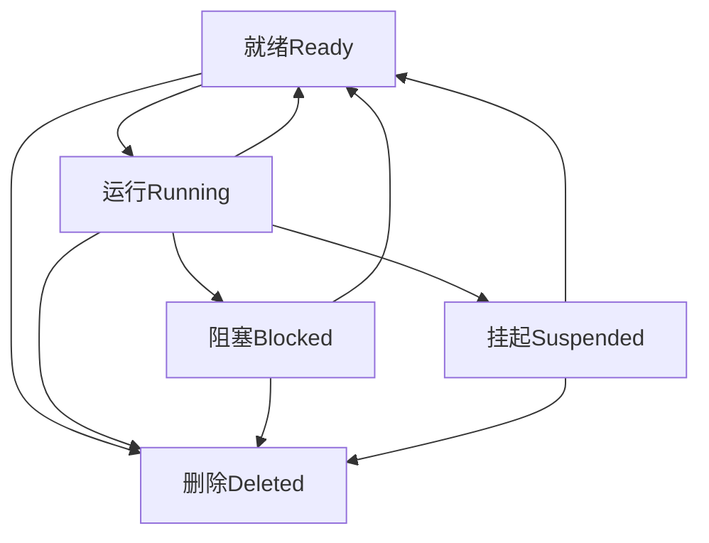

# FreeRTOS深度分析教程：从源码到底层运行机制

## 目录
1. [项目结构概览](#项目结构概览)
2. [FreeRTOS核心架构](#freertos核心架构)
3. [任务管理系统](#任务管理系统)
4. [队列与通信机制](#队列与通信机制)
5. [内存管理](#内存管理)
6. [移植层分析](#移植层分析)
7. [配置系统](#配置系统)
8. [启动流程](#启动流程)
9. [实时调度算法](#实时调度算法)
10. [中断处理机制](#中断处理机制)

---

## 项目结构概览

本项目是一个基于STM32F407的FreeRTOS应用，展示了完整的FreeRTOS实时操作系统实现。

### 主要目录结构

```
TKX/
├── Core/                           # 应用层核心代码
│   ├── Inc/
│   │   ├── FreeRTOSConfig.h       # FreeRTOS配置文件
│   │   ├── main.h                 # 主程序头文件
│   │   └── stm32f4xx_hal_conf.h   # HAL库配置
│   └── Src/
│       ├── main.c                 # 主程序
│       ├── freertos.c             # FreeRTOS任务定义
│       └── stm32f4xx_it.c         # 中断处理程序
├── Middlewares/Third_Party/FreeRTOS/  # FreeRTOS内核源码
│   └── Source/
│       ├── include/               # 内核头文件
│       ├── portable/              # 移植层代码
│       │   ├── GCC/ARM_CM4F/      # ARM Cortex-M4F GCC移植
│       │   └── MemMang/           # 内存管理实现
│       ├── tasks.c                # 任务管理核心
│       ├── queue.c                # 队列实现
│       ├── list.c                 # 双向链表实现
│       ├── timers.c               # 软件定时器
│       ├── event_groups.c         # 事件组
│       └── stream_buffer.c        # 流缓冲区
├── Drivers/                       # 驱动层
│   ├── STM32F4xx_HAL_Driver/      # STM32 HAL驱动
│   └── CMSIS/                     # ARM CMSIS标准
└── CMakeLists.txt                 # 构建配置
```

---

## FreeRTOS核心架构

### 内核组织结构

FreeRTOS采用微内核架构，主要包含以下核心组件：

#### 1. 核心内核文件
- **FreeRTOS.h**: 主配置头文件，定义了系统配置检查和基础类型
- **tasks.c**: 任务管理的核心实现
- **queue.c**: 队列、信号量、互斥量的统一实现
- **list.c**: 双向链表数据结构实现
- **timers.c**: 软件定时器实现

#### 2. 数据抽象层
```c
// 基础类型定义 (portmacro.h:46-57)
#define portCHAR        char
#define portFLOAT       float
#define portSTACK_TYPE  uint32_t
#define portBASE_TYPE   long

typedef portSTACK_TYPE StackType_t;
typedef long BaseType_t;
typedef unsigned long UBaseType_t;
typedef uint32_t TickType_t;  // 32位时钟滴答类型
```

#### 3. 配置系统
FreeRTOS使用编译时配置，通过`FreeRTOSConfig.h`定义系统行为：

```c
// 核心配置参数 (FreeRTOSConfig.h:62-79)
#define configUSE_PREEMPTION                     1      // 启用抢占式调度
#define configCPU_CLOCK_HZ                       (SystemCoreClock)  // CPU时钟
#define configTICK_RATE_HZ                       1000   // 1ms时钟滴答
#define configMAX_PRIORITIES                     56     // 最大优先级数
#define configMINIMAL_STACK_SIZE                 128    // 最小栈大小
#define configTOTAL_HEAP_SIZE                    15360  // 堆大小(15KB)
#define configUSE_MUTEXES                        1      // 启用互斥量
#define configUSE_COUNTING_SEMAPHORES            1      // 启用计数信号量
```

---

## 任务管理系统

### 任务控制块(TCB)结构

任务是FreeRTOS的基本调度单元，每个任务都有一个任务控制块(TCB)：

```c
// 任务状态定义 (tasks.c:95-99)
#define tskRUNNING_CHAR     ('X')  // 运行状态
#define tskBLOCKED_CHAR     ('B')  // 阻塞状态  
#define tskREADY_CHAR       ('R')  // 就绪状态
#define tskDELETED_CHAR     ('D')  // 删除状态
#define tskSUSPENDED_CHAR   ('S')  // 挂起状态
```

### 任务状态转换



### 任务创建过程

1. **内存分配**: 为TCB和栈分配内存
2. **栈初始化**: 初始化任务栈，设置初始上下文
3. **TCB初始化**: 设置任务参数、优先级、状态等
4. **加入就绪列表**: 将任务添加到对应优先级的就绪列表

### 关键数据结构

```c
// 静态任务结构 (FreeRTOS.h:1112-1160)
typedef struct xSTATIC_TCB
{
    void *pxDummy1;                    // 栈指针
    StaticListItem_t xDummy3[2];       // 状态列表项和事件列表项
    UBaseType_t uxDummy5;              // 优先级
    void *pxDummy6;                    // 栈起始地址
    uint8_t ucDummy7[configMAX_TASK_NAME_LEN];  // 任务名称
    // ... 其他字段根据配置条件编译
} StaticTask_t;
```

---

## 队列与通信机制

### 队列统一架构

FreeRTOS中的队列、信号量、互斥量都基于统一的队列机制实现：

```c
// 队列定义结构 (queue.c:97-100)
typedef struct QueueDefinition
{
    int8_t *pcHead;      // 队列存储区起始地址
    int8_t *pcWriteTo;   // 下一个写入位置
    // ... 其他队列管理字段
} Queue_t;
```

### 队列操作机制

#### 1. 数据传递方式
- **值传递**: 队列中存储的是数据的拷贝，不是指针
- **原子操作**: 所有队列操作都是原子的，支持中断安全

#### 2. 阻塞机制
```c
// 阻塞状态常量 (queue.c:52-53)
#define queueUNLOCKED           (-1)  // 队列未锁定
#define queueLOCKED_UNMODIFIED  (0)   // 队列已锁定但未修改
```

#### 3. 信号量实现
```c
// 信号量特殊配置 (queue.c:81-82)
#define queueSEMAPHORE_QUEUE_ITEM_LENGTH  (0)      // 信号量项长度为0
#define queueMUTEX_GIVE_BLOCK_TIME        (0U)     // 互斥量释放不阻塞
```

### 互斥量与优先级继承

```c
// 信号量数据结构 (queue.c:73-77)
typedef struct SemaphoreData
{
    TaskHandle_t xMutexHolder;         // 互斥量持有者
    UBaseType_t uxRecursiveCallCount;  // 递归调用计数
} SemaphoreData_t;
```

互斥量实现了优先级继承协议，防止优先级反转问题。

---

## 内存管理

### Heap_4内存管理算法

项目使用heap_4.c内存管理方案，具有以下特点：

#### 1. 内存合并算法
- **首次适配**: 寻找第一个足够大的空闲块
- **自动合并**: 释放时自动合并相邻的空闲块
- **碎片控制**: 有效减少内存碎片

#### 2. 内存块结构
```c
// 内存块结构 (heap_4.c实现中)
typedef struct A_BLOCK_LINK
{
    struct A_BLOCK_LINK *pxNextFreeBlock;  // 下一个空闲块
    size_t xBlockSize;                     // 块大小
} BlockLink_t;
```

#### 3. 堆初始化
```c
// 堆大小配置 (FreeRTOSConfig.h:71)
#define configTOTAL_HEAP_SIZE  ((size_t)15360)  // 15KB堆空间
```

### 内存安全机制

1. **边界检查**: 防止缓冲区溢出
2. **双重释放检测**: 防止重复释放内存
3. **内存泄漏跟踪**: 可选的内存使用统计

---

## 移植层分析

### ARM Cortex-M4F移植实现

项目针对ARM Cortex-M4F处理器进行了专门优化：

#### 1. 硬件抽象宏定义

```c
// 处理器特定定义 (portmacro.h:72-76)
#define portSTACK_GROWTH            (-1)    // 栈向下增长
#define portTICK_PERIOD_MS          (1000/configTICK_RATE_HZ)  // 1ms滴答
#define portBYTE_ALIGNMENT          8       // 8字节对齐
#define portTICK_TYPE_IS_ATOMIC     1       // 32位原子访问
```

#### 2. 上下文切换实现

```c
// 任务切换宏 (portmacro.h:79-88)
#define portYIELD() \
{ \
    portNVIC_INT_CTRL_REG = portNVIC_PENDSVSET_BIT; \
    __asm volatile( "dsb" ::: "memory" ); \
    __asm volatile( "isb" ); \
}
```

#### 3. 临界区保护

```c
// 中断控制宏 (portmacro.h:99-104)
#define portDISABLE_INTERRUPTS()    vPortRaiseBASEPRI()
#define portENABLE_INTERRUPTS()     vPortSetBASEPRI(0)
#define portENTER_CRITICAL()        vPortEnterCritical()
#define portEXIT_CRITICAL()         vPortExitCritical()
```

#### 4. 浮点单元支持

```c
// FPU寄存器定义 (port.c:85-86)
#define portFPCCR                   ((volatile uint32_t *)0xe000ef34)
#define portASPEN_AND_LSPEN_BITS    (0x3UL << 30UL)
```

### 优先级优化

```c
// 硬件优先级查找优化 (portmacro.h:127-149)
#if configUSE_PORT_OPTIMISED_TASK_SELECTION == 1
    // 使用CLZ指令快速查找最高优先级
    __attribute__((always_inline)) static inline uint8_t ucPortCountLeadingZeros(uint32_t ulBitmap)
    {
        uint8_t ucReturn;
        __asm volatile ("clz %0, %1" : "=r" (ucReturn) : "r" (ulBitmap) : "memory");
        return ucReturn;
    }
#endif
```

---

## 配置系统

### 编译时配置

FreeRTOS使用条件编译实现灵活配置：

#### 1. 功能开关配置
```c
// 功能启用配置 (FreeRTOSConfig.h:106-118)
#define INCLUDE_vTaskPrioritySet             1  // 任务优先级设置
#define INCLUDE_uxTaskPriorityGet            1  // 任务优先级获取  
#define INCLUDE_vTaskDelete                  1  // 任务删除
#define INCLUDE_vTaskSuspend                 1  // 任务挂起
#define INCLUDE_vTaskDelayUntil              1  // 绝对延时
#define INCLUDE_vTaskDelay                   1  // 相对延时
#define INCLUDE_xTaskGetCurrentTaskHandle    1  // 获取当前任务句柄
```

#### 2. 中断优先级配置
```c
// 中断优先级设置 (FreeRTOSConfig.h:134-149)
#define configLIBRARY_LOWEST_INTERRUPT_PRIORITY    15   // 最低中断优先级
#define configLIBRARY_MAX_SYSCALL_INTERRUPT_PRIORITY 5  // 系统调用最高优先级
#define configKERNEL_INTERRUPT_PRIORITY \
    (configLIBRARY_LOWEST_INTERRUPT_PRIORITY << (8 - configPRIO_BITS))
#define configMAX_SYSCALL_INTERRUPT_PRIORITY \
    (configLIBRARY_MAX_SYSCALL_INTERRUPT_PRIORITY << (8 - configPRIO_BITS))
```

#### 3. 断言与调试配置
```c
// 断言定义 (FreeRTOSConfig.h:154)
#define configASSERT(x) if ((x) == 0) {taskDISABLE_INTERRUPTS(); for(;;);}
```

### 配置验证机制

FreeRTOS内核会在编译时检查配置的合法性：

```c
// 配置检查示例 (FreeRTOS.h:79-89)
#ifndef configMINIMAL_STACK_SIZE
    #error Missing definition: configMINIMAL_STACK_SIZE must be defined
#endif

#if configMAX_PRIORITIES < 1
    #error configMAX_PRIORITIES must be defined to be greater than or equal to 1
#endif
```

---

## 启动流程

### 系统初始化序列

1. **硬件初始化** (main.c)
   - 时钟配置
   - GPIO初始化
   - 外设配置

2. **FreeRTOS初始化** (freertos.c)
   - 创建初始任务
   - 配置定时器
   - 初始化同步对象

3. **调度器启动**
   - `vTaskStartScheduler()` 调用
   - 创建空闲任务
   - 启动第一个任务

### 启动时内存布局

```
Flash Memory:
├── 中断向量表
├── 应用程序代码
├── FreeRTOS内核代码
└── 常量数据

RAM Memory:
├── 系统栈
├── FreeRTOS堆 (15KB)
├── 任务栈区域
├── 全局变量
└── BSS段
```

---

## 实时调度算法

### 抢占式优先级调度

FreeRTOS实现了基于优先级的抢占式调度算法：

#### 1. 调度策略
- **优先级抢占**: 高优先级任务总是先执行
- **时间片轮转**: 同优先级任务采用时间片轮转
- **就绪列表管理**: 每个优先级维护一个就绪任务列表

#### 2. 调度点
- 系统滴答中断
- 任务阻塞/唤醒
- 任务优先级改变
- 主动让出CPU

#### 3. 调度开销优化
```c
// 优化的任务选择 (portmacro.h:143-149)
#define portRECORD_READY_PRIORITY(uxPriority, uxReadyPriorities) \
    (uxReadyPriorities) |= (1UL << (uxPriority))

#define portRESET_READY_PRIORITY(uxPriority, uxReadyPriorities) \
    (uxReadyPriorities) &= ~(1UL << (uxPriority))

#define portGET_HIGHEST_PRIORITY(uxTopPriority, uxReadyPriorities) \
    uxTopPriority = (31UL - (uint32_t)ucPortCountLeadingZeros((uxReadyPriorities)))
```

### 时钟管理

#### 1. 系统滴答
- **频率**: 1000Hz (1ms间隔)
- **实现**: SysTick定时器
- **用途**: 任务延时、超时检测、时间片管理

#### 2. 软件定时器
```c
// 定时器配置 (FreeRTOSConfig.h:91-94)
#define configUSE_TIMERS                1      // 启用软件定时器
#define configTIMER_TASK_PRIORITY       2      // 定时器任务优先级
#define configTIMER_QUEUE_LENGTH        10     // 定时器命令队列长度
#define configTIMER_TASK_STACK_DEPTH    256    // 定时器任务栈深度
```

---

## 中断处理机制

### 中断安全API

FreeRTOS提供了两套API：

#### 1. 任务级API
- `xQueueSend()` / `xQueueReceive()`
- `xSemaphoreGive()` / `xSemaphoreTake()`
- `vTaskDelay()` / `vTaskDelayUntil()`

#### 2. 中断级API  
- `xQueueSendFromISR()` / `xQueueReceiveFromISR()`
- `xSemaphoreGiveFromISR()` / `xSemaphoreTakeFromISR()`
- `vTaskNotifyGiveFromISR()`

### 中断嵌套管理

```c
// 中断屏蔽级别 (portmacro.h:191-203)
portFORCE_INLINE static void vPortRaiseBASEPRI(void)
{
    uint32_t ulNewBASEPRI;
    __asm volatile
    (
        "mov %0, %1\n"
        "msr basepri, %0\n"
        "isb\n"
        "dsb\n"
        :"=r" (ulNewBASEPRI) : "i" (configMAX_SYSCALL_INTERRUPT_PRIORITY) : "memory"
    );
}
```

### 中断延迟处理

FreeRTOS使用PendSV异常实现上下文切换，确保中断响应的实时性：

```c
// PendSV触发 (portmacro.h:79-88)
#define portYIELD() \
{ \
    portNVIC_INT_CTRL_REG = portNVIC_PENDSVSET_BIT; \
    __asm volatile( "dsb" ::: "memory" ); \
    __asm volatile( "isb" ); \
}
```

---

## 性能分析与优化

### 内存使用分析

- **代码空间**: FreeRTOS内核约6-12KB (取决于配置)
- **数据空间**: 每个任务约100-200字节TCB
- **栈空间**: 每个任务128字节起 (可配置)
- **堆空间**: 15KB动态内存池

### 实时性能指标

- **中断响应时间**: < 25个时钟周期
- **任务切换时间**: < 100个时钟周期  
- **队列操作时间**: 恒定时间复杂度O(1)
- **优先级查找**: 硬件加速，O(1)时间复杂度

### 优化建议

1. **栈大小优化**: 使用`uxTaskGetStackHighWaterMark()`监控栈使用
2. **优先级设计**: 避免过多优先级层次，推荐3-7个层次
3. **内存管理**: 优先使用静态分配，减少碎片
4. **中断处理**: 保持ISR简短，使用延迟处理机制

---

## 调试与跟踪

### 配置跟踪功能

```c
// 跟踪配置 (FreeRTOSConfig.h:73)
#define configUSE_TRACE_FACILITY    1   // 启用跟踪功能
```

### 任务状态监控

FreeRTOS提供丰富的运行时统计信息：
- 任务运行时间统计
- 堆使用情况监控
- 任务栈使用情况
- 队列使用状态

### 断言与错误处理

```c
// 错误处理 (FreeRTOSConfig.h:154)
#define configASSERT(x) if ((x) == 0) {taskDISABLE_INTERRUPTS(); for(;;);}
```

---

## 总结

本项目展示了FreeRTOS在STM32平台上的完整实现，涵盖了：

1. **模块化设计**: 清晰的分层架构，便于移植和维护
2. **高效调度**: 基于硬件特性的优化调度算法
3. **丰富的同步机制**: 队列、信号量、互斥量、事件组等
4. **灵活的配置系统**: 编译时配置，满足不同应用需求
5. **完善的移植层**: 针对ARM Cortex-M4F的深度优化
6. **实时性保证**: 确定性的响应时间和调度行为

FreeRTOS凭借其简洁高效的设计和强大的功能，已成为嵌入式实时系统开发的首选操作系统。通过深入理解其内部机制，开发者能够更好地利用其特性，构建高质量的嵌入式应用。

---

*本教程基于FreeRTOS V10.3.1版本，适用于ARM Cortex-M4F处理器平台。*